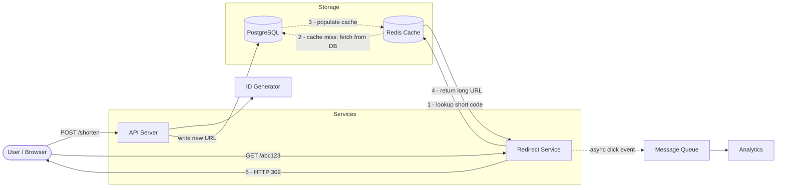
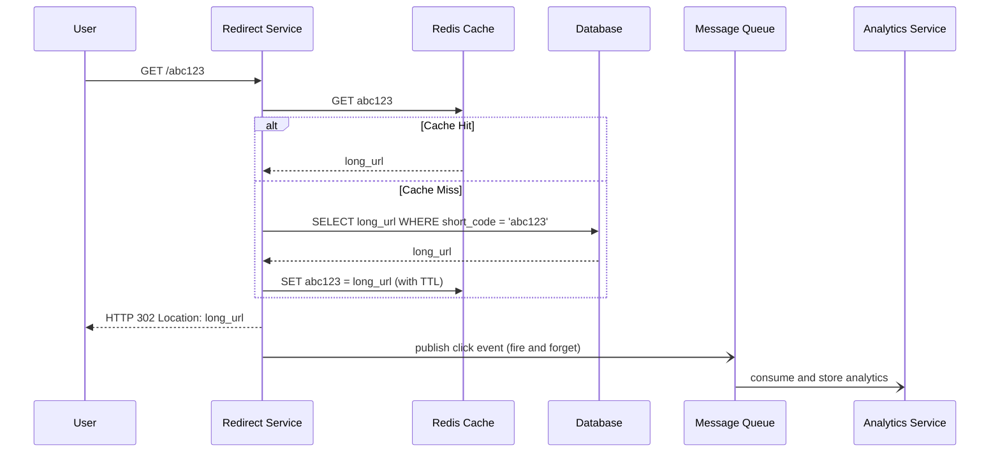
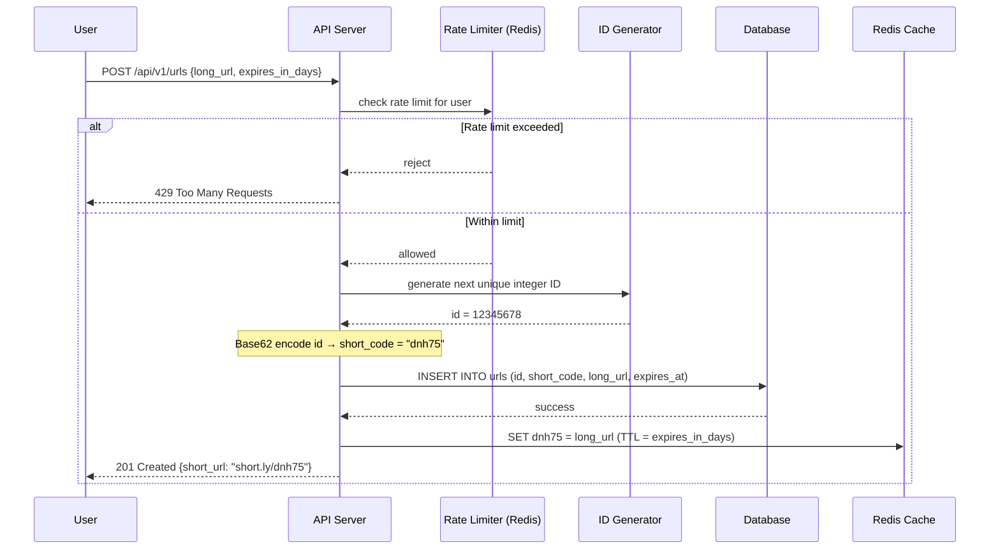
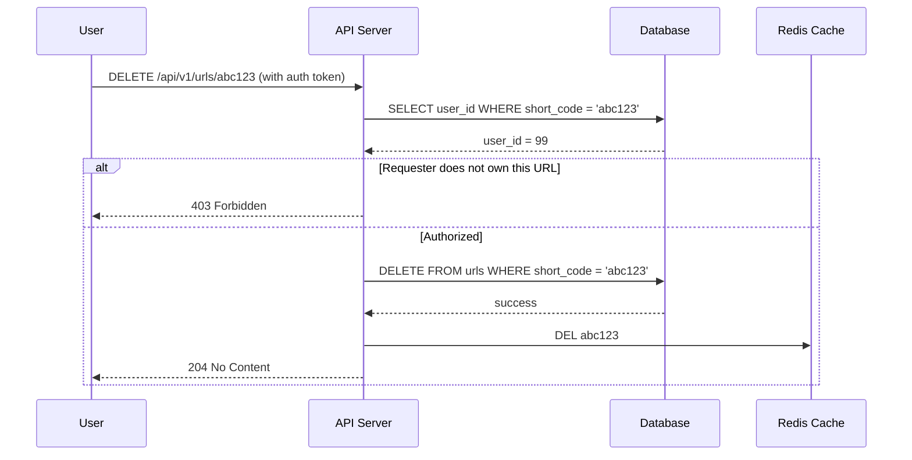

# 1. Design a URL Shortener (bit.ly)

## Requirements

### Functional
- Given a long URL, generate a unique short URL (e.g., `https://short.ly/abc123`)
- Redirect users from the short URL to the original long URL
- Short URLs should be customizable (optional — e.g., `short.ly/my-campaign`)
- Short URLs can have an optional expiry time
- Track click analytics (count, location, device) — optional

### Non-Functional
- **High availability**: redirection must always work (more critical than write)
- **Low latency**: redirect must be fast — target < 10ms
- **Durability**: short URLs must never be silently lost
- **Scale**: read-heavy system — reads far outnumber writes (100:1 ratio typical)
- Short URLs must be unpredictable (not guessable by incrementing)

---

## Scale Estimation

```
Write (URL creation):
  100 million new URLs/day
  = 100M / 86,400 ≈ 1,200 writes/second (peak ~5,000/s)

Read (redirects):
  100:1 read/write ratio → 10 billion redirects/day
  = 10B / 86,400 ≈ 115,000 reads/second (peak ~500,000/s)

Storage:
  Per record: ~100 bytes (long_url) + ~500 bytes (metadata, indexes) = ~600 bytes
  10 years retention: 100M * 365 * 10 = 365 billion records
  Total: 365B * 600 bytes ≈ 219 TB (manageable with sharding)

Bandwidth:
  Read: 115,000 reads/s * 500 bytes ≈ 57 MB/s outbound
```

**Key insight**: This is overwhelmingly **read-heavy**. The architecture must optimize for fast redirects, not writes.

---

## High-Level Architecture



---

## Core Components

### 1. ID Generation — How do we create the short code?

The short code (e.g., `abc123`) must be short (6–8 chars), unique, and not guessable.

**Approach: Base62 encoding of a unique integer ID**

Base62 uses characters `[0-9, a-z, A-Z]` = 62 characters.

```
6 characters → 62^6 = ~56 billion unique codes  ✓ enough for years
7 characters → 62^7 = ~3.5 trillion unique codes
```

Steps:
1. Generate a unique integer ID — use SQL `AUTO_INCREMENT` on a single node, or a distributed ID generator like Twitter Snowflake on multiple nodes (see Q18)
2. Encode that integer in Base62 → short code

```
ID: 12345678  →  Base62 encode  →  "dnh75"
```

**Why not MD5/SHA256 hash of the long URL?**
- Hash collisions: two different URLs can produce the same first 6 characters
- Must check DB and retry with the next 6 characters until a free slot is found
- Base62 + auto-increment is collision-free and simpler

### 2. Redirect Service — The hot path

Every redirect:
1. Receives `GET /abc123`
2. Looks up `abc123` in **Redis cache** (target: 99% hit rate)
3. On cache miss → queries DB → stores result in cache
4. Returns HTTP redirect to client

**HTTP 301 vs 302:**

| Code | Meaning | Browser caches? | Analytics tracked? |
|------|---------|-----------------|-------------------|
| 301 Permanent | URL has moved permanently | Yes — browser skips our server next time | No — repeat visits bypass us |
| 302 Temporary | URL has moved temporarily | No — browser always calls us | Yes — every visit goes through us |

> Use **302** if you want analytics or the ability to update/expire the destination. Use **301** only if you want to reduce server load and never need to change the destination.

### 3. Cache Layer (Redis)

- Key: `short_code` → Value: `long_url`
- **TTL** (per-key): set to match the URL's expiry date — Redis auto-deletes the key when the URL expires
- **LRU eviction** (cache-wide): when Redis runs out of memory, it evicts the least-recently-used keys automatically
- TTL and LRU serve different purposes and are used together — TTL is a business rule per key, LRU is memory management across all keys

### 4. Custom Short URLs

- User provides their own alias: `short.ly/my-brand`
- Stored in same DB table with `is_custom = true`
- Must check for conflicts before accepting

---

## Data Model

### URL Table

```sql
CREATE TABLE urls (
    id          BIGINT PRIMARY KEY,
    short_code  VARCHAR(8) UNIQUE NOT NULL,
    long_url    TEXT NOT NULL,
    user_id     BIGINT,
    created_at  TIMESTAMP NOT NULL,
    expires_at  TIMESTAMP,              -- NULL = never expires
    is_custom   BOOLEAN DEFAULT FALSE
);

CREATE INDEX idx_short_code ON urls(short_code);
```

**Why SQL?**
- Structured data with a natural uniqueness constraint on `short_code`
- Read pattern is simple point lookups — SQL with an index handles this efficiently
- With Redis absorbing 99% of reads, a primary + read replicas easily handles the remaining load

### Analytics Table (separate service)

```sql
CREATE TABLE clicks (
    id          BIGINT PRIMARY KEY,
    short_code  VARCHAR(8) NOT NULL,
    clicked_at  TIMESTAMP NOT NULL,
    ip_address  VARCHAR(45),
    user_agent  TEXT,
    country     VARCHAR(2)
);
```

> Analytics writes are async (via message queue) — never block a redirect for analytics.

---

## API Design

### Create a short URL
```
POST /api/v1/urls

Request:
{
  "long_url": "https://www.example.com/very/long/path?query=params",
  "custom_code": "my-alias",    // optional
  "expires_in_days": 30         // optional
}

Response 201 Created:
{
  "short_url": "https://short.ly/abc123",
  "short_code": "abc123",
  "expires_at": "2026-07-01T00:00:00Z"
}
```

### Redirect
```
GET /{short_code}

Response 302 Found:
Location: https://www.example.com/very/long/path?query=params
```

### Delete a short URL
```
DELETE /api/v1/urls/{short_code}
Authorization: Bearer <token>

Response 204 No Content
```

### Get analytics
```
GET /api/v1/urls/{short_code}/stats

Response 200 OK:
{
  "short_code": "abc123",
  "total_clicks": 4821,
  "clicks_last_7_days": 312
}
```

---

## Key Challenges & Solutions

### Challenge 1: Same long URL submitted twice
- **Option A**: Always generate a new code — simple, wastes storage
- **Option B**: Deduplicate per user — same user gets same code, different users get different codes
- **Recommendation**: Option B — balances simplicity with storage efficiency

### Challenge 2: Cache stampede on popular URLs
- A viral URL's cache entry expires → thousands of requests simultaneously hit the DB
- **Solution**: Use Redis `SET NX` (set if not exists) as a distributed lock — only the first thread fetches from DB and populates cache; all others wait and read from cache once it's ready

### Challenge 3: Database scaling
- At 1,200 writes/s a single primary node is sufficient initially
- **Read replicas** absorb the read load — writes go to primary, reads go to replicas (replication lag is typically milliseconds, acceptable here)
- For write scale-out: shard by `short_code` — hash the short code to determine which DB shard owns it

### Challenge 4: Expired URL cleanup
- Check `expires_at` on every redirect (fast — it's in the cache entry)
- Background job runs nightly to hard-delete expired rows and free storage

### Challenge 5: Preventing abuse
- Rate limit URL creation per user (e.g., 100/day on free tier) using Redis counters
- Validate URLs against Google Safe Browsing API before accepting
- Blacklist known spam domains

---

## Trade-offs

| Decision | Choice | Why | Alternative |
|----------|--------|-----|-------------|
| ID generation | Base62 + auto-increment | Collision-free, simple | MD5 hash (collision risk) |
| Redirect code | HTTP 302 | Enables analytics, keeps control | HTTP 301 (faster, no analytics) |
| Storage | PostgreSQL | Structured, unique constraints, simple lookups | Cassandra (overkill) |
| Cache | Redis LRU + TTL | Absorbs 99% of reads, native TTL per key | Memcached (no per-key TTL) |
| Analytics writes | Async via queue | Never blocks the redirect hot path | Synchronous (adds latency) |
| CAP position | **AP** | Availability matters more than perfect consistency for redirects | CP (unnecessary strictness) |

---

## Sequence Diagrams

**GET — Redirect a short URL**



---

**POST — Create a short URL**



---

**DELETE — Remove a short URL**


