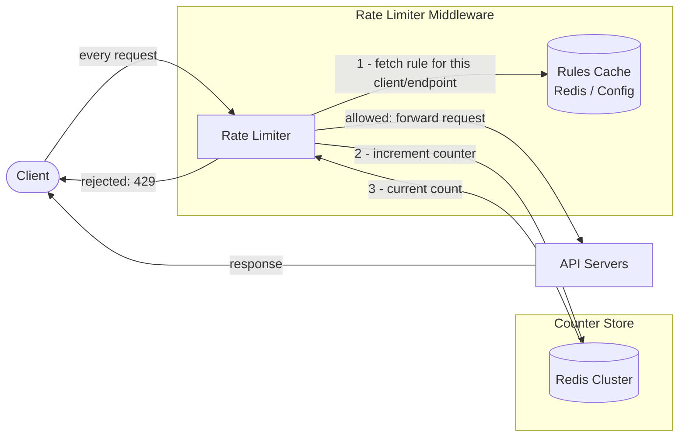
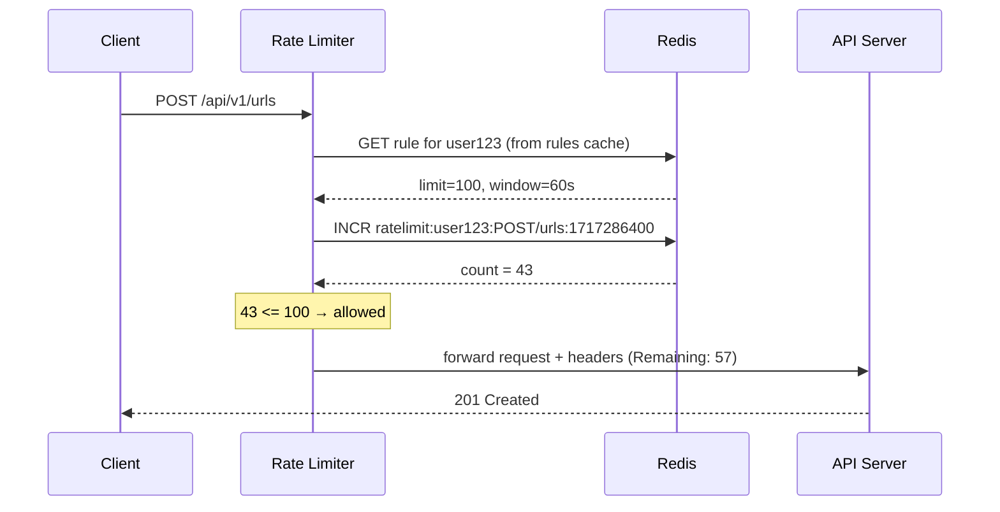
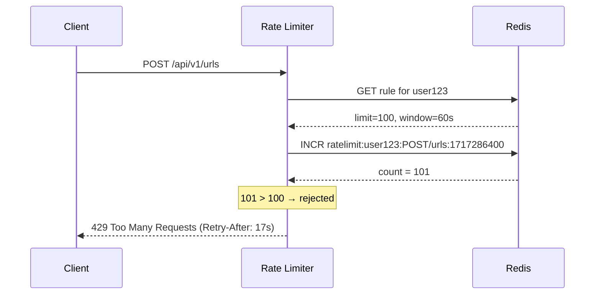

# 2. Design a Rate Limiter

## Requirements

### Functional
- Limit the number of requests a client can make within a time window
- Return HTTP 429 (Too Many Requests) when the limit is exceeded
- Support multiple limit rules: by user, by IP, by API endpoint, by plan tier
- Limits should be configurable without redeploying (e.g., 100 req/min for free tier, 1000 req/min for paid)
- Client should know how many requests they have remaining and when the limit resets

### Non-Functional
- **Low latency**: the rate limiter runs on every request — must add < 5ms overhead
- **High availability**: if the rate limiter fails, requests should still go through (fail open) rather than blocking all traffic
- **Accuracy**: limits should be enforced correctly across all servers in a distributed system
- **Scalability**: must handle millions of requests per second

---

## Scale Estimation

```
Assume: 10 million active users, each making ~10 requests/min
Total: 100 million requests/min = ~1.7 million requests/second

Per-request cost of rate limiter:
  1 Redis read + 1 Redis write per request
  Redis handles ~500K ops/second per node
  → Need 3–4 Redis nodes for this scale

Storage (Redis counters):
  Each counter: user_id (8 bytes) + count (4 bytes) + TTL overhead ≈ ~100 bytes
  10 million active users × 100 bytes = ~1 GB  (fits easily in memory)
```

---

## High-Level Architecture

The rate limiter sits as **middleware** between clients and your API servers. It intercepts every request, checks the counter in Redis, and either allows or rejects it before the request ever reaches your application.



---

## Core Components

### 1. Where to place the rate limiter

| Placement | Pros | Cons |
|-----------|------|------|
| **API Gateway** (recommended) | Single enforcement point, no app code changes | Gateway becomes a bottleneck if not scaled |
| **Application middleware** | Fine-grained control per route | Must be duplicated across all services |
| **Client-side** | Reduces traffic before it hits servers | Easily bypassed — never rely on this alone |

In practice: enforce at the **API Gateway** for general limits, with per-service middleware for fine-grained rules.

### 2. Rate Limiting Algorithms

**Token Bucket** *(most widely used — used by AWS, Stripe)*
- A bucket holds up to `capacity` tokens
- Tokens are added at a fixed `refill rate` (e.g., 10 tokens/second)
- Each request consumes 1 token; rejected if bucket is empty
- Allows bursts up to the bucket capacity, then throttles to the refill rate

```
Bucket capacity: 10   Refill rate: 2 tokens/sec

t=0s: bucket=10, 5 requests → bucket=5   ✓ all allowed
t=1s: bucket=7,  8 requests → bucket=0, 1 rejected  (7 allowed)
t=2s: bucket=2,  1 request  → bucket=1   ✓ allowed
```

---

**Leaky Bucket**
- Requests enter a fixed-size queue; processed at a constant rate
- Excess requests are dropped if the queue is full
- Produces a smooth, consistent output rate regardless of input bursts
- Used when downstream systems need predictable request rates (e.g., payment processors)

---

**Fixed Window Counter**
- Count requests in fixed time windows (e.g., 00:00–00:59, 01:00–01:59)
- Reject if count exceeds the limit within the window
- Simple to implement
- **Weakness**: burst at window boundary — 100 requests at 00:59 + 100 at 01:00 = 200 requests in 2 seconds

---

**Sliding Window Log**
- Store a timestamp for every request in a sorted set
- On each request: remove timestamps older than the window, count remaining, reject if over limit
- Most accurate — no boundary burst problem
- **Weakness**: high memory usage (stores every timestamp)

---

**Sliding Window Counter** *(best balance — recommended for most cases)*
- Combines Fixed Window + Sliding Window
- Formula: `count = current_window_count + previous_window_count × overlap_ratio`

```
Example: limit = 100/min, window = 1 min

At 01:45 (45 seconds into current window):
  Previous window (00:00–01:00): 80 requests
  Current window  (01:00–02:00): 30 requests so far
  Overlap ratio = (60 - 45) / 60 = 0.25  (25% of previous window still in the 1-min lookback)

  Estimated count = 30 + 80 × 0.25 = 30 + 20 = 50  → under limit, allow
```

Accurate enough for most cases, memory-efficient (only two counters per user per window).

### 3. Distributed Counter Storage (Redis)

In a distributed system with multiple API servers, counters must be stored centrally — not in each server's memory. Redis is the standard choice:

- All servers read/write the same counters
- `INCR` is atomic — no race conditions
- TTL auto-expires counters after the window closes

### 4. Rules Storage

Rate limit rules (who gets what limit) are stored in a config service or database and **cached in Redis** so the rate limiter doesn't hit the DB on every request:

```
Rule examples:
  user:free_tier    → 100 req/min
  user:paid_tier    → 1000 req/min
  endpoint:/login   → 5 req/min per IP  (brute force protection)
  ip:anonymous      → 30 req/min
```

### 5. Response Headers

Always include these headers so clients can self-throttle:

```
HTTP/1.1 200 OK
X-RateLimit-Limit: 100
X-RateLimit-Remaining: 43
X-RateLimit-Reset: 1717286400      ← Unix timestamp when the window resets

HTTP/1.1 429 Too Many Requests
Retry-After: 30                    ← seconds until they can retry
X-RateLimit-Limit: 100
X-RateLimit-Remaining: 0
```

---

## Data Model

Counters are stored in Redis — no persistent database needed for the counters themselves.

**Sliding Window Counter (two keys per user per endpoint):**

```
Key pattern:   ratelimit:{user_id}:{endpoint}:{window_start}
Value:         integer count
TTL:           2 × window duration (keep previous window for overlap calculation)

Example keys:
  ratelimit:user123:POST/urls:1717286400   →  47   (TTL: 120s)
  ratelimit:user123:POST/urls:1717286340   →  83   (TTL: 60s)
```

**Rules** (stored in Redis as a hash, loaded from a config DB):

```
Key:    rules:{tier}:{endpoint}
Value:  { "limit": 100, "window_seconds": 60 }
```

---

## API Design

The rate limiter is infrastructure middleware — it has no public API. It intercepts requests transparently. However, an admin API to manage rules is useful:

### Get current rate limit status for a client
```
GET /internal/ratelimit/{user_id}

Response 200 OK:
{
  "user_id": "user123",
  "limit": 100,
  "remaining": 43,
  "reset_at": "2026-06-02T12:00:00Z"
}
```

### Update a rate limit rule
```
PUT /internal/ratelimit/rules/{tier}

Request:
{
  "limit": 200,
  "window_seconds": 60
}

Response 200 OK
```

---

## Key Challenges & Solutions

### Challenge 1: Race condition on counters
- Two servers read the same counter value simultaneously, both increment locally, both write back — one increment is lost
- **Solution**: Use Redis `INCR` which is atomic. Never read-then-write; always use atomic increment

### Challenge 2: Rate limiter itself becomes a bottleneck
- Every request now has an extra Redis round-trip
- **Solution**:
  - Use a Redis cluster (shard counters by user_id)
  - Cache rules locally in the rate limiter process (rules change rarely)
  - Use Redis pipelining to batch commands

### Challenge 3: What if Redis goes down?
- If the rate limiter can't check the counter, do you block all traffic or let everything through?
- **Fail open** (let requests through): preferred — downtime of the rate limiter doesn't take down your service; risk is temporary traffic spike
- **Fail closed** (block all requests): only for high-security endpoints (e.g., login, payment)
- Implement a local in-memory fallback counter as a rough backstop when Redis is unavailable

### Challenge 4: Distributed clock skew
- Servers in different regions may have slightly different clocks — window boundaries won't align perfectly
- **Solution**: Use Redis server time (`TIME` command) as the authoritative clock, not each server's local clock

### Challenge 5: Hard vs Soft limits
- **Hard limit**: strictly enforce — 101st request always rejected
- **Soft limit**: allow small bursts over the limit (e.g., allow up to 110% before rejecting)
- Soft limits give a better user experience for occasional spikes; hard limits protect downstream systems

---

## Trade-offs

| Decision | Choice | Why | Alternative |
|----------|--------|-----|-------------|
| Algorithm | Sliding Window Counter | Accurate, memory efficient, handles bursts | Token Bucket (slightly more complex state) |
| Counter storage | Redis | Atomic ops, TTL, fast, distributed | In-process memory (doesn't work across servers) |
| Placement | API Gateway | Single enforcement point | Per-service middleware (more flexible, more code) |
| Failure mode | Fail open | Availability over perfect enforcement | Fail closed (safer for auth endpoints) |
| Clock source | Redis TIME | Consistent across all nodes | Local server time (skew causes window misalignment) |

---

## Sequence Diagram

**Request allowed:**



**Request rejected:**


