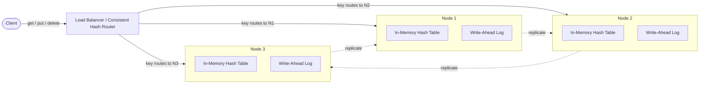
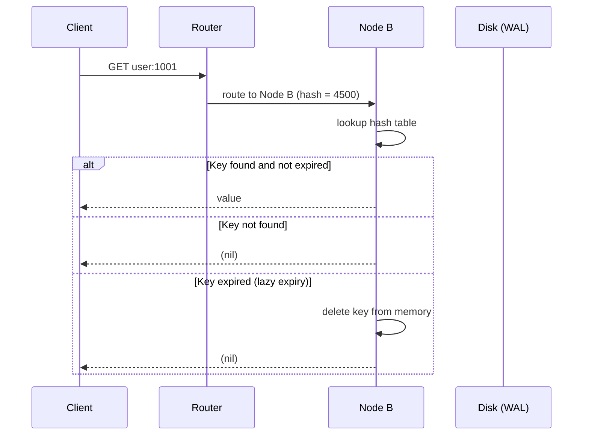
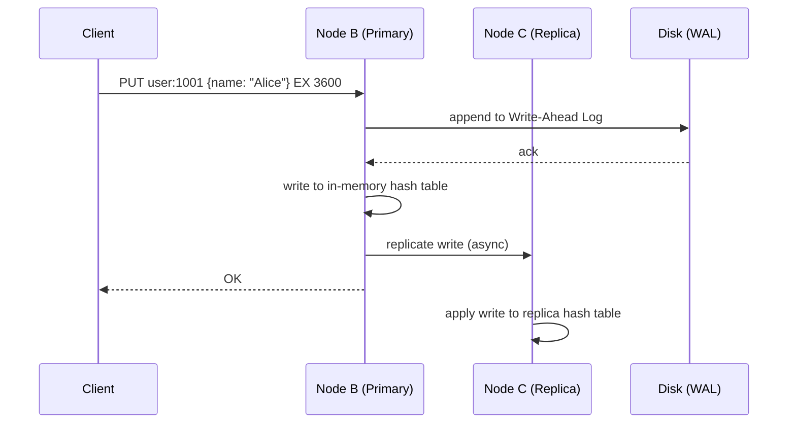

# 3. Design a Key-Value Store (Redis-like)

## Requirements

### Functional
- `put(key, value)` — store a value against a key; overwrite if key already exists
- `get(key)` — retrieve value by key; return null if not found
- `delete(key)` — remove a key-value pair
- Keys and values are arbitrary byte strings (values up to ~1 MB)
- Optional: TTL support — keys expire automatically after a set duration
- Optional: support richer data types beyond plain strings (lists, sets, hashes)

### Non-Functional
- **Low latency**: reads and writes at p99 < 1ms
- **High availability**: survive node failures without downtime
- **Scalability**: scale to store more data than fits on one machine
- **Durability**: configurable — pure in-memory (fast, volatile) or persisted to disk (slower, durable)
- **Consistency**: strong consistency within a single node; tunable in distributed mode

---

## Scale Estimation

```
Assume: 1 billion key-value pairs
Average key size:   50 bytes
Average value size: 250 bytes
Total raw data:     1B × 300 bytes = 300 GB

With overhead (hash table pointers, metadata, replication):
  ~3× multiplier → ~900 GB total

A single machine with 256 GB RAM holds ~85 billion bytes of data
→ Need at least 4 nodes to hold 900 GB with headroom

QPS target: 500,000 reads/second + 100,000 writes/second = 600,000 ops/second total
  Redis handles ~100K–500K ops/s per node (range depends on hardware and command size)
  At 200K ops/s per node (middle estimate): 600K ÷ 200K = 3 nodes
  At 100K ops/s per node (conservative):   600K ÷ 100K = 6 nodes
  → 3–5 nodes is the practical range for throughput
```

---

## High-Level Architecture



---

## Core Components

### 1. Storage Engine — How is data stored internally?

**In-memory hash table** is the foundation of a fast key-value store. A hash table maps keys to values in O(1) average time for reads and writes.

```
Hash Table internals:
  - Array of N buckets
  - hash(key) % N → bucket index
  - Each bucket holds a linked list of (key, value) pairs (handles collisions)
  - Resize (rehash) when load factor exceeds ~0.7
```

**For persistence (optional):** data must also be written to disk so it survives restarts. Two strategies:

| Strategy | How | Pros | Cons |
|----------|-----|------|------|
| **Write-Ahead Log (WAL)** | Every write is appended to a log file before being applied to memory | Fast writes (append-only), recoverable on crash | Log grows forever; needs compaction |
| **Snapshotting (RDB)** | Periodically serialize the full in-memory state to disk | Simple, fast restores | Can lose data written since last snapshot |
| **Both (Redis default)** | WAL for durability + periodic snapshots for fast restores | Best of both worlds | Slightly more disk I/O |

### 2. Single-Threaded Event Loop

Redis is famously **single-threaded** for command execution. This is intentional:

- No locks or mutexes needed — only one thread ever touches data
- No context switching overhead
- Commands execute atomically by default
- Fast enough because all data is in memory — CPU is rarely the bottleneck

One thread processes commands sequentially from a queue. Network I/O uses non-blocking multiplexing (epoll/kqueue) so the single thread handles thousands of concurrent connections.

### 3. Partitioning — Scaling beyond one node

When data exceeds one machine, it must be split across nodes. Use **consistent hashing**:

- Keys and nodes are placed on a virtual ring (0 to 2³²)
- A key is owned by the first node clockwise from `hash(key)` on the ring
- Adding/removing a node only remaps a small fraction of keys (not the whole dataset)

```
Ring (simplified):
  Node A owns keys hashing to 0–3000
  Node B owns keys hashing to 3001–7000
  Node C owns keys hashing to 7001–10000 (wraps around to 0)

  put("user:123", ...) → hash = 4500 → goes to Node B
  put("user:456", ...) → hash = 1200 → goes to Node A
```

**Virtual nodes**: each physical node is represented by multiple points on the ring (e.g., 150 virtual nodes per physical node). This ensures even distribution even with heterogeneous hardware.

### 4. Replication — Surviving node failures

Each key is replicated to N nodes (typically N=3). Two models:

**Leader-based (single-leader) replication:**
- One node is the primary for each key; it accepts writes
- Changes are replicated synchronously or asynchronously to replicas
- On primary failure, a replica is promoted via leader election (Raft or Paxos)

**Leaderless replication (Dynamo-style):**
- Any node can accept a write
- Write is sent to W nodes; read is sent to R nodes
- Strong consistency when W + R > N (e.g., N=3, W=2, R=2)
- No leader election needed — simpler failure handling

### 5. TTL (Time-To-Live)

Two eviction strategies run together:

- **Lazy expiry**: check if a key is expired when it is accessed; delete it then
- **Active expiry**: a background process randomly samples keys every 100ms and deletes expired ones

Lazy expiry alone is insufficient — keys that are never accessed again would stay in memory forever. Active expiry reclaims that memory proactively.

### 6. Eviction Policies (when memory is full)

When the store hits its memory limit and TTL alone doesn't free enough space:

| Policy | Behaviour |
|--------|-----------|
| `noeviction` | Reject new writes — return an error |
| `allkeys-lru` | Evict the least recently used key across all keys |
| `volatile-lru` | Evict the least recently used key that has a TTL set |
| `allkeys-lfu` | Evict the least frequently used key |
| `allkeys-random` | Evict a random key |

For a cache use case: `allkeys-lru`. For a durable store: `noeviction` (never silently drop data).

---

## Data Model

No schema — keys are arbitrary strings, values are byte arrays. Internally, the store supports typed value encodings for efficiency:

| Type | Use case | Internal encoding |
|------|----------|------------------|
| String | Simple values, counters, serialised JSON | Raw bytes or integer |
| List | Ordered sequences, message queues | Doubly linked list / ziplist |
| Hash | Object fields (user profile) | Hash table / ziplist |
| Set | Unique tags, memberships | Hash table / intset |
| Sorted Set | Leaderboards, priority queues | Skip list + hash table |

**Key naming convention** (not enforced, but standard practice):
```
user:1001:profile       → hash of user fields
session:abc123          → string (session token)
queue:emails            → list (job queue)
leaderboard:2026-06     → sorted set (scores)
```

---

## API Design

```
PUT    key value [EX seconds]    → OK
GET    key                       → value | (nil)
DELETE key                       → (integer) 1 if deleted, 0 if not found
EXISTS key                       → (integer) 1 | 0
EXPIRE key seconds               → (integer) 1 | 0
TTL    key                       → seconds remaining | -1 (no TTL) | -2 (not found)
INCR   key                       → (integer) new value
MGET   key1 key2 key3            → [value1, value2, value3]
MSET   key1 val1 key2 val2       → OK
```

Batch operations (`MGET`, `MSET`) are important for performance — they reduce round-trips between client and server.

---

## Key Challenges & Solutions

### Challenge 1: Hot keys
- A single key receives a disproportionate share of traffic (e.g., a viral post's view count)
- One node gets overwhelmed while others are idle
- **Solution**: replicate hot keys to multiple nodes and distribute reads across all replicas; or use local client-side caching for the hottest keys

### Challenge 2: Large values
- Storing values > 1 MB causes latency spikes (single-threaded server blocks while serialising)
- **Solution**: enforce a value size limit (e.g., 1 MB cap); for large objects, store them in blob storage (S3) and keep only the reference URL in the key-value store

### Challenge 3: Network partition — split brain
- A network partition separates nodes; both sides continue accepting writes independently
- When partition heals, the two sides have conflicting values for the same key
- **Solution options**:
  - **Last Write Wins (LWW)**: use timestamps — the newer write wins; risk of losing data if clocks are skewed
  - **Vector clocks**: track causality; detect conflicts and surface them to the application to resolve
  - **Quorum writes**: only accept a write if W nodes confirm it — prevents split-brain at the cost of availability

### Challenge 4: Persistence vs latency trade-off
- Synchronous disk writes (fsync on every write) guarantee durability but add ~1–5ms latency
- Async writes are fast but can lose the last second of data on a crash
- **Solution**: let operators configure the trade-off per deployment. For a cache: async is fine. For session storage: sync or replicate to a second node before acknowledging.

### Challenge 5: Rebalancing when nodes are added/removed
- Adding a node must move some keys from existing nodes to the new node without downtime
- **Solution**: consistent hashing minimises data movement — only keys on the arc between the new node and its predecessor need to move; use a background migration process with double-reads during the transition

---

## Trade-offs

| Decision | Choice | Why | Alternative |
|----------|--------|-----|-------------|
| Storage | In-memory primary | Sub-millisecond latency | Disk-based (durable but 100× slower) |
| Execution model | Single-threaded | No locking overhead, atomic commands | Multi-threaded (higher throughput, complex locking) |
| Partitioning | Consistent hashing | Minimal rebalancing on node changes | Range-based sharding (simpler but hotspot risk) |
| Replication | Leader-based | Strong consistency, simple reads | Leaderless (higher availability, eventual consistency) |
| Eviction | LRU | Best general-purpose eviction | LFU (better for skewed access patterns) |
| CAP position | **CP** (single node) / **AP** (leaderless config) | Configurable based on use case | Fixed CP or AP |

---

## Sequence Diagrams

**GET — cache hit and miss**



**PUT — write with replication**


