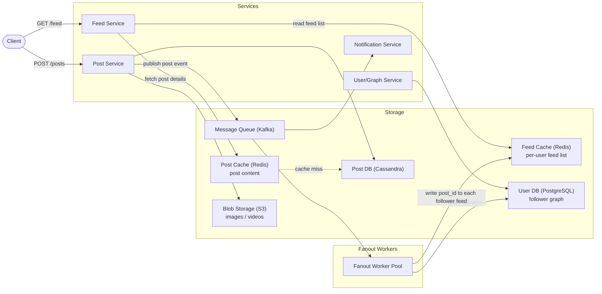
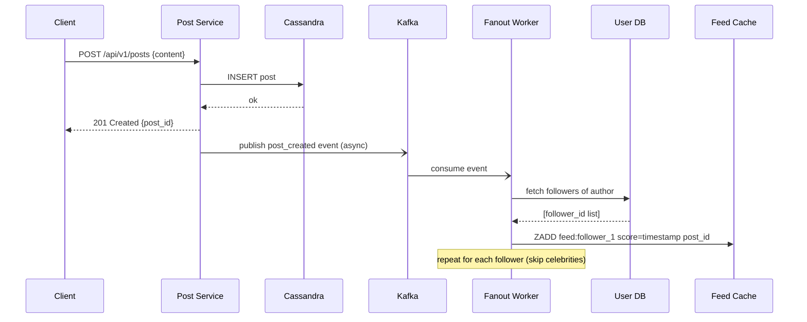
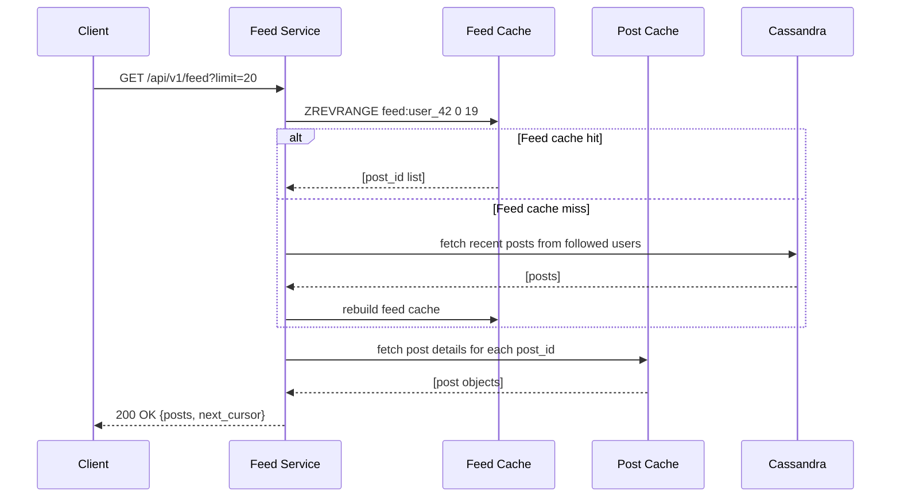

# 4. Design a News Feed (Twitter/Facebook)

## Requirements

### Functional
- Users can create posts (text, images, videos)
- Users can follow other users
- A user's feed shows posts from people they follow, sorted by recency or relevance
- Feed supports infinite scroll (pagination)
- Users can like and comment on posts

### Non-Functional
- **Read-heavy**: users scroll feeds far more than they post (100:1 read/write ratio)
- **Low latency**: feed load time < 200ms
- **Eventual consistency**: a post appearing in followers' feeds a few seconds late is acceptable
- **High availability**: feed must always be readable even during partial outages
- Scale: 500 million DAU, each user checks feed ~5 times/day, follows ~200 people on average

---

## Scale Estimation

```
Posts created:
  500M users × 0.1 posts/day = 50 million posts/day
  = ~580 posts/second (peak ~2,000/s)

Feed reads:
  500M users × 5 feed loads/day = 2.5 billion feed loads/day
  = ~29,000 feed reads/second (peak ~100,000/s)

Fanout writes (push model):
  580 posts/s × 200 avg followers = 116,000 feed writes/second

Storage:
  Post: ~1 KB (text + metadata)
  50M posts/day × 1 KB = 50 GB/day
  10 years: ~180 TB (text only; media stored separately in blob storage)
```

---

## High-Level Architecture



---

## Core Components

### 1. The Central Design Decision — Fanout Strategy

"Fanout" is the process of distributing a new post to all followers' feeds. There are three approaches:

**Fanout on Write (Push model)**
When a user posts, immediately write the post ID into every follower's feed cache.

```
User A (200 followers) posts → write post_id to 200 Redis lists → done
Follower loads feed → read their pre-built list from Redis → instant
```
- ✓ Feed reads are extremely fast (pre-computed)
- ✗ Write amplification: 1 post → N writes (N = follower count)
- ✗ Celebrities with 10M followers cause 10 million cache writes per post

---

**Fanout on Read (Pull model)**
When a user loads their feed, pull recent posts from every followed account and merge.

```
User loads feed → fetch latest posts from 200 followed users → merge & sort → return
```
- ✓ No write amplification — celebrities are free to post
- ✗ Feed reads are slow — fan out to hundreds of users on every load
- ✗ Hot users (celebrities) get read at massive scale on every follower's feed load

---

**Hybrid (recommended — used by Twitter/Facebook)**
- **Regular users** (< ~10K followers): fanout on write — pre-build their followers' feeds
- **Celebrity users** (> ~10K followers): fanout on read — fetch their posts at read time and merge with the pre-built feed

```
Feed load for User B who follows Alice (100 followers) and Beyoncé (50M followers):
  1. Read pre-built feed from Redis (contains Alice's posts already pushed)
  2. Fetch Beyoncé's recent posts from Post DB (pull, not pre-pushed)
  3. Merge and sort the two lists
  4. Return to client
```

This caps write amplification at ~10K writes per post while keeping feed reads fast for the majority of cases.

### 2. Feed Cache Structure (Redis)

Each user has a feed stored as a Redis **sorted set**:
- Member: `post_id`
- Score: `timestamp` (used for chronological ordering)
- Keep only the most recent ~500 post IDs per user (older posts fetched from DB on demand)

```
Key:   feed:{user_id}
Type:  Sorted Set
Score: Unix timestamp of post
Value: post_id

Example:
  feed:user_42 → [(post:9001, 1717286400), (post:8997, 1717286300), ...]
```

### 3. Post Storage (Cassandra)

Posts are write-heavy and read by `user_id` + time range — a perfect fit for Cassandra:

- Partition key: `author_id`
- Clustering key: `created_at DESC` (newest first)
- Enables efficient `SELECT * FROM posts WHERE author_id = ? LIMIT 20`
- Horizontally scalable — handles 50M posts/day without issue

### 4. Follower Graph (PostgreSQL)

The follower relationship is relational and needs ACID guarantees (follow/unfollow must be atomic):

```sql
CREATE TABLE follows (
    follower_id  BIGINT NOT NULL,
    followee_id  BIGINT NOT NULL,
    created_at   TIMESTAMP NOT NULL,
    PRIMARY KEY (follower_id, followee_id)
);

CREATE INDEX idx_followee ON follows(followee_id);  -- "who follows me?"
```

For social graphs at massive scale (billions of edges), this moves to a dedicated graph DB (Neo4j) or a sharded adjacency list — but PostgreSQL handles hundreds of millions of edges fine.

### 5. Feed Ranking

A pure chronological feed is simple. A ranked feed (like Facebook/Instagram) adds a **ranking score**:

```
score = recency_weight × time_decay
      + engagement_weight × (likes + comments + shares)
      + relationship_weight × closeness_to_author
```

The feed service computes or retrieves this score and re-orders the post list before returning it to the client. Ranking models are trained offline and served as lightweight scoring functions at read time.

---

## Data Model

### Posts Table (Cassandra)

```sql
CREATE TABLE posts (
    author_id   BIGINT,
    created_at  TIMESTAMP,
    post_id     UUID,
    content     TEXT,
    media_urls  LIST<TEXT>,
    like_count  COUNTER,
    PRIMARY KEY (author_id, created_at, post_id)
) WITH CLUSTERING ORDER BY (created_at DESC);
```

### Users Table (PostgreSQL)

```sql
CREATE TABLE users (
    id           BIGINT PRIMARY KEY,
    username     VARCHAR(50) UNIQUE NOT NULL,
    display_name VARCHAR(100),
    bio          TEXT,
    created_at   TIMESTAMP NOT NULL
);
```

### Follows Table (PostgreSQL)

```sql
CREATE TABLE follows (
    follower_id  BIGINT REFERENCES users(id),
    followee_id  BIGINT REFERENCES users(id),
    created_at   TIMESTAMP NOT NULL,
    PRIMARY KEY (follower_id, followee_id)
);
```

---

## API Design

### Create a post
```
POST /api/v1/posts

Request:
{
  "content": "Hello world!",
  "media_ids": ["img-abc123"]   // pre-uploaded to blob storage
}

Response 201 Created:
{
  "post_id": "post-9001",
  "author_id": "user-42",
  "created_at": "2026-06-06T10:00:00Z"
}
```

### Get news feed
```
GET /api/v1/feed?cursor=<last_post_id>&limit=20

Response 200 OK:
{
  "posts": [ { post objects... } ],
  "next_cursor": "post-8750"    // pass this on next scroll to get the next page
}
```

### Follow a user
```
POST /api/v1/users/{user_id}/follow

Response 200 OK
```

---

## Key Challenges & Solutions

### Challenge 1: Celebrity / Hotspot problem
- A celebrity posts → fanout on write would create millions of cache writes
- **Solution**: hybrid fanout — classify users by follower count; push for regular users, pull for celebrities at read time

### Challenge 2: Feed pagination (infinite scroll)
- Offset-based pagination (`LIMIT 20 OFFSET 100`) is slow — DB must scan and discard 100 rows
- New posts arriving between page loads cause items to shift — users see duplicates or miss posts
- **Solution**: cursor-based pagination — use the last seen `post_id` or `timestamp` as a cursor; next page fetches posts strictly older than the cursor

### Challenge 3: User goes offline then returns
- User hasn't opened the app in 2 weeks — their feed cache has expired
- **Solution**: on cache miss, fall back to fanout on read — fetch recent posts from followed accounts directly from Post DB, rebuild the feed, and warm the cache

### Challenge 4: Unfollow / delete post
- User unfollows someone → their old posts should disappear from the feed
- Post is deleted → must be removed from all followers' feed caches
- **Solution**: don't immediately clean up all feed caches (expensive); instead, at feed read time, filter out posts from unfollowed users and deleted posts by checking a small blocklist

### Challenge 5: Feed consistency across devices
- User likes a post on mobile, then sees the like count unchanged on web
- **Solution**: eventual consistency is acceptable here — like counts are approximate. Use Redis counters for fast reads; periodically persist accurate counts to the DB

---

## Trade-offs

| Decision | Choice | Why | Alternative |
|----------|--------|-----|-------------|
| Fanout strategy | Hybrid | Balances write amplification vs read latency | Pure push (breaks on celebrities) / Pure pull (slow feeds) |
| Feed storage | Redis sorted set | O(log n) inserts, fast range reads by score | Plain list (no ordering) |
| Post storage | Cassandra | High write throughput, time-range queries | PostgreSQL (harder to scale writes) |
| Pagination | Cursor-based | Stable across concurrent inserts | Offset-based (duplicates on concurrent writes) |
| Feed consistency | Eventual | Availability and speed matter more than perfect sync | Strong (unnecessary for social feeds) |
| CAP position | **AP** | Feed availability beats perfect consistency | CP |

---

## Sequence Diagrams

**POST — User creates a post**



**GET — User loads their feed**


