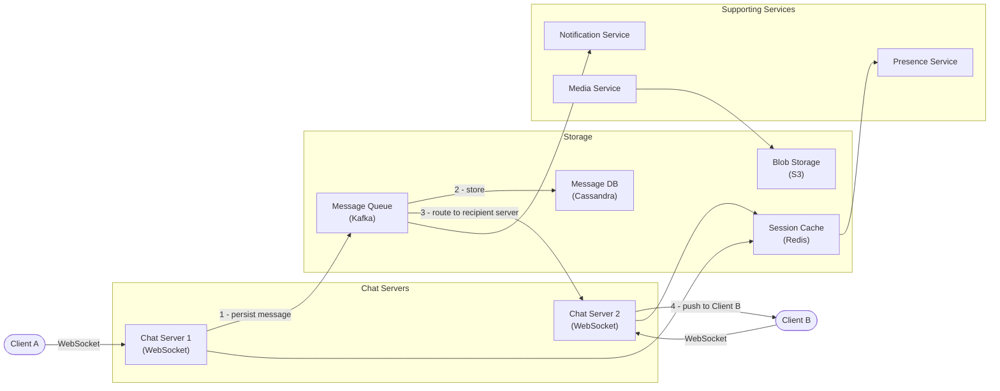
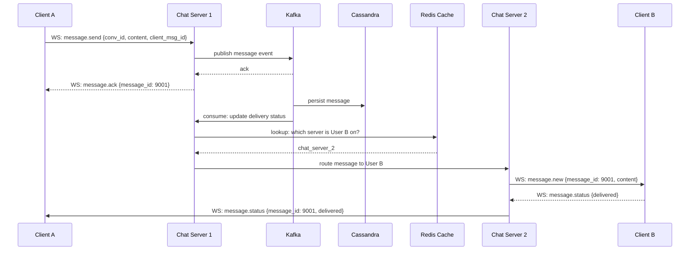
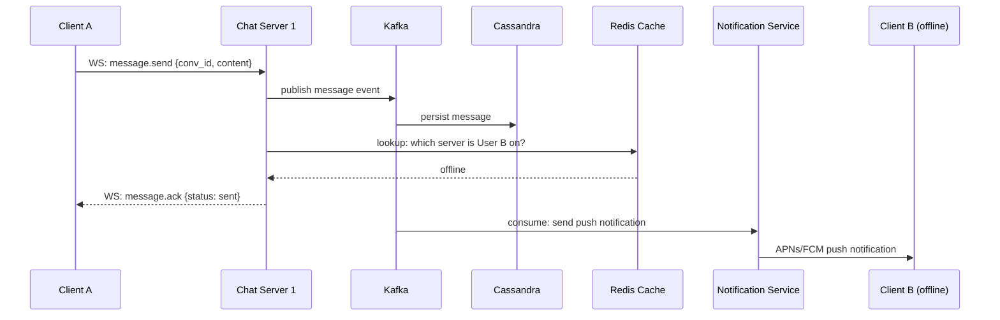

# 5. Design a Chat System (WhatsApp/Messenger)

## Requirements

### Functional
- One-on-one messaging between users
- Group messaging (up to 500 members per group)
- Message delivery status: sent → delivered → read receipts
- Online/offline presence indicator
- Push notifications for offline users
- Media sharing (images, videos, files)
- Message history — users can scroll back through past conversations

### Non-Functional
- **Low latency**: messages delivered in < 100ms on good network conditions
- **High availability**: chat must work even during partial outages
- **Durability**: messages must never be lost once sent
- **Eventual consistency**: read receipts and presence can lag by a few seconds
- Scale: 2 billion users (WhatsApp scale), 100 billion messages/day

---

## Scale Estimation

```
Messages:
  100 billion messages/day = ~1.16 million messages/second
  Average message size: ~100 bytes (text) + metadata
  Storage: 100B × 200 bytes = 20 TB/day
  With 5 years retention: ~36 PB (media stored separately in blob storage)

Connections:
  2B users, ~20% active concurrently = 400 million concurrent connections
  Each connection = 1 persistent WebSocket
  → Need tens of thousands of chat servers (10K connections per server)

Presence updates:
  400M active users sending heartbeat every 5s
  = 80 million presence updates/second → handled by Redis, not main DB
```

---

## High-Level Architecture



---

## Core Components

### 1. WebSocket — Why not regular HTTP?

HTTP is request/response — the client must ask before the server can respond. For chat, the server needs to **push** a message to the recipient unprompted.

Three options:

| Approach | How | Problem |
|----------|-----|---------|
| **Short polling** | Client asks "any new messages?" every second | Wastes bandwidth; 1-second delay |
| **Long polling** | Client asks; server holds connection open until a message arrives, then responds | Half-duplex; server must manage many held connections |
| **WebSocket** ✓ | Full-duplex persistent connection; either side can send at any time | Slightly more complex to manage at scale |

WebSocket is the standard choice for chat. One persistent TCP connection per client handles all messages in both directions.

### 2. Chat Server — Connection Management

Each chat server maintains WebSocket connections for a subset of users. When Client A sends a message to Client B:

1. Client A's chat server receives the message
2. Looks up which chat server Client B is connected to (via Redis session cache)
3. Routes the message to that server
4. That server pushes the message to Client B over their WebSocket

```
Redis session cache:
  user:B → chat_server_2   (Client B is connected to server 2)
  user:C → chat_server_1
  user:D → offline         (use push notification instead)
```

### 3. Message Queue (Kafka)

Messages flow through Kafka between the chat server and storage/delivery:
- **Durability**: message is persisted to Kafka before acknowledged to the sender — no message loss even if the chat server crashes mid-delivery
- **Decoupling**: Cassandra writes, push notifications, and analytics all consume from Kafka independently
- **Ordering**: Kafka partitioned by `conversation_id` guarantees messages within a conversation are processed in order

### 4. Message Storage (Cassandra)

Chat is append-only and queried by conversation + time range — a perfect fit for Cassandra:

```sql
CREATE TABLE messages (
    conversation_id  UUID,
    message_id       BIGINT,        -- sequence number, monotonically increasing per conversation
    sender_id        BIGINT,
    content          TEXT,
    media_url        TEXT,
    sent_at          TIMESTAMP,
    status           TINYINT,       -- 1=sent, 2=delivered, 3=read
    PRIMARY KEY (conversation_id, message_id)
) WITH CLUSTERING ORDER BY (message_id DESC);
```

- Partition key: `conversation_id` — all messages in a conversation are co-located on one node
- Clustering key: `message_id` — physically sorted so fetching recent messages is a fast sequential read

### 5. Message Ordering — Sequence Numbers

Timestamps alone are unreliable for message ordering (two messages can have the same millisecond timestamp; client clocks drift). Instead, use a **per-conversation sequence number**:

- Each conversation has a monotonically increasing counter
- Every new message gets `seq = seq + 1` for that conversation
- Clients display messages sorted by sequence number, not timestamp
- Use a distributed ID generator (see Q18) to generate these sequence numbers without a single-point bottleneck

### 6. Online Presence

Each active client sends a **heartbeat** to the presence service every 5 seconds. Redis stores presence with a TTL of 10 seconds:

```
SET presence:user_42 "online" EX 10
```

If the heartbeat stops (client disconnects or app is backgrounded), the key expires in 10 seconds and the user appears offline. This avoids expensive cleanup on disconnect events — TTL handles it automatically.

### 7. Push Notifications (Offline Users)

When the recipient is offline (not in the Redis session cache), the notification service sends a push notification via:
- **APNs** (Apple Push Notification Service) for iOS
- **FCM** (Firebase Cloud Messaging) for Android

Push notifications are best-effort — if they fail, the full message history is available when the user next opens the app.

### 8. Media Messages

Media is never sent through the chat server directly (too large, blocks the WebSocket):
1. Client uploads media directly to S3 via a pre-signed URL
2. Client sends a message containing the S3 URL (just a string, tiny)
3. Recipient's client downloads the media directly from S3

---

## Data Model

### Messages Table (Cassandra) — shown above

### Conversations Table (Cassandra)

```sql
CREATE TABLE conversations (
    conversation_id  UUID PRIMARY KEY,
    type             TINYINT,     -- 1=direct, 2=group
    name             TEXT,        -- null for direct messages
    created_at       TIMESTAMP,
    last_message_id  BIGINT
);
```

### Conversation Members Table (Cassandra)

```sql
CREATE TABLE conversation_members (
    conversation_id  UUID,
    user_id          BIGINT,
    joined_at        TIMESTAMP,
    last_read_seq    BIGINT,      -- highest sequence number this user has read
    PRIMARY KEY (conversation_id, user_id)
);
```

### Users Table (PostgreSQL)

```sql
CREATE TABLE users (
    id            BIGINT PRIMARY KEY,
    phone_number  VARCHAR(20) UNIQUE NOT NULL,
    display_name  VARCHAR(100),
    avatar_url    TEXT,
    created_at    TIMESTAMP
);
```

---

## API Design

Chat operates over **WebSocket** for real-time messaging and **REST** for history and setup.

### WebSocket events (JSON frames over WS connection)

```
Client → Server (send message):
{
  "type": "message.send",
  "conversation_id": "conv-abc",
  "content": "Hey!",
  "client_msg_id": "client-uuid-123"   // idempotency key to deduplicate retries
}

Server → Client (new message received):
{
  "type": "message.new",
  "conversation_id": "conv-abc",
  "message_id": 9001,
  "sender_id": "user-42",
  "content": "Hey!",
  "sent_at": "2026-06-08T10:00:00Z"
}

Server → Client (delivery status update):
{
  "type": "message.status",
  "message_id": 9001,
  "status": "delivered"
}
```

### REST endpoints

```
GET  /api/v1/conversations
     → list all conversations for the current user

GET  /api/v1/conversations/{id}/messages?before=<message_id>&limit=50
     → fetch message history (cursor-based)

POST /api/v1/conversations
     → create a new group conversation

POST /api/v1/media/upload-url
     → get a pre-signed S3 URL for direct media upload
```

---

## Key Challenges & Solutions

### Challenge 1: Message delivery guarantee — what if the recipient's server crashes?
- Message is published to Kafka *before* the sender is acknowledged
- Kafka retains the message until the consumer (chat server / notification service) confirms processing
- On server crash, Kafka redelivers to another consumer — no message loss
- Client uses `client_msg_id` (idempotency key) so duplicate deliveries are detected and discarded

### Challenge 2: Group message fanout
- Sending to a group of 500 members = 500 WebSocket pushes
- **Solution**: same hybrid fanout as the news feed — for small groups push to all members' chat servers; for very large groups (broadcast channels) use a pub/sub topic per group that chat servers subscribe to

### Challenge 3: Message ordering across devices
- User has chat open on phone and laptop simultaneously
- Both receive messages independently; order must be consistent
- **Solution**: sequence numbers per conversation are the source of truth; clients sort by `message_id`, not arrival time

### Challenge 4: Reconnection — catching up on missed messages
- Client loses network for 30 seconds then reconnects
- **Solution**: on reconnect, client sends the last `message_id` it received; server returns all messages with `message_id > last_seen` for each conversation

### Challenge 5: End-to-end encryption
- WhatsApp stores messages encrypted — even the server cannot read them
- Client generates key pairs; public keys stored on the server; messages encrypted with recipient's public key before sending
- Server routes ciphertext it cannot decrypt — only recipient's device can read it
- This means server-side message search is not possible with E2E encryption

---

## Trade-offs

| Decision | Choice | Why | Alternative |
|----------|--------|-----|-------------|
| Transport | WebSocket | Full-duplex, low overhead | Long polling (simpler but half-duplex) |
| Message broker | Kafka | Durable, ordered per partition, replayable | RabbitMQ (simpler, less durable) |
| Message storage | Cassandra | Append-heavy, time-range queries, high write throughput | PostgreSQL (harder to scale writes at this volume) |
| Ordering | Sequence numbers | Reliable, clock-independent | Timestamps (unreliable with clock skew) |
| Presence | Redis TTL | Self-cleaning, no explicit disconnect handling | DB rows (expensive to update at 80M/s) |
| Media | S3 direct upload | Chat server never handles large payloads | Through chat server (blocks WebSocket) |
| CAP position | **AP** | Availability is critical; slight eventual consistency on receipts is fine | CP (unnecessary strictness for chat) |

---

## Sequence Diagrams

**Sending a message (online recipient)**



**Sending a message (offline recipient)**


