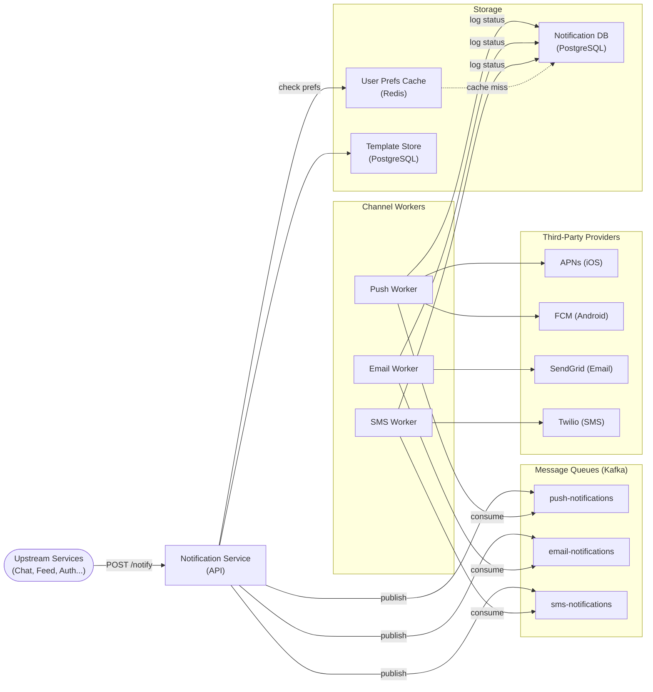
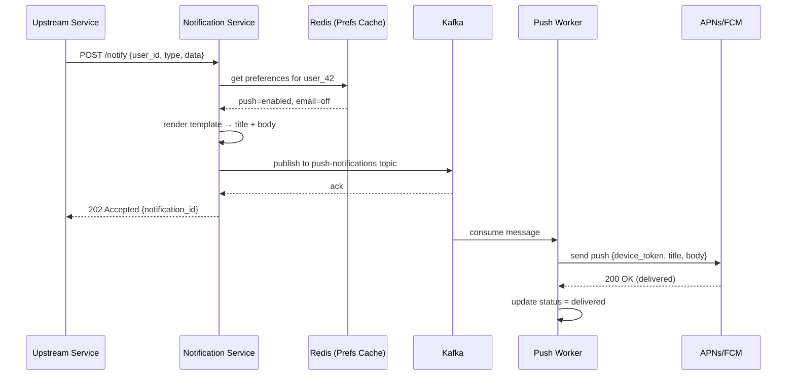
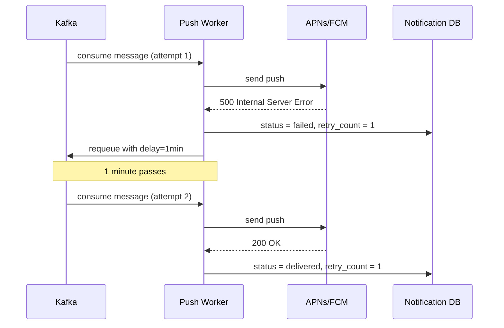

# 6. Design a Notification System

## Requirements

### Functional
- Send notifications through three channels: **push** (iOS/Android), **email**, and **SMS**
- Notifications are triggered by other services (e.g., chat system sends a "new message" notification)
- Users can configure preferences: opt out of a channel, set quiet hours, control notification types
- Support templated messages with dynamic content (e.g., "Alice sent you a message")
- Retry failed deliveries automatically
- Track delivery status: queued → sent → delivered → failed

### Non-Functional
- **High throughput**: handle bursts up to 1 million notifications/second
- **Eventual delivery**: a notification may be delayed by seconds under load but must not be lost
- **Fault tolerance**: provider outages should not lose notifications — retry until delivered or TTL expires
- **Scalability**: each channel scales independently
- Scale: ~1 billion notifications/day across all channels

---

## Scale Estimation

```
Total: 1 billion notifications/day = ~11,600/second (average)

Channel split (typical):
  Push notifications: 70% = 700M/day = ~8,100/s
  Email:             20% = 200M/day = ~2,300/s
  SMS:               10% = 100M/day = ~1,160/s

Peak burst: 10× average = ~115,000 notifications/second
  (e.g., a breaking news alert sent to 100M users simultaneously)

Storage:
  Notification record: ~500 bytes (metadata + content)
  1B/day × 500 bytes = 500 GB/day
  With 90-day retention: ~45 TB
  → Partition by date; archive or delete older records
```

---

## High-Level Architecture



---

## Core Components

### 1. Notification Service API — The Entry Point

Upstream services (chat, feed, payments, etc.) call this single API. It is responsible for:

1. **Validating** the request
2. **Resolving preferences** — is this user opted out? Do they have quiet hours set? What channels are enabled?
3. **Rendering the template** — substituting `{{sender_name}}` with "Alice"
4. **Publishing** one message per enabled channel to Kafka

This is a thin router — it does not deliver anything itself.

```csharp
// Upstream service sends one request:
POST /api/v1/notify
{
  "user_id": "user-42",
  "type": "chat.new_message",
  "template_id": "tmpl-chat-msg",
  "data": {
    "sender_name": "Alice",
    "preview": "Hey, are you free tomorrow?"
  },
  "idempotency_key": "msg-9001-notify"
}

// Notification service fans out to:
//   push-notifications queue  (if user has a device token)
//   email queue               (if user has email notifications on)
//   sms queue                 (if user has SMS on — usually off for chat)
```

### 2. User Preferences

Each user has per-channel, per-type preferences:

```
user_42 preferences:
  push:  enabled = true,  quiet_hours = 23:00–07:00
  email: enabled = true,  types = [security, billing]   (chat = off)
  sms:   enabled = false
```

Preferences are cached in Redis (TTL 5 minutes) because they're read on every notification but rarely change. On cache miss, read from PostgreSQL.

Critically: the preference check happens **before** publishing to the queue. There is no point enqueuing a push notification for a user who has push disabled.

### 3. Message Queue (Kafka) — Decoupling and Buffering

Kafka absorbs burst traffic. If a marketing campaign sends 100 million emails at once, the email workers drain the queue at their own pace — the API never blocks and no notification is dropped.

- One topic per channel: `push-notifications`, `email-notifications`, `sms-notifications`
- Partitioned by `user_id` — ensures notifications to the same user are processed in order
- Message TTL: 72 hours — if a notification isn't delivered within 3 days, it is stale and discarded

### 4. Channel Workers

Stateless worker processes that consume from Kafka and call the third-party provider API.

**Push Worker** (handles both iOS and Android):
```csharp
public async Task ProcessAsync(PushNotificationMessage msg)
{
    var token = await _deviceTokenService.GetTokenAsync(msg.UserId);
    if (token == null) return; // user logged out, no device registered

    var result = token.Platform == Platform.iOS
        ? await _apns.SendAsync(token.Value, msg.Title, msg.Body)
        : await _fcm.SendAsync(token.Value, msg.Title, msg.Body);

    await _db.UpdateStatusAsync(msg.NotificationId, result.Success
        ? NotificationStatus.Delivered
        : NotificationStatus.Failed);

    if (!result.Success && msg.RetryCount < 3)
        await _queue.RequeueWithDelayAsync(msg, delay: TimeSpan.FromMinutes(Math.Pow(2, msg.RetryCount)));
}
```

**Email Worker**: calls SendGrid (or AWS SES). HTML template already rendered by the API layer.

**SMS Worker**: calls Twilio. Short text only — trim to 160 characters.

### 5. Template System

Notification content is stored as templates, not hardcoded strings. This allows:
- Internationalisation (different template per locale)
- A/B testing notification copy
- Changing wording without deploying code

```
Template: tmpl-chat-msg
  title:   "New message from {{sender_name}}"
  body:    "{{preview}}"
  locale:  en-US
```

Templates are stored in PostgreSQL and cached aggressively (content rarely changes).

### 6. Retry and Dead-Letter Queue

Failures are expected — provider APIs go down, rate limits are hit.

**Retry strategy**: exponential backoff — retry after 1 min, then 2 min, then 4 min (up to 3 retries).

```
Attempt 1: fails → wait 1 min
Attempt 2: fails → wait 2 min
Attempt 3: fails → wait 4 min
Attempt 4: fails → move to dead-letter queue (DLQ)
```

**Dead-letter queue**: a Kafka topic `notifications-dlq` that captures permanently failed notifications. An alert fires when DLQ volume spikes — it usually means a provider is down, not a bug.

### 7. Device Token Management

Push notifications require a **device token** — a string the mobile OS issues that identifies the specific app install on the specific device.

```
iOS:  APNs issues a token when the app is first opened
Android: FCM issues a registration token

Tokens expire or become invalid when:
  - User uninstalls the app
  - User reinstalls the app (new token issued)
  - Token rotates automatically (iOS does this periodically)
```

**Invalid token handling**: when APNs or FCM returns a `BadDeviceToken` or `NotRegistered` error, the worker deletes that token from the database immediately — continuing to send to it is pointless.

---

## Data Model

### Notifications Table (PostgreSQL)

```sql
CREATE TABLE notifications (
    id               BIGINT PRIMARY KEY,
    user_id          BIGINT NOT NULL,
    type             VARCHAR(100) NOT NULL,       -- e.g., 'chat.new_message'
    channel          SMALLINT NOT NULL,           -- 1=push, 2=email, 3=sms
    status           SMALLINT NOT NULL DEFAULT 1, -- 1=queued, 2=sent, 3=delivered, 4=failed
    title            TEXT,
    body             TEXT NOT NULL,
    idempotency_key  VARCHAR(200) UNIQUE,
    created_at       TIMESTAMP NOT NULL,
    sent_at          TIMESTAMP,
    retry_count      SMALLINT DEFAULT 0
);

CREATE INDEX idx_notifications_user ON notifications(user_id, created_at DESC);
```

### User Preferences Table (PostgreSQL)

```sql
CREATE TABLE user_notification_prefs (
    user_id          BIGINT NOT NULL,
    channel          SMALLINT NOT NULL,           -- 1=push, 2=email, 3=sms
    enabled          BOOLEAN NOT NULL DEFAULT TRUE,
    quiet_start      TIME,                        -- e.g., 23:00
    quiet_end        TIME,                        -- e.g., 07:00
    allowed_types    TEXT[],                      -- null = all types allowed
    PRIMARY KEY (user_id, channel)
);
```

### Device Tokens Table (PostgreSQL)

```sql
CREATE TABLE device_tokens (
    id          BIGINT PRIMARY KEY,
    user_id     BIGINT NOT NULL,
    token       TEXT NOT NULL UNIQUE,
    platform    SMALLINT NOT NULL,   -- 1=iOS, 2=Android
    created_at  TIMESTAMP NOT NULL
);

CREATE INDEX idx_device_tokens_user ON device_tokens(user_id);
```

---

## API Design

### Send a notification (called by upstream services)

```
POST /api/v1/notify

Request:
{
  "user_id": "user-42",
  "type": "chat.new_message",
  "template_id": "tmpl-chat-msg",
  "data": { "sender_name": "Alice", "preview": "Hey!" },
  "idempotency_key": "msg-9001-notify"
}

Response 202 Accepted:
{
  "notification_id": "notif-8801",
  "queued_channels": ["push"]
}
```

202 (Accepted) not 200 (OK) — the notification is queued, not yet delivered.

### Update user preferences

```
PUT /api/v1/users/{user_id}/notification-prefs

Request:
{
  "channel": "push",
  "enabled": true,
  "quiet_start": "23:00",
  "quiet_end": "07:00"
}

Response 200 OK
```

### Get notification history

```
GET /api/v1/users/{user_id}/notifications?limit=20&cursor=<notification_id>

Response 200 OK:
{
  "notifications": [ { notification objects... } ],
  "next_cursor": "notif-8750"
}
```

---

## Key Challenges & Solutions

### Challenge 1: Duplicate notifications (idempotency)

An upstream service retries its `POST /notify` call after a timeout, not knowing if the first attempt succeeded.

**Solution**: the `idempotency_key` in the request maps to a `UNIQUE` constraint in the notifications table. The second identical request hits a duplicate key error and returns the original `notification_id` — no duplicate is sent.

```csharp
var existing = await _db.FindByIdempotencyKeyAsync(request.IdempotencyKey);
if (existing != null) return existing; // return the original, don't re-queue
```

### Challenge 2: Thundering herd — bulk campaigns

A product team sends a promotional email to 50 million users simultaneously.

**Solution**: the API publishes all 50M messages to the email Kafka topic — Kafka buffers them. The email workers drain at whatever rate SendGrid allows (e.g., 1M emails/hour). The system never crashes; it just takes longer. This is acceptable for marketing email; it is NOT acceptable for transactional alerts (password reset), which get a separate high-priority Kafka topic and dedicated workers.

### Challenge 3: Provider rate limits and outages

SendGrid limits sending rate. APNs occasionally has outages.

**Solution**:
- **Rate limiting**: workers check their own rate budget before calling the provider; they self-throttle rather than getting rejected
- **Circuit breaker**: if a provider returns errors for 60 seconds straight, open the circuit — stop calling it, alert on-call, drain the queue once the circuit closes
- **Provider fallback**: for SMS, have a secondary provider (e.g., AWS SNS as backup to Twilio) — the worker tries Twilio first, falls back to SNS on failure

### Challenge 4: Quiet hours

A notification is triggered at 2 AM for a user with quiet hours 23:00–07:00.

**Solution**: two options:
- **Discard**: drop the notification entirely (acceptable for low-priority types like marketing)
- **Delay**: schedule the notification to be sent at 07:00 when quiet hours end (required for important notifications like "your order shipped")

Implementation: when the preference check detects quiet hours, publish to a delayed Kafka topic with a `deliver_after` timestamp. A scheduler reads this topic and re-queues the message at the appropriate time.

### Challenge 5: Stale push tokens

Over time, device tokens accumulate for users who uninstalled the app or changed devices.

**Solution**: clean up on failure. When a push provider returns `BadDeviceToken` / `NotRegistered`, immediately delete that token from the database. Proactively, run a weekly job to remove tokens not used in 90 days. Keep a `last_used_at` column on the device_tokens table.

---

## Trade-offs

| Decision | Choice | Why | Alternative |
|----------|--------|-----|-------------|
| Queue | Kafka | Durable, replayable, handles burst | RabbitMQ (simpler, less durable at extreme scale) |
| Preference check | Before queuing | Avoid enqueuing messages no one wants | After queuing (wastes queue capacity) |
| Delivery semantics | At-least-once | Never lose a notification; handle duplicates with idempotency | Exactly-once (much harder, not worth it here) |
| Priority | Separate topics per priority | Transactional alerts never blocked by marketing burst | Single queue with priority field (complex to implement fairly) |
| Storage | PostgreSQL | Structured, ACID for preferences and token management | Cassandra (overkill; notification volume doesn't require it) |
| CAP position | **AP** | Notification delivery can be eventually consistent; a 5-second delay is fine | CP (unnecessary strictness for notifications) |

---

## Sequence Diagrams

**Sending a notification (happy path — push)**



**Retry on provider failure**


