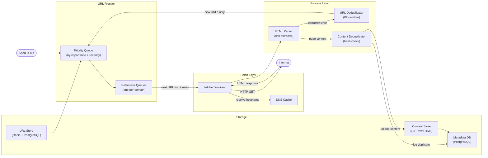
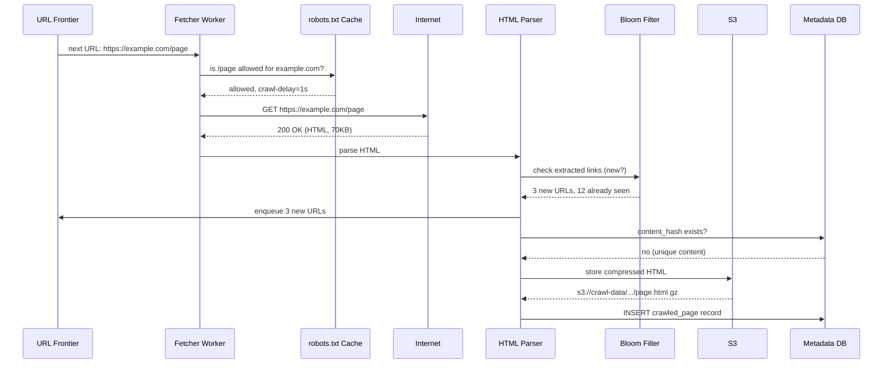
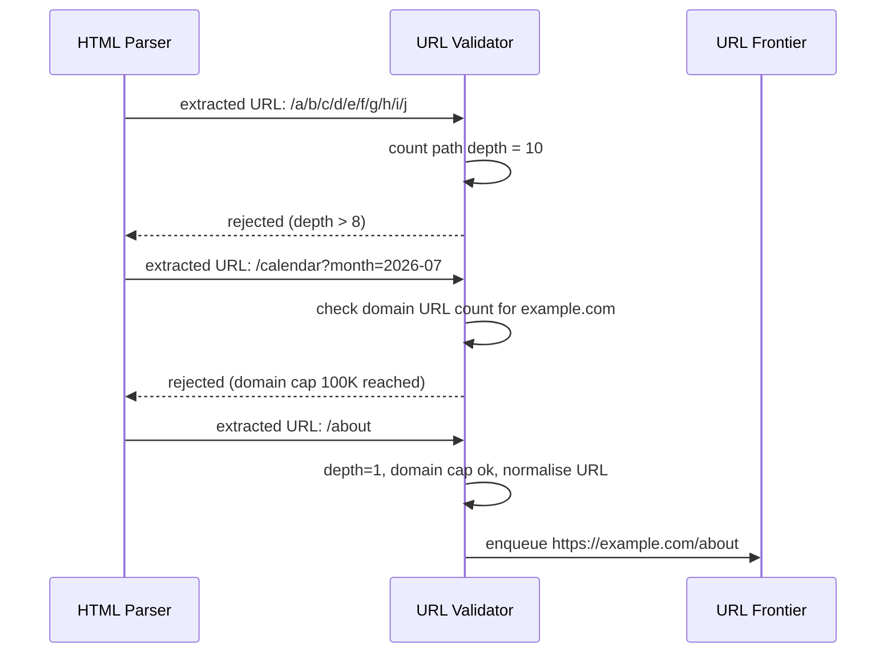

# 7. Design a Web Crawler

## Requirements

### Functional
- Crawl billions of web pages starting from a set of seed URLs
- Extract and follow links to discover new pages
- Store raw HTML content for downstream processing (search indexing, ML training, etc.)
- Re-crawl pages periodically to detect updates
- Respect `robots.txt` — honour crawl rules set by website owners
- Handle different content types: HTML, PDF, images (skip or process based on config)

### Non-Functional
- **Scale**: crawl ~5 billion pages, complete a full crawl within 30 days
- **Politeness**: never overwhelm any single server; rate limit per domain
- **Robustness**: survive failures — a crashed worker should not lose its assigned URLs
- **Extensibility**: easy to plug in new content processors (index, deduplicate, classify)
- **Deduplication**: avoid storing or re-crawling identical content

---

## Scale Estimation

```
Pages:
  ~5 billion pages on the crawlable web
  Target: full crawl in 30 days

Throughput:
  5B pages / (30 days × 86,400 s/day) = ~1,930 pages/second
  → Round up to 2,000 pages/second target

Bandwidth:
  Average HTML page: ~70 KB
  2,000 pages/s × 70 KB = 140 MB/s inbound network

Storage (raw HTML):
  5B pages × 70 KB = 350 TB for one full crawl snapshot
  With 3 monthly snapshots: ~1 PB
  → Object storage (S3), not a database

DNS lookups:
  Many pages share a domain → cache DNS aggressively
  Without caching: 2,000 DNS lookups/s → DNS servers throttle you
  With caching (1-hour TTL): vastly fewer actual lookups
```

---

## High-Level Architecture



---

## Core Components

### 1. URL Frontier — The Heart of the Crawler

The URL Frontier is a priority queue of URLs waiting to be crawled. It has two layers:

**Priority queue** — ranks URLs by importance so the crawler processes high-value pages first:
- New URLs from highly authoritative domains (e.g., wikipedia.org) → high priority
- Deep pages from unknown sites → low priority
- Freshness signal: pages known to update frequently get re-queued sooner

**Politeness queues** — one queue per domain:
```
Queue for nytimes.com:    [url1, url2, url3, ...]   → fetch max 1 request/second
Queue for wikipedia.org:  [url4, url5, ...]          → fetch max 1 request/second
Queue for bbc.co.uk:      [url6, ...]                → fetch max 1 request/second
```

A scheduler picks the next URL from each domain queue, enforcing the per-domain delay. This prevents hammering a single server even when crawling many pages from it.

The frontier is backed by Redis (hot/active URLs in memory) and PostgreSQL (the full URL set on disk — too large for memory).

### 2. robots.txt Handling

Before crawling any URL on a domain, the fetcher retrieves and parses `robots.txt`:

```
# https://example.com/robots.txt
User-agent: *
Disallow: /admin/
Disallow: /private/
Crawl-delay: 2          # wait 2 seconds between requests

User-agent: Googlebot
Allow: /                # Googlebot can crawl everything
```

The crawler must:
1. Fetch `robots.txt` once per domain and cache it (re-fetch every 24 hours)
2. Check every URL against the rules before fetching
3. Respect `Crawl-delay` — honour it as the minimum delay between requests to that domain
4. Never crawl `Disallow`ed paths

Ignoring `robots.txt` is both unethical and likely to get your crawler IP-blocked.

### 3. Fetcher Workers

Stateless worker processes that:
1. Pull the next URL from their assigned domain queue
2. Look up the cached DNS result (or resolve and cache it)
3. Make an HTTP GET request with a browser-like User-Agent header
4. Follow redirects (up to a max depth, e.g., 5 hops) and record the final URL
5. Hand the response to the parser

```csharp
public async Task<FetchResult> FetchAsync(string url)
{
    var uri = new Uri(url);
    if (!await _robotsCache.IsAllowedAsync(uri)) return FetchResult.Disallowed;

    await _politenessTracker.WaitForDomainSlotAsync(uri.Host);

    using var response = await _httpClient.GetAsync(url);
    var contentType = response.Content.Headers.ContentType?.MediaType;

    if (contentType != "text/html") return FetchResult.SkippedContentType(contentType);

    var html = await response.Content.ReadAsStringAsync();
    return FetchResult.Success(html, response.RequestMessage!.RequestUri!.ToString());
}
```

Workers are scaled horizontally. 2,000 pages/second requires ~200–500 workers (most time is spent waiting on network I/O, not CPU).

### 4. URL Deduplication — Bloom Filter

The crawler will discover the same URL from thousands of different pages. Re-crawling it each time wastes resources. The **Bloom filter** efficiently tracks which URLs have already been seen:

- A Bloom filter is a compact probabilistic data structure — it answers "have I seen this URL before?" in O(1) time with a small chance of false positives (1–2%)
- False positive = occasionally skip a URL we haven't actually crawled (acceptable; we'll encounter it again later)
- False negative = never miss a URL we should crawl (guaranteed — Bloom filters never have false negatives)
- 5 billion URLs at ~10 bytes each in a Bloom filter ≈ ~6 GB — fits in Redis

```
URL arrives: "https://example.com/about"
→ Hash the URL → check 3 bits in the Bloom filter
→ All 3 set? → "probably seen" → skip
→ Any bit unset? → "definitely new" → add to frontier
```

For URLs that pass the Bloom filter, do a secondary check against the URL store (PostgreSQL) to confirm it's truly new before queuing.

### 5. Content Deduplication

Different URLs often serve identical content:
- `http://example.com` and `https://www.example.com` (same page, different protocol/subdomain)
- Syndicated articles copied across dozens of news sites
- Printer-friendly versions of pages

**Solution**: compute a **SimHash** (or MD5) of the page content. Store the hash in the metadata DB. Before storing a new page, check if its hash already exists.

```
Page content → MD5 hash → "a3f9c2..."
Check DB: SELECT id FROM pages WHERE content_hash = 'a3f9c2...'
→ Found? → duplicate, record the mapping but don't store again
→ Not found? → store in S3, save hash to DB
```

SimHash is preferred over MD5 for near-duplicate detection — it can catch pages that are 95% identical (same article, different ads/nav).

### 6. Content Storage

Raw HTML is stored in S3 (object storage), not a database — pages average 70 KB and you have 5 billion of them:

```
S3 key structure:
  crawl-data/2026/06/13/{domain}/{url-hash}.html.gz

  e.g.: crawl-data/2026/06/13/wikipedia.org/a3f9c2b1.html.gz
```

Gzip compression reduces storage by ~70% (HTML compresses very well).

The metadata DB (PostgreSQL) stores the index — URL, crawl timestamp, content hash, HTTP status, redirect chain — without the raw content:

```sql
CREATE TABLE crawled_pages (
    id              BIGINT PRIMARY KEY,
    url             TEXT NOT NULL UNIQUE,
    final_url       TEXT,                    -- after redirects
    domain          VARCHAR(255) NOT NULL,
    crawled_at      TIMESTAMP NOT NULL,
    http_status     SMALLINT,
    content_hash    VARCHAR(64),
    content_type    VARCHAR(100),
    s3_path         TEXT,                    -- null if duplicate
    next_crawl_at   TIMESTAMP               -- for recrawl scheduling
);
```

---

## Data Model

### URL Queue Table (PostgreSQL — backing store for frontier)

```sql
CREATE TABLE url_queue (
    id          BIGINT PRIMARY KEY,
    url         TEXT NOT NULL UNIQUE,
    domain      VARCHAR(255) NOT NULL,
    priority    SMALLINT DEFAULT 5,          -- 1 (low) to 10 (high)
    status      SMALLINT DEFAULT 1,          -- 1=pending, 2=in_progress, 3=done, 4=failed
    added_at    TIMESTAMP NOT NULL,
    scheduled_at TIMESTAMP NOT NULL          -- when to crawl (respects recrawl schedule)
);

CREATE INDEX idx_url_queue_domain ON url_queue(domain, scheduled_at);
CREATE INDEX idx_url_queue_priority ON url_queue(priority DESC, scheduled_at);
```

### Domain Metadata Table (PostgreSQL)

```sql
CREATE TABLE domains (
    domain          VARCHAR(255) PRIMARY KEY,
    robots_txt      TEXT,
    robots_fetched_at TIMESTAMP,
    crawl_delay_ms  INT DEFAULT 1000,        -- milliseconds between requests
    is_blocked      BOOLEAN DEFAULT FALSE
);
```

---

## API Design

A web crawler is an internal system — no public-facing API. Internal control endpoints:

```
POST /api/v1/seeds
     → submit new seed URLs to the frontier
     Body: { "urls": ["https://example.com", ...] }

GET  /api/v1/stats
     → crawl progress: pages crawled, queue depth, errors/s, pages/s

POST /api/v1/domains/{domain}/block
     → block a domain from being crawled (spam, malicious sites)

POST /api/v1/recrawl
     → force re-crawl of specific URLs or domains
     Body: { "domain": "nytimes.com" }
```

---

## Key Challenges & Solutions

### Challenge 1: Spider traps

Some websites generate infinite URLs:
```
https://example.com/calendar?month=2026-01
https://example.com/calendar?month=2026-02
https://example.com/calendar?month=2026-03
... (infinite)

https://example.com/a/b/c/d/e/f/g/h/... (infinite path depth)
```

**Solutions**:
- **URL depth limit**: skip URLs with more than N path segments (e.g., 8)
- **Per-domain URL cap**: don't crawl more than 100,000 URLs from a single domain
- **Query parameter normalisation**: `?id=1&sort=asc` and `?sort=asc&id=1` are the same URL — canonicalise before deduplication
- **Cyclic redirect detection**: track redirect chains; abort if the same URL appears twice in a chain

### Challenge 2: Dynamic content (JavaScript-rendered pages)

Many modern sites render content via JavaScript — a plain HTTP GET returns an empty shell:
```html
<div id="app"></div>   <!-- content loaded by React/Vue after JS executes -->
```

**Solution**: use a headless browser (Playwright, Puppeteer) for a subset of URLs where the HTML GET returns very little content. This is expensive (~10× slower than a plain fetch), so reserve it for high-priority domains. Plain HTTP fetching covers ~80% of the web.

### Challenge 3: URL normalisation

The same page can appear under many different URLs:
```
http://example.com/page
https://example.com/page        ← different protocol
https://www.example.com/page    ← different subdomain
https://example.com/page?ref=twitter  ← tracking parameter
https://example.com/page#section1    ← fragment (ignored by servers)
```

**Solution**: canonicalise all URLs before deduplication:
1. Lowercase the scheme and hostname
2. Remove default ports (`:80`, `:443`)
3. Remove known tracking parameters (`utm_source`, `ref`, `fbclid`)
4. Remove fragments (`#...`)
5. Resolve relative URLs to absolute

### Challenge 4: Recrawl scheduling

Pages change at different frequencies — a news homepage changes every few minutes; a Wikipedia article about ancient history might not change for years.

**Solution**: adaptive recrawl scheduling:
```
High-frequency pages (news, sports scores): recrawl every 1–6 hours
Medium-frequency (blog posts, product pages): recrawl every 1–7 days
Low-frequency (static docs, archives): recrawl every 30–90 days
```

Calculate change frequency from historical crawls: if a page's content hash changed in 3 of the last 5 crawls, it's high-frequency. Update `next_crawl_at` accordingly.

### Challenge 5: Distributed coordination — avoiding duplicate work

With 200 fetcher workers, two workers might pick up the same URL simultaneously.

**Solution**: use Redis atomic operations to "claim" URLs:
```csharp
// Atomic check-and-claim using Redis SET NX:
var claimed = await _redis.StringSetAsync(
    $"crawl:lock:{urlHash}",
    workerId,
    TimeSpan.FromMinutes(10),
    When.NotExists);

if (!claimed) return; // another worker already claimed this URL
```

If a worker crashes mid-crawl, the lock expires after 10 minutes and another worker can pick it up.

---

## Trade-offs

| Decision | Choice | Why | Alternative |
|----------|--------|-----|-------------|
| URL dedup | Bloom filter | O(1), ~6 GB for 5B URLs | Hash set in Redis (much more memory) |
| Content dedup | SimHash | Detects near-duplicates (95% similar) | MD5 (exact match only) |
| Content storage | S3 + metadata in DB | 350 TB won't fit in any DB | DB only (too expensive, too slow) |
| Frontier backing | Redis + PostgreSQL | Hot URLs in memory, full set on disk | Pure Redis (too expensive at 5B URLs) |
| JS rendering | Headless browser for subset | Plain HTTP is 10× faster; most pages don't need it | Always headless (too slow, too expensive) |
| CAP position | **AP** | Missing a URL or duplicate-crawling occasionally is fine | CP (unnecessary; crawlers tolerate eventual consistency) |

---

## Sequence Diagrams

**Crawling a new URL (happy path)**



**Handling a spider trap**


