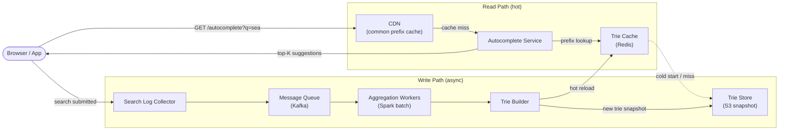
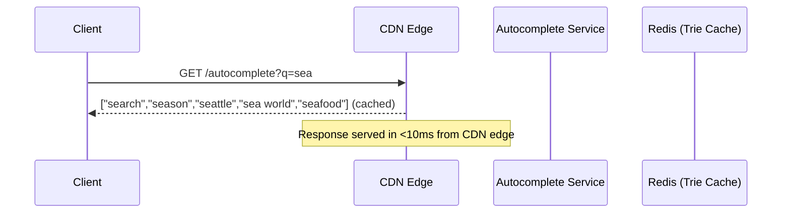
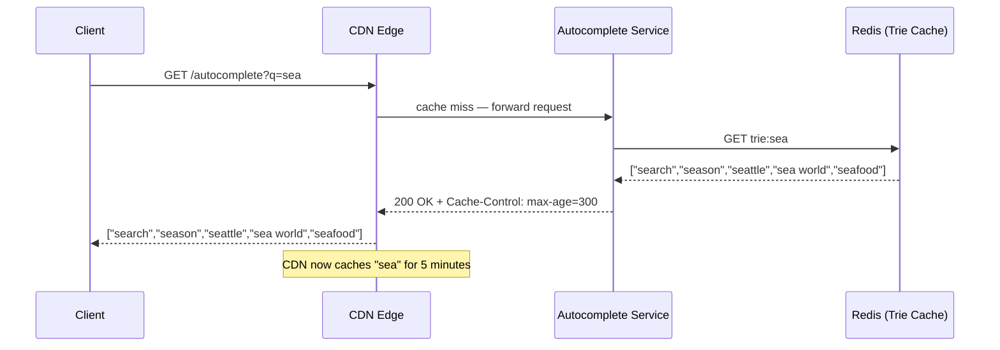
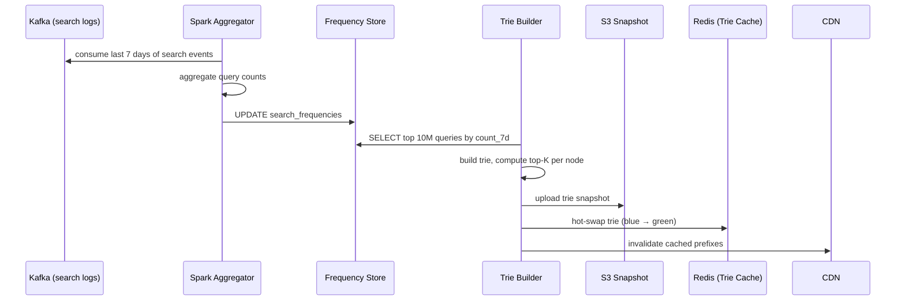

# 8. Design Search Autocomplete / Typeahead

## Requirements

### Functional
- As a user types, return the top 5–10 suggestions that match the typed prefix
- Suggestions are ranked by popularity (global search frequency)
- Results must update with every keystroke
- Support for returning results in < 100ms
- Data pipeline updates suggestions based on recent search trends (near real-time, not instant)

### Non-Functional
- **Low latency**: p99 < 100ms per suggestion request (ideally < 50ms)
- **High availability**: autocomplete must work even during partial outages
- **Read-heavy**: vastly more reads (keystrokes) than writes (trie updates)
- **Eventual consistency**: suggestion rankings update with a small lag (minutes to hours) — a trending term appearing with a slight delay is acceptable
- Scale: Google-scale — ~10 billion searches/day, autocomplete fires on every keystroke

---

## Scale Estimation

```
Search queries:
  10 billion searches/day = ~115,000 searches/second

Autocomplete requests:
  Users type ~7 characters on average before selecting a suggestion
  → 7 autocomplete requests per search query
  → 115,000 × 7 = ~800,000 autocomplete requests/second

Response size:
  5 suggestions × ~30 bytes each = ~150 bytes per response
  → 800,000 × 150 bytes = 120 MB/s outbound bandwidth

Trie size:
  ~10 million unique popular search terms
  Average term: 20 characters
  With frequency + top-K metadata per node: ~10–20 GB
  → Fits in Redis on a single large node; sharding needed for redundancy
```

---

## High-Level Architecture



---

## Core Components

### 1. Trie — The Core Data Structure

A **trie** (prefix tree) stores strings character by character. Each node represents one character; the path from root to a node spells out a prefix.

```
Trie containing: "apple", "app", "application", "apply"

root
 └─ a
     └─ p
         └─ p  [end: "app", freq=9500]
             ├─ l
             │   ├─ e  [end: "apple", freq=4200]
             │   ├─ i
             │   │   └─ c
             │   │       └─ a
             │   │           └─ t
             │   │               └─ i
             │   │                   └─ o
             │   │                       └─ n  [end: "application", freq=8100]
             │   └─ y  [end: "apply", freq=3300]
```

When the user types "app", the service:
1. Traverses the trie to the node at "app"
2. Collects all words reachable from that node
3. Returns the top 5 by frequency

Naive traversal from "app" is O(total words with that prefix) — too slow for deep tries.

### 2. Top-K Cache at Each Node — The Key Optimisation

Instead of traversing the subtree on every request, **store the top-K suggestions directly at each node**:

```
Node "a":   top5 = ["amazon", "apple", "application", "app", "android"]
Node "ap":  top5 = ["apple", "application", "app", "apply", "apache"]
Node "app": top5 = ["application", "app", "apple", "apply", "appstore"]
```

A lookup is now O(1) — navigate to the node for the typed prefix, read the cached top-K list. No subtree traversal needed.

Trade-off: updating a term's frequency means updating the top-K list at every ancestor node up to the root. For "apple" (5 characters), that's 5 node updates. This is why trie updates are done in batch, not in real time.

### 3. Read Path — How Suggestions Are Served

```
User types "sea":

1. Client sends: GET /autocomplete?q=sea
2. Check CDN cache: is "sea" cached? → yes → return immediately (< 10ms)
   No? → forward to Autocomplete Service

3. Autocomplete Service: lookup Redis key "trie:sea"
   → Redis returns: ["search", "season", "seattle", "sea world", "seafood"]

4. Return to client → client displays dropdown
```

The CDN caches responses for the most common prefixes. Common 2–3 character prefixes like "se", "sea", "the" are queried millions of times per second — caching them at the CDN edge saves the vast majority of backend calls.

**CDN cache TTL**: 5–10 minutes. Slightly stale suggestions are acceptable.

### 4. Data Collection Pipeline — Keeping Suggestions Fresh

Suggestions must reflect current trends (a viral event makes "taylor swift concert" suddenly popular). The pipeline:

```
Step 1 — Log collection:
  Every submitted search query is logged to Kafka:
  { "query": "seattle coffee", "user_id": "u-42", "timestamp": "2026-06-13T10:00:00Z" }

Step 2 — Aggregation (Spark batch job, runs hourly):
  Read Kafka logs from the last 7 days
  Count frequency of each query: "seattle coffee" → 48,200 searches
  Merge with historical counts (decay older data)

Step 3 — Trie rebuild:
  Load top ~10M queries by frequency
  Build a new trie in memory with top-K precomputed at each node
  Serialize the trie → upload snapshot to S3

Step 4 — Hot reload:
  Autocomplete Service workers detect the new snapshot
  Load the new trie into Redis (replace old one atomically)
  CDN cache invalidated for affected prefixes
```

Full rebuild runs hourly. Real-time trends (breaking news) appear in suggestions within ~1 hour — acceptable for most use cases.

### 5. Trie Storage in Redis

The trie is stored in Redis as a hash map — each prefix maps to its top-K list:

```
Redis key:   "trie:sea"
Redis value: ["search", "season", "seattle", "sea world", "seafood"]

Redis key:   "trie:se"
Redis value: ["search", "season", "seattle", "service", "senior"]

Redis key:   "trie:s"
Redis value: ["search", "sports", "shopping", "samsung", "spotify"]
```

This is a flat representation of the trie — no actual tree structure in Redis, just one key per prefix. The trie structure only exists during the build phase (in the Trie Builder) to compute the top-K values for each prefix.

### 6. Distributed Trie — Scaling Beyond One Node

10–20 GB of trie data can fit on one Redis node, but for reliability and throughput it is sharded:

**Shard by first character:**
```
Shard 1: prefixes starting with a–f   (keys: "trie:a", "trie:ab", "trie:app", ...)
Shard 2: prefixes starting with g–n
Shard 3: prefixes starting with o–z
Shard 4: prefixes starting with digits/special chars
```

The Autocomplete Service routes each query to the correct shard based on the first character. Each shard has replicas for read throughput and failover.

---

## Data Model

### Trie Snapshot (S3)

```
s3://autocomplete-data/trie-snapshots/2026-06-13T10:00:00Z.bin

Format: serialised dictionary
  {
    "a":    ["amazon", "apple", "application", "app", "android"],
    "ap":   ["apple", "application", "app", "apply", "apache"],
    "app":  ["application", "app", "apple", "apply", "appstore"],
    ...
    (one entry per unique prefix, ~10M entries total)
  }
```

### Search Frequency Store (PostgreSQL — source of truth for aggregated counts)

```sql
CREATE TABLE search_frequencies (
    query       TEXT PRIMARY KEY,
    count_7d    BIGINT NOT NULL,    -- searches in last 7 days
    count_30d   BIGINT NOT NULL,    -- searches in last 30 days
    updated_at  TIMESTAMP NOT NULL
);
```

### Search Log (Kafka → data lake, not queried directly)

```
Topic: search-events
Schema:
  {
    "query":     "seattle coffee",
    "user_id":   "u-42",
    "session_id": "sess-xyz",
    "timestamp": "2026-06-13T10:00:00Z",
    "selected_suggestion": "seattle coffee shops"  // null if user typed full query
  }
```

---

## API Design

### Get autocomplete suggestions

```
GET /api/v1/autocomplete?q=sea&limit=5

Response 200 OK:
{
  "query": "sea",
  "suggestions": [
    "search",
    "season",
    "seattle",
    "sea world",
    "seafood"
  ]
}
```

No authentication required — this is a public, cacheable endpoint.
Response includes `Cache-Control: public, max-age=300` (5-minute CDN cache).

### Submit a search query (triggers logging)

```
POST /api/v1/search

Request:
{
  "query": "seattle coffee shops",
  "selected_from_autocomplete": true,
  "suggestion_rank": 2
}

Response 200 OK:
{
  "results": [ ... ]
}
```

The search service logs this event to Kafka asynchronously — the user gets their results immediately without waiting for logging.

---

## Key Challenges & Solutions

### Challenge 1: Trie too large for one machine

10–20 GB fits on one Redis instance, but at 800K requests/second, one node cannot serve all reads.

**Solution**: read replicas. The trie is read-only between updates — every Redis replica serves reads independently. 10 replicas handle 10× the read throughput. The Autocomplete Service load-balances across replicas using consistent hashing on the prefix.

### Challenge 2: Updating the trie without downtime

Rebuilding and reloading the trie takes minutes. You can't block reads during the rebuild.

**Solution**: **blue-green trie swap**:
- Current trie is "blue" — serving all traffic
- Trie Builder builds a new "green" trie in the background
- Once ready, swap the Redis pointer atomically: all subsequent reads go to "green"
- "Blue" stays in memory until all in-flight requests complete, then deallocated

No downtime, no degraded suggestions during the swap.

### Challenge 3: Personalisation

Global frequency rankings don't account for individual preferences. A user in Seattle who types "se" should see "seattle" higher than a user in London.

**Solution**: two-layer ranking:
1. **Global trie** — base ranking by global frequency (described above)
2. **Personalisation re-ranking** — at query time, boost suggestions matching the user's recent search history, location, and language

The re-ranking is applied on the Autocomplete Service after fetching the global top-K from Redis. It's a lightweight in-memory operation (sorting 10 items) — adds < 1ms.

### Challenge 4: Special characters and multiple languages

Different languages have different character sets. A trie sharded by first letter doesn't work for Chinese, Arabic, or Japanese.

**Solution**:
- Normalise all queries: lowercase, strip diacritics (é → e), Unicode NFC normalisation
- For CJK languages (Chinese, Japanese, Korean): shard by language code, not character
- Run separate trie instances per language/region (en-US, zh-CN, ja-JP, etc.)

### Challenge 5: Preventing abuse / low-quality suggestions

Bad actors submit spam queries to boost certain terms into autocomplete.

**Solution**:
- Filter out queries from bot-like sessions (high-frequency, no click-through)
- Require a minimum frequency threshold to appear in suggestions (e.g., 1,000 searches in 7 days)
- Manual blocklist for harmful or inappropriate terms
- Rate-limit the autocomplete endpoint per IP to prevent enumeration attacks

---

## Trade-offs

| Decision | Choice | Why | Alternative |
|----------|--------|-----|-------------|
| Data structure | Trie with top-K per node | O(1) lookup at query time | Raw trie traversal (O(n) — too slow) |
| Update frequency | Hourly batch rebuild | Simple, consistent, handles 99% of use cases | Real-time updates (complex, requires atomic node updates across distributed trie) |
| Storage | Flat Redis hash (prefix → top-K) | Simple to load, fast lookup | Actual tree in Redis (complex pointer management) |
| Caching | CDN for common prefixes | Eliminates most backend calls | No CDN (backend would need 10× capacity) |
| Consistency | Eventual (minutes lag) | Reads are vastly more important than freshness | Strong (unnecessary; slightly stale suggestions are fine) |
| CAP position | **AP** | Availability is critical; returning slightly old suggestions beats returning nothing | CP |

---

## Sequence Diagrams

**User types "sea" — cache hit**



**User types "sea" — cache miss + trie lookup**



**Trie rebuild pipeline (runs hourly)**


