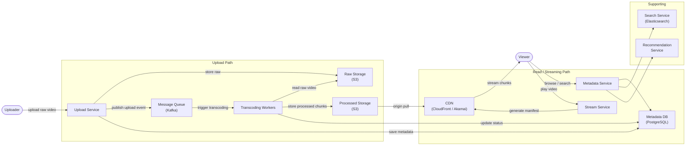
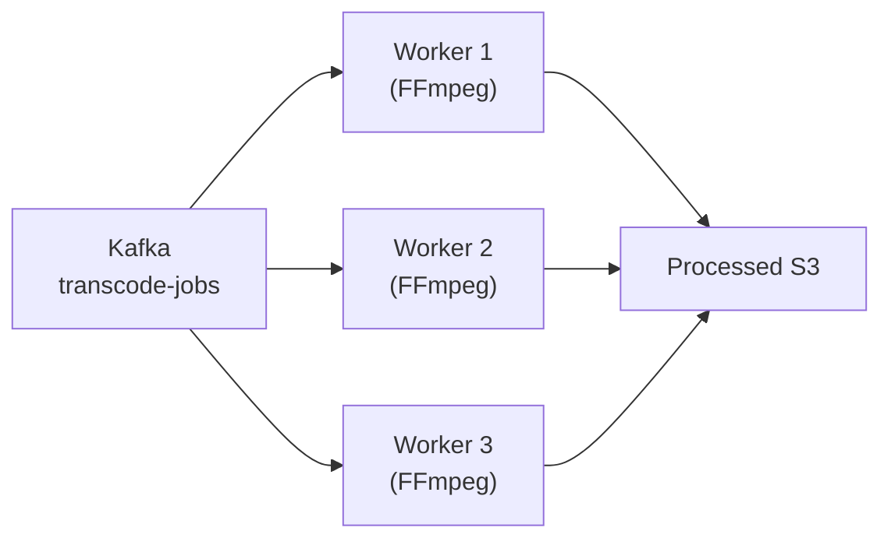
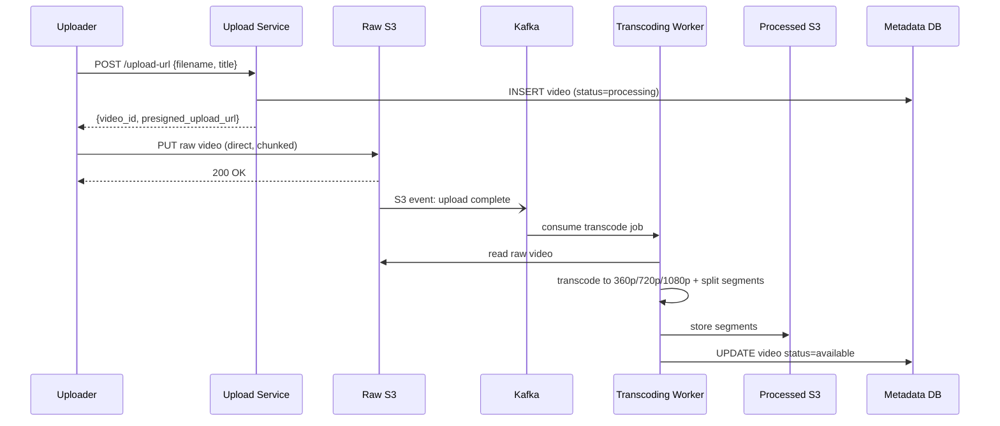
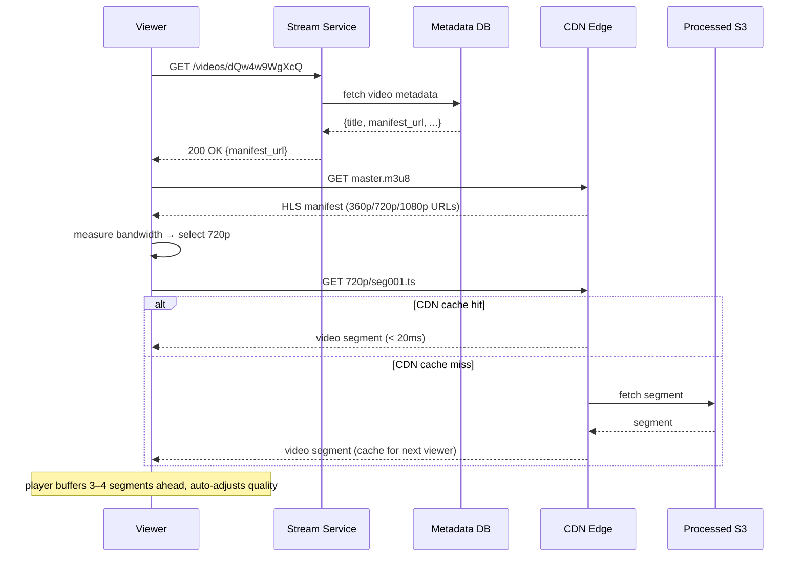

# 9. Design a Video Streaming Platform (YouTube / Netflix)

## Requirements

### Functional
- Users can upload videos
- Uploaded videos are processed into multiple resolutions (360p, 720p, 1080p, 4K)
- Users can stream videos with adaptive quality (auto-adjusts to network speed)
- Support video metadata: title, description, tags, thumbnail
- Basic social features: likes, comments, view count
- Search videos by title/tag
- Video recommendations on the home page

### Non-Functional
- **High availability**: video playback must work even during partial outages
- **Low latency start**: video should begin playing within 2 seconds of pressing play
- **Smooth playback**: no buffering under normal network conditions
- **Scalability**: support millions of concurrent viewers
- **Durability**: uploaded videos must never be lost
- Scale: YouTube — 500 hours of video uploaded per minute, 1 billion hours watched per day

---

## Scale Estimation

```
Uploads:
  500 hours of video/minute = 8.3 hours/second
  Raw video: ~1 GB per minute of 1080p = ~500 GB/minute uploaded
  After transcoding to 5 formats: ~3–4× storage = ~1.5 TB/minute stored
  Per year: ~800 PB of new video storage

Views:
  1 billion hours watched/day = ~41.7 million hours/second
  Peak: 3–5× average = ~100–200 million concurrent viewers
  Average video bitrate (720p): ~2.5 Mbps
  Total outbound bandwidth: 200M viewers × 2.5 Mbps = 500 Tbps
  → This is why CDN is non-negotiable — no single data centre serves 500 Tbps

Upload-to-view ratio:
  ~500 hours uploaded per minute vs billions watched
  → Heavily read-dominant; optimise the read/streaming path above all else
```

---

## High-Level Architecture



---

## Core Components

### 1. Video Upload

The upload flow is separate from the streaming flow — raw video never touches the streaming path.

```
Uploader → Upload Service → Raw S3 bucket → Kafka event → Transcoding pipeline
```

For large files (a 2-hour movie = ~8 GB), use **chunked upload**:
1. Client splits the video into 5 MB chunks
2. Uploads each chunk independently (retryable, parallelisable)
3. Upload Service reassembles chunks in S3 once all parts arrive (S3 Multipart Upload)

```csharp
// Client-side chunked upload (simplified):
var chunkSize = 5 * 1024 * 1024; // 5 MB
var chunks = SplitFile(videoFile, chunkSize);
var uploadId = await _api.InitiateMultipartUploadAsync(videoId);

var etags = await Task.WhenAll(chunks.Select((chunk, i) =>
    _api.UploadPartAsync(uploadId, partNumber: i + 1, data: chunk)));

await _api.CompleteMultipartUploadAsync(uploadId, etags);
```

### 2. Transcoding Pipeline — The Most Complex Part

Raw video from a camera or phone is in various formats (MOV, AVI, MKV) at various resolutions. Transcoding converts it to standardised formats suitable for web streaming.

**What transcoding produces:**

| Output | Resolution | Bitrate | Use case |
|--------|-----------|---------|----------|
| 360p | 640×360 | 0.5 Mbps | Slow mobile connections |
| 480p | 854×480 | 1 Mbps | Standard mobile |
| 720p | 1280×720 | 2.5 Mbps | Default desktop |
| 1080p | 1920×1080 | 5 Mbps | HD desktop |
| 4K | 3840×2160 | 15 Mbps | Premium / TV |

Each resolution is encoded in H.264 (wide compatibility) and optionally H.265/VP9 (better compression, newer devices).

Each output is split into **2–10 second segments** (chunks):
```
video_abc_720p_seg001.ts
video_abc_720p_seg002.ts
video_abc_720p_seg003.ts
...
```

**Transcoding is CPU-intensive and slow** (a 1-hour video takes 30–60 minutes to transcode at all resolutions). This is handled by a pool of dedicated worker machines, not the upload server:



Workers scale horizontally — a popular platform runs hundreds of transcoding workers. On upload, the video is marked "processing"; once all resolutions are complete, it becomes "available."

### 3. Adaptive Bitrate Streaming (ABR)

When you watch YouTube and quality automatically drops when your connection slows, that is **adaptive bitrate streaming**. The two dominant protocols are:

- **HLS** (HTTP Live Streaming) — Apple's standard, used by YouTube and most mobile
- **DASH** (Dynamic Adaptive Streaming over HTTP) — used by Netflix

Both work the same way: a **manifest file** (`.m3u8` for HLS) lists all available quality levels and the URLs of their segments:

```
# video_abc_master.m3u8 (master manifest)
#EXTM3U
#EXT-X-STREAM-INF:BANDWIDTH=500000,RESOLUTION=640x360
/videos/abc/360p/playlist.m3u8
#EXT-X-STREAM-INF:BANDWIDTH=2500000,RESOLUTION=1280x720
/videos/abc/720p/playlist.m3u8
#EXT-X-STREAM-INF:BANDWIDTH=5000000,RESOLUTION=1920x1080
/videos/abc/1080p/playlist.m3u8
```

The player downloads the master manifest → picks a quality level → downloads that quality's segment playlist → streams segments one at a time. Every few segments, the player measures download speed and switches to a higher or lower quality level.

```
Player logic (simplified):
  measured_bandwidth = 3.2 Mbps
  → 720p requires 2.5 Mbps → fits with 28% headroom → stay at 720p
  
  (30 seconds later, network slows)
  measured_bandwidth = 0.8 Mbps
  → 720p requires 2.5 Mbps → won't fit → switch down to 360p
```

### 4. CDN — Critical for Global Scale

Video segments are static files once created — perfect for CDN caching. The CDN stores copies of popular video segments at edge nodes worldwide:

```
Viewer in Tokyo requests: video_abc_720p_seg042.ts
→ CDN edge in Tokyo has it cached → serve immediately (< 20ms)

Viewer in São Paulo requests: video_abc_720p_seg042.ts (first time)
→ CDN edge in São Paulo doesn't have it → fetch from S3 origin → cache it
→ Next viewer in São Paulo gets it from edge
```

**Cache hit rates for popular videos approach 99%** — the origin (S3) barely receives any requests. For long-tail videos (rarely watched), the CDN may not cache them at all — they're served directly from S3.

### 5. Video Metadata

Metadata (title, description, view count, likes) is stored separately from video content:

```sql
CREATE TABLE videos (
    id              VARCHAR(12) PRIMARY KEY,     -- "dQw4w9WgXcQ" (base62)
    uploader_id     BIGINT NOT NULL,
    title           VARCHAR(200) NOT NULL,
    description     TEXT,
    status          SMALLINT DEFAULT 1,           -- 1=processing, 2=available, 3=deleted
    duration_secs   INT,
    thumbnail_url   TEXT,
    view_count      BIGINT DEFAULT 0,
    like_count      BIGINT DEFAULT 0,
    created_at      TIMESTAMP NOT NULL
);
```

**View count at scale**: 200M concurrent viewers incrementing a single counter = hot write problem. Solution: increment a Redis counter (fast, in-memory), then periodically flush to PostgreSQL in batch (every 30 seconds). The displayed count is always slightly approximate — acceptable for YouTube.

```csharp
// Increment view in Redis (fast):
await _redis.StringIncrementAsync($"views:{videoId}");

// Background job flushes to DB every 30 seconds:
var views = await _redis.StringGetDeleteAsync($"views:{videoId}");
await _db.ExecuteAsync(
    "UPDATE videos SET view_count = view_count + @inc WHERE id = @id",
    new { inc = (long)views, id = videoId });
```

### 6. Search and Recommendations

**Search**: video titles, descriptions, and tags are indexed in Elasticsearch. Full-text search with ranking by relevance + view count.

**Recommendations**: a complex ML system outside the scope of this design (covered separately in Q24). At a high level: a trained model ranks candidate videos by predicted watch probability for a given user, based on watch history, demographics, and video features.

---

## Data Model

### Videos Table — shown above

### Segments Table (tracks transcoding progress per segment)

```sql
CREATE TABLE video_segments (
    video_id    VARCHAR(12) NOT NULL,
    quality     SMALLINT NOT NULL,     -- 360, 480, 720, 1080, 2160
    segment_no  INT NOT NULL,
    s3_path     TEXT NOT NULL,
    duration_ms INT NOT NULL,
    PRIMARY KEY (video_id, quality, segment_no)
);
```

### Comments Table

```sql
CREATE TABLE comments (
    id          BIGINT PRIMARY KEY,
    video_id    VARCHAR(12) NOT NULL,
    user_id     BIGINT NOT NULL,
    parent_id   BIGINT,               -- null for top-level, non-null for replies
    content     TEXT NOT NULL,
    like_count  INT DEFAULT 0,
    created_at  TIMESTAMP NOT NULL
);

CREATE INDEX idx_comments_video ON comments(video_id, created_at DESC);
```

---

## API Design

### Upload a video

```
POST /api/v1/videos/upload-url

Request:
{
  "filename": "my_video.mp4",
  "file_size": 1073741824,
  "title": "My Video",
  "description": "..."
}

Response 200 OK:
{
  "video_id": "dQw4w9WgXcQ",
  "upload_url": "https://s3.amazonaws.com/raw-videos/...?presigned",
  "expires_at": "2026-06-15T11:00:00Z"
}
```

Client uploads directly to S3 using the pre-signed URL — same pattern as the chat system media upload.

### Get video metadata + streaming manifest

```
GET /api/v1/videos/{video_id}

Response 200 OK:
{
  "video_id": "dQw4w9WgXcQ",
  "title": "My Video",
  "duration_secs": 212,
  "view_count": 1482930,
  "manifest_url": "https://cdn.example.com/videos/dQw4w9WgXcQ/master.m3u8",
  "thumbnail_url": "https://cdn.example.com/thumbnails/dQw4w9WgXcQ.jpg",
  "status": "available"
}
```

### Stream video (served by CDN, not the API)

```
GET https://cdn.example.com/videos/dQw4w9WgXcQ/master.m3u8
    → returns HLS master manifest

GET https://cdn.example.com/videos/dQw4w9WgXcQ/720p/seg001.ts
    → returns video segment (served by CDN edge)
```

### Search

```
GET /api/v1/search?q=cooking+pasta&limit=20&cursor=<token>

Response 200 OK:
{
  "videos": [ { video metadata objects... } ],
  "next_cursor": "eyJ..."
}
```

---

## Key Challenges & Solutions

### Challenge 1: A video goes viral — thundering herd on CDN

A video gets tweeted by a celebrity → 10 million people click play in 5 minutes. The CDN edge node nearest to most of them may not have the video cached yet.

**Solution**: **pre-warm the CDN** for videos predicted to go viral (e.g., trending on social media, scheduled release of a major film). Before the peak hits, proactively push the video segments to CDN edge nodes. For unexpected virality, CDN edge nodes have enough peer-to-peer capacity to handle a stampede from origin — the first few thousand concurrent cache misses go to S3; after that, the CDN serves from cache.

### Challenge 2: Resuming playback after network interruption

User pauses at 4:32, closes the app, reopens later. Video must resume at 4:32, not the beginning.

**Solution**: the player stores the last playback position locally and syncs it to the server:

```
POST /api/v1/videos/{video_id}/progress
{ "position_secs": 272, "percentage": 64.2 }
```

On next open: `GET /api/v1/videos/{video_id}/progress` → returns `position_secs: 272` → player seeks to that segment and resumes. ABR naturally handles this — seeking to a timestamp fetches the segment containing that time, no need to re-download earlier segments.

### Challenge 3: Long-tail storage costs

Most YouTube videos are watched very rarely. Storing billions of rarely-accessed videos in hot S3 storage is expensive.

**Solution**: **tiered storage**:
- Videos watched in the last 30 days → S3 Standard (fast, expensive)
- Videos not watched in 30–180 days → S3 Infrequent Access (30% cheaper)
- Videos not watched in 180+ days → S3 Glacier (90% cheaper, minutes to retrieve)

A lifecycle policy moves videos between tiers automatically. If a cold video gets a sudden spike in traffic, S3 Glacier restores it to Standard within minutes.

### Challenge 4: Transcoding a 4K video takes too long

A 2-hour 4K film could take 8+ hours to transcode sequentially on one machine.

**Solution**: **parallel transcoding** — split the video into segments first, then transcode each segment in parallel across many workers:

```
2-hour video split into 720 × 10-second segments
→ 720 workers each transcode 1 segment in parallel
→ Total transcoding time: ~seconds for each segment, not hours
→ Reassemble into final output
```

Also: start serving the video before all resolutions are done. The 360p version finishes fastest — make it available first; 4K follows later.

### Challenge 5: Deduplication — same video uploaded multiple times

Users upload the same copyrighted video (a movie clip, a song). Storing it once is both legal (DMCA compliance) and cost-efficient.

**Solution**: compute a **perceptual hash** of the video during upload. If the hash matches an existing video, link the new upload to the existing content rather than storing it again. This is how YouTube's Content ID system works.

---

## Trade-offs

| Decision | Choice | Why | Alternative |
|----------|--------|-----|-------------|
| Upload target | S3 direct via pre-signed URL | Upload server never handles large files | Upload through API server (bottleneck, bandwidth cost) |
| Streaming protocol | HLS | Universal device support, CDN-friendly | DASH (equivalent but less device support) |
| Bitrate adaptation | Client-side ABR | Player has best view of local network conditions | Server-side push (server can't know client's bandwidth as well) |
| View count | Redis counter + batch flush | Counter can't sustain 200M concurrent DB writes | Direct DB increment (too slow, lock contention) |
| Storage tiers | S3 Standard → IA → Glacier | 90% cost reduction for cold content | All Standard (expensive, unnecessary) |
| CDN | Third-party (CloudFront/Akamai) | Global PoPs, managed, fast | Self-hosted CDN (massive infrastructure investment) |
| CAP position | **AP** | A slightly stale view count or buffering under load is better than unavailability | CP |

---

## Sequence Diagrams

**Video upload and transcoding**



**Video playback (viewer presses play)**


