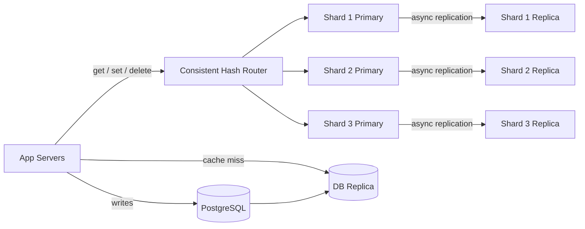
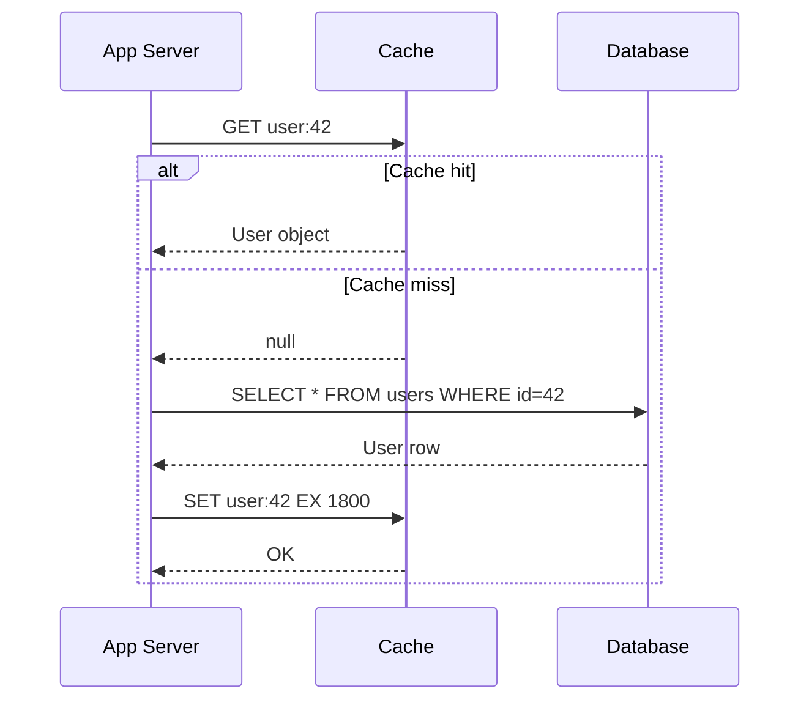
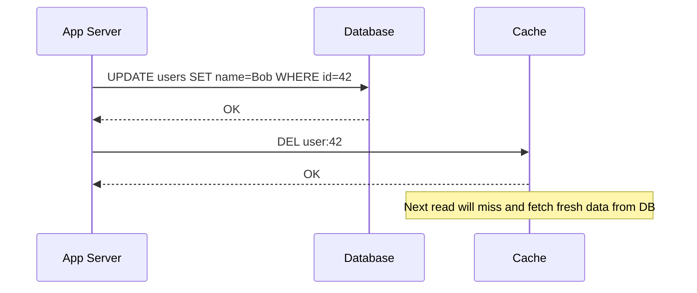
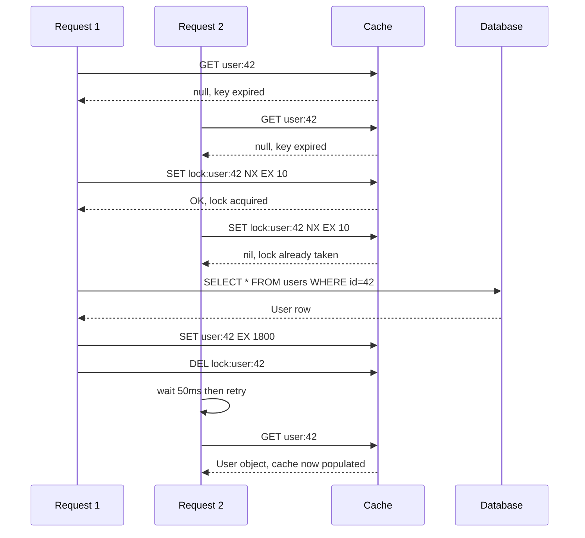

# 10. Design a Distributed Cache (Redis-like)

> **Note**: Q3 (Key-Value Store) covers single-node internals — the hash table, skip list, TTL, eviction policies, and single-node replication. This answer focuses on the **distributed** layer: how to spread a cache across many nodes, keep it consistent with the database, and handle failures gracefully.

## Requirements

### Functional
- `get(key)` — retrieve a cached value; return null on cache miss
- `set(key, value, ttl)` — store a value with an optional expiry
- `delete(key)` — explicitly evict a key
- Cache sits in front of a persistent database; database is the source of truth
- Support multiple cache clients (many application servers reading/writing the same cache)

### Non-Functional
- **Low latency**: p99 < 1ms for reads
- **High availability**: cache node failure must not cause downtime for the application
- **Scalability**: scale horizontally as dataset grows
- **Consistency**: cache must not serve stale data beyond a configurable tolerance
- Scale: millions of read requests per second across a large application fleet

---

## Scale Estimation

```
Assume: large web application (e-commerce, social network)
  Read QPS:  2,000,000 requests/second
  Write QPS:    50,000 requests/second (cache population + invalidations)
  Cache hit target: 95% (5% go through to the DB)

  DB requests without cache: 2,000,000/s → DB would be overwhelmed
  DB requests with 95% hit rate: 100,000/s → DB can handle this

Cache dataset size:
  Working set (hot data): ~200 GB
  At 95% hit rate, this covers the majority of traffic
  Single Redis node: 64–128 GB RAM
  → Need 2–4 nodes to hold the working set, plus replicas for availability
```

---

## High-Level Architecture



---

## Core Components

### 1. Sharding — Distributing Keys Across Nodes

A single cache node can only hold as much data as its RAM. Sharding splits the keyspace across multiple nodes.

**Consistent hashing** (covered in Q3) is the standard approach:
- Each key is hashed to a position on a virtual ring
- Each shard owns a range of that ring
- Adding or removing a shard only remaps ~1/N of the keys

```
Shard 1 owns ring positions 0–33%:    user:*, session:*, product:1–3333
Shard 2 owns ring positions 33–66%:   product:3334–6666, order:*, cart:*
Shard 3 owns ring positions 66–100%:  product:6667–9999, feed:*, search:*
```

The cache client (library running inside each app server) performs the routing — it hashes the key, determines the shard, and connects directly to that shard's primary. No central proxy needed.

### 2. Replication — Surviving Node Failures

Each shard has one primary and one or more replicas. Replicas are kept in sync via **async replication** — the primary writes to memory and acknowledges the client immediately, then propagates the change to replicas in the background.

**Reads**: served by any replica (load balanced) — this multiplies read throughput proportional to replica count.
**Writes**: always go to the primary — replicas are read-only.

**On primary failure**: a replica is automatically promoted via leader election. During the election window (~5–30 seconds), that shard is temporarily read-only (replicas can still serve reads). This is acceptable for a cache — the worst case is a brief spike of cache misses going through to the DB, not data loss.

```
Normal:    App → Primary 1 → write → async replicate → Replica 1a, 1b
Failure:   Primary 1 crashes
Election:  Replica 1a promoted to Primary 1 (takes 5–30s)
Recovery:  App → new Primary 1a → reads and writes resume
           Original Primary 1 rejoins later as a replica
```

### 3. Cache Patterns — How the Application Uses the Cache

There are four patterns, each with different consistency and performance trade-offs:

---

**Pattern A: Cache-Aside (Lazy Loading)** — most common

The application manages the cache explicitly. On read: check cache first; if miss, read from DB and populate the cache.

```csharp
public async Task<User?> GetUserAsync(long userId)
{
    var key = $"user:{userId}";

    // 1. Check cache:
    var cached = await _cache.StringGetAsync(key);
    if (cached.HasValue)
        return JsonSerializer.Deserialize<User>(cached!);

    // 2. Cache miss — read from DB:
    var user = await _db.QuerySingleOrDefaultAsync<User>(
        "SELECT * FROM users WHERE id = @id", new { id = userId });

    if (user != null)
    {
        // 3. Populate cache for future reads:
        await _cache.StringSetAsync(key,
            JsonSerializer.Serialize(user),
            TimeSpan.FromMinutes(30));
    }
    return user;
}
```

- ✓ Only caches data that is actually read — no wasted memory
- ✓ Cache failure doesn't break the app — reads fall back to DB
- ✗ First request after a miss (or after cold start) is slow — hits the DB

---

**Pattern B: Write-Through**

On every write to the DB, also write to the cache immediately.

```csharp
public async Task UpdateUserAsync(User user)
{
    // 1. Write to DB:
    await _db.ExecuteAsync("UPDATE users SET name=@name WHERE id=@id", user);

    // 2. Immediately update cache:
    await _cache.StringSetAsync($"user:{user.Id}",
        JsonSerializer.Serialize(user),
        TimeSpan.FromMinutes(30));
}
```

- ✓ Cache is always fresh — reads never return stale data
- ✓ No cache miss on subsequent reads after a write
- ✗ Every write pays the cost of a cache update, even for data that may never be read again
- ✗ Cache and DB update are two separate operations — if the cache write fails after a successful DB write, they're out of sync (use a transaction or accept the risk)

---

**Pattern C: Write-Behind (Write-Back)**

Write to cache immediately, persist to DB asynchronously in the background.

```csharp
public async Task UpdateUserAsync(User user)
{
    // 1. Write to cache immediately (fast):
    await _cache.StringSetAsync($"user:{user.Id}",
        JsonSerializer.Serialize(user),
        TimeSpan.FromMinutes(30));

    // 2. Queue DB write for async processing:
    await _writeQueue.EnqueueAsync(user);
    // Background worker drains the queue and persists to DB
}
```

- ✓ Writes feel instant to the user
- ✓ Batches multiple writes to the same key — reduces DB write amplification
- ✗ **Risk of data loss**: if the cache node crashes before the DB write completes, data is lost
- ✗ Complexity: the write queue must be durable (Kafka, not in-memory)

Use write-behind only when writes are extremely frequent and slight data loss is tolerable (e.g., like counts, game scores, view counters).

---

**Pattern D: Read-Through**

The cache itself fetches from the DB on a miss — the application talks only to the cache, never directly to the DB.

```
App → Cache.get("user:42") 
  → Cache miss → Cache fetches from DB → stores result → returns to app
  → App never writes DB connection logic
```

- ✓ Simpler application code — no cache miss handling in the app
- ✗ Requires a "loader" function registered with the cache (tight coupling)
- ✗ Less control — hard to customise what happens on a miss

Less common in practice; cache-aside is preferred because it keeps the application in control.

---

### 4. Cache Invalidation — Keeping Cache and DB in Sync

Stale data is the hardest problem in caching. Three strategies:

**TTL-based expiry** — simplest, most common:
```
set("user:42", userData, TTL=30min)
→ After 30 minutes, key expires automatically
→ Next read is a cache miss → fetches fresh data from DB
```
Accepts up to 30 minutes of staleness. Fine for most data (user profiles, product descriptions). Not fine for inventory counts or prices.

**Event-driven invalidation** — delete the cache key whenever the underlying data changes:
```csharp
// After updating the DB:
await _db.ExecuteAsync("UPDATE users SET name=@name WHERE id=@id", user);
await _cache.KeyDeleteAsync($"user:{user.Id}");  // force next read to miss and re-fetch
```
More complex but zero-staleness. The key is deleted (not updated) — updating risks a race condition (see Challenge 2 below).

**Version-based keys** — embed a version number in the cache key:
```
user:42:v7   ← current version
user:42:v6   ← stale, will expire naturally
```
On every write, increment the version and write to the new key. Old version keys expire via TTL. Reads always use the current version. Simple to reason about; uses slightly more memory.

---

### 5. Cluster Coordination — Redis Cluster vs Sentinel

Two common topologies for distributed Redis:

**Redis Sentinel**:
- Separate sentinel processes monitor the primaries
- On primary failure, sentinels vote and promote a replica
- Application connects to sentinel; sentinel redirects to the current primary
- Good for: simple setups, manual sharding, up to ~100 GB dataset

**Redis Cluster**:
- Sharding and failover built into Redis itself (no separate sentinel process)
- 16,384 hash slots distributed across shards
- Cluster handles slot assignment, rebalancing, and failover automatically
- Application connects to any cluster node; node redirects if needed (`MOVED` response)
- Good for: large datasets, automated sharding, production at scale

Most large-scale deployments use Redis Cluster (or a managed equivalent like AWS ElastiCache Cluster Mode).

---

## Data Model

No schema — keys are arbitrary strings, values are byte arrays. See Q3 for Redis data type internals.

**Key naming conventions** (critical at scale — many app servers share the same cache):

```
user:{id}                     → serialised User object
session:{token}               → session data, TTL = 24h
product:{id}                  → product details, TTL = 1h
feed:{user_id}                → news feed list, TTL = 10min
rate_limit:{user_id}:{window} → rate limit counter, TTL = window size
lock:{resource_id}            → distributed lock, TTL = 30s
```

Namespacing by entity type prevents key collisions between different features sharing the same cluster.

---

## API Design

The cache is an internal infrastructure component — no external-facing HTTP API. Application servers access it via a client library:

```csharp
// ASP.NET Core — register cache client at startup:
builder.Services.AddStackExchangeRedisCache(options =>
{
    options.Configuration = "redis-cluster:6379";
    options.InstanceName = "myapp:";    // prefix all keys
});

// Inject and use:
public class ProductService(IDistributedCache cache, IProductRepository repo)
{
    public async Task<Product?> GetProductAsync(int productId)
    {
        var key = $"product:{productId}";
        var bytes = await cache.GetAsync(key);
        if (bytes != null)
            return JsonSerializer.Deserialize<Product>(bytes);

        var product = await repo.GetByIdAsync(productId);
        if (product != null)
            await cache.SetAsync(key, JsonSerializer.Serialize(product),
                new DistributedCacheEntryOptions { AbsoluteExpirationRelativeToNow = TimeSpan.FromHours(1) });

        return product;
    }
}
```

---

## Key Challenges & Solutions

### Challenge 1: Cache stampede (thundering herd)

A popular key expires. At the exact moment it expires, 10,000 concurrent requests all get a cache miss simultaneously — all 10,000 hit the DB at once. The DB is overwhelmed. This is the **cache stampede**.

**Solution 1 — Mutex / single-flight**:
Only one request regenerates the cache entry; all others wait for it:

```csharp
public async Task<User?> GetUserWithLockAsync(long userId)
{
    var key = $"user:{userId}";
    var cached = await _cache.StringGetAsync(key);
    if (cached.HasValue) return Deserialize(cached);

    // Acquire a distributed lock — only one request populates the cache:
    var lockKey = $"lock:populate:{key}";
    var acquired = await _cache.StringSetAsync(lockKey, "1",
        TimeSpan.FromSeconds(10), When.NotExists);

    if (acquired)
    {
        // This request fetches from DB and populates the cache:
        var user = await _db.GetUserAsync(userId);
        await _cache.StringSetAsync(key, Serialize(user), TimeSpan.FromMinutes(30));
        await _cache.KeyDeleteAsync(lockKey);
        return user;
    }
    else
    {
        // Another request is already fetching — wait briefly, then retry:
        await Task.Delay(50);
        return await GetUserWithLockAsync(userId);
    }
}
```

**Solution 2 — Probabilistic early expiry**:
Before the key actually expires, randomly start refreshing it early. Keys with a remaining TTL of < 10% start being proactively refreshed by a small fraction of requests. The key never fully expires under load.

### Challenge 2: Cache-aside race condition (write → delete → miss → stale)

```
Thread 1: reads DB → gets old value "Alice"
Thread 2: updates DB → name is now "Bob" → deletes cache key
Thread 1: writes old value "Alice" to cache ← STALE!

Now cache has "Alice" even though DB has "Bob"
```

**Solution**: use **delete on write** (not update), and accept a single cache miss:
- On DB write: delete the cache key
- On next read: cache miss → fetch fresh value from DB → populate cache with current value

The race above still has a tiny window but is far less likely. For stricter requirements, use **version-based keys** (the old version is never written back after a new version exists).

### Challenge 3: Hot key — one key gets all the traffic

A single product page goes viral. Every user hits `product:bestseller` — all traffic routes to the one shard that owns that key. That shard is overwhelmed while others are idle.

**Solutions**:
- **Read replicas**: reads are distributed across the primary + replicas of that shard
- **Key replication**: copy the hot key to multiple shards with a suffix: `product:bestseller:1`, `product:bestseller:2`, `product:bestseller:3` — client picks randomly. Reads spread across three shards.
- **Local in-process cache**: cache the hottest keys in application server memory (Dictionary in C#) with a very short TTL (1–5 seconds). Cache hits never even reach Redis.

### Challenge 4: Large values

Storing a 5 MB value in Redis: the single-threaded Redis process blocks for ~25ms to serialise it — all other clients wait. (See also Q3 — large value → blob storage.)

**Solution**: enforce a max value size (e.g., 1 MB). For larger objects, store in S3 and cache only the S3 URL or a summary. Alternatively, compress values before storing (`gzip` typically achieves 70–80% reduction on JSON).

### Challenge 5: Cache warming after cold start

A new cache node starts empty. All requests are cache misses — the DB receives 100% of traffic and may be overwhelmed before the cache warms up.

**Solutions**:
- **Lazy warming**: accept the slow warmup period; DB handles the load temporarily with extra read replicas
- **Pre-warming**: before directing traffic to the new node, run a script that reads the most common keys from the DB and populates the cache
- **Replica promotion**: when replacing a node, promote an existing replica rather than starting a cold new node — the replica already has the data

---

## Trade-offs

| Decision | Choice | Why | Alternative |
|----------|--------|-----|-------------|
| Cache pattern | Cache-aside | App controls the logic; cache failure graceful | Write-through (simpler consistency, more write load) |
| Invalidation | TTL + event-driven delete | TTL handles the common case; explicit delete for critical freshness | Version-based keys (zero staleness but more memory) |
| Sharding | Consistent hashing | Minimal rebalancing on node changes | Range-based sharding (hotspot risk) |
| Replication | Async to replicas | Low write latency; accepts slight replica lag | Synchronous (zero staleness on replicas but slower writes) |
| Cluster mode | Redis Cluster | Built-in sharding and failover | Sentinel (simpler but manual sharding) |
| CAP position | **AP** | Cache availability is critical; slight staleness is acceptable | CP (unnecessary for a cache — serving slightly stale data is fine) |

---

## Sequence Diagrams

**Cache-aside read — hit and miss**



**Write with cache invalidation**



**Cache stampede — mutex solution**


