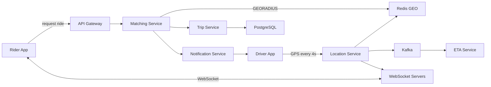
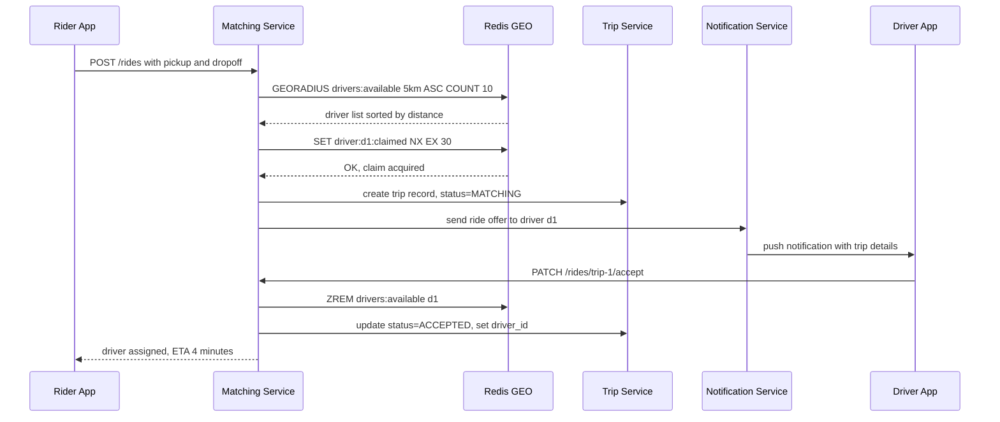
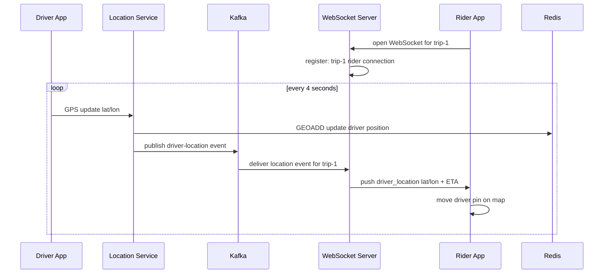

# 11. Design a Ride-Sharing App (Uber / Lyft)

## Requirements

### Functional
- Riders can request a ride from a pickup location to a destination
- System matches the rider with the nearest available driver
- Rider sees the driver's location updating in real time during pickup and trip
- Driver can accept or decline a ride request (15-second timeout)
- Fare is calculated at trip end and payment processed automatically
- ETA shown to rider before and during the trip

### Non-Functional
- **Match latency**: driver assigned within 5 seconds of request
- **Location update latency**: driver position visible to rider within 4 seconds of GPS update
- **High availability**: matching must survive partial outages
- **Consistency**: a driver must never be assigned to two riders simultaneously
- Scale: 500,000 concurrent active drivers globally at peak

---

## Scale Estimation

```
Active drivers at peak:    500,000
GPS update interval:       every 4 seconds per driver
Location writes:           500,000 / 4 = 125,000 writes/second

Active trips at peak:      ~200,000
Ride requests:             ~5M trips/day = ~60 new requests/second

WebSocket connections:     200,000 trips × 2 (rider + driver) = 400,000 connections
WebSocket servers:         400,000 / 10,000 per server = 40 servers
```

---

## High-Level Architecture



---

## Core Components

### 1. Location Service — Ingesting Driver GPS Updates

Every driver app sends a GPS coordinate every 4 seconds. The Location Service does two things with each update:

**Write to Redis GEO** — so the Matching Service can query nearby drivers in real time:

```csharp
public async Task UpdateDriverLocationAsync(string driverId, double latitude, double longitude)
{
    // GEOADD drivers:available <lon> <lat> <driver_id>
    // Only available drivers are in this set — on-trip drivers are removed
    await _redis.GeoAddAsync("drivers:available",
        new GeoEntry(longitude, latitude, driverId));
}
```

**Publish to Kafka** — for downstream consumers (ETA service, analytics, trip location history):

```csharp
var update = new DriverLocationEvent
{
    DriverId = driverId,
    Latitude = latitude,
    Longitude = longitude,
    Timestamp = DateTimeOffset.UtcNow
};
await _producer.ProduceAsync("driver-locations", new Message<string, string>
{
    Key = driverId,
    Value = JsonSerializer.Serialize(update)
});
```

---

### 2. Matching Service — Finding and Assigning a Driver

When a rider requests a ride:

**Step 1 — Find nearby available drivers using Redis GEORADIUS:**

```csharp
public async Task<List<string>> FindNearbyDriversAsync(double lat, double lon, double radiusKm = 5)
{
    var results = await _redis.GeoRadiusAsync(
        "drivers:available",
        longitude: lon,
        latitude: lat,
        radius: radiusKm,
        unit: GeoUnit.Kilometers,
        count: 10,
        order: Order.Ascending);   // sorted nearest first

    return results.Select(r => r.Member.ToString()).ToList();
}
```

**Step 2 — Claim a driver atomically** to prevent two riders being matched to the same driver simultaneously:

```csharp
public async Task<bool> TryClaimDriverAsync(string driverId, string tripId)
{
    var claimKey = $"driver:{driverId}:claimed";

    // SET NX — only succeeds if the key does not exist
    // If another request already claimed this driver, returns false
    return await _redis.StringSetAsync(
        claimKey,
        tripId,
        TimeSpan.FromSeconds(30),
        When.NotExists);
}
```

**Step 3 — Offer the trip to the driver** (push notification via FCM/APNs). If the driver declines or the 15-second window expires, release the claim and try the next driver.

**Step 4 — On accept**: remove driver from `drivers:available` GEO set, create Trip record, notify rider with driver info and ETA.

---

### 3. Trip Service — Managing the Trip Lifecycle

A trip moves through these states:

```
REQUESTED → MATCHING → ACCEPTED → DRIVER_EN_ROUTE → IN_PROGRESS → COMPLETED
                                                                  → CANCELLED
```

```csharp
public enum TripStatus
{
    Requested,
    Matching,
    Accepted,
    DriverEnRoute,
    InProgress,
    Completed,
    Cancelled
}
```

State transitions are persisted to PostgreSQL. Each transition records a timestamp so fare and ETA calculations have the full timeline.

---

### 4. Real-Time Location Tracking — Rider Sees Driver Moving

Once a driver accepts:
- The rider app opens a **WebSocket connection** to a WebSocket server
- Every 4 seconds, the driver's GPS update flows: Driver App → Location Service → Kafka → WebSocket Server → Rider App

```
Driver sends GPS
  → Location Service: update Redis GEO + publish to Kafka
  → Kafka consumer (WebSocket server subscribed to this driver's topic partition)
  → WebSocket server pushes to rider's open connection
  → Rider app moves the driver pin on the map
```

This is the same pattern as the chat system (Q5) — WebSocket servers are stateful, and a routing layer (Redis) maps each trip to the WebSocket server that holds the rider's connection.

---

### 5. ETA Service

The ETA Service consumes driver location updates from Kafka and calculates:
- **Pickup ETA**: time for driver to reach rider, given current traffic
- **Destination ETA**: estimated trip duration to dropoff

ETA uses a road network graph (like OSRM or Google Maps Platform). The calculation is re-run on each GPS update and pushed to the rider.

```
ETA Service:
  consumes Kafka topic "driver-locations"
  for each update where driver is en-route to pickup:
    run Dijkstra/A* on road graph from driver_pos to pickup_pos
    push updated ETA to rider via WebSocket
```

---

### 6. Surge Pricing

The city is divided into **H3 hexagonal cells** (~1 km across). Uber invented H3 specifically for this:

```
For each H3 cell, every 30 seconds:
  pending_requests  = count of unmatched ride requests in this cell
  available_drivers = count of available drivers in this cell
  
  demand_ratio = pending_requests / max(available_drivers, 1)

  if demand_ratio > 2.0:  surge = 1.5×
  if demand_ratio > 4.0:  surge = 2.0×
  if demand_ratio > 8.0:  surge = 3.0×
```

Surge multiplier is shown to riders before they confirm the request.

---

## Data Model

### trips (PostgreSQL — source of truth for all trip state)

```sql
CREATE TABLE trips (
    trip_id          UUID PRIMARY KEY DEFAULT gen_random_uuid(),
    rider_id         BIGINT NOT NULL,
    driver_id        BIGINT,
    status           TEXT NOT NULL,
    pickup_lat       DOUBLE PRECISION NOT NULL,
    pickup_lon       DOUBLE PRECISION NOT NULL,
    dropoff_lat      DOUBLE PRECISION NOT NULL,
    dropoff_lon      DOUBLE PRECISION NOT NULL,
    requested_at     TIMESTAMPTZ NOT NULL,
    accepted_at      TIMESTAMPTZ,
    started_at       TIMESTAMPTZ,
    completed_at     TIMESTAMPTZ,
    fare_cents       INT,
    surge_multiplier NUMERIC(4,2) DEFAULT 1.0
);
```

### Driver state (Redis)

```
drivers:available           → GEO set: lon/lat per available driver_id
driver:{id}:claimed         → trip_id, TTL=30s (prevents double assignment)
driver:{id}:status          → "available" | "on_trip" | "offline"
trip:{id}:ws_server         → which WebSocket server holds the rider connection
```

### Location history (Cassandra — optional, for audit and replay)

```sql
CREATE TABLE driver_locations (
    driver_id   BIGINT,
    ts          TIMESTAMP,
    lat         DOUBLE,
    lon         DOUBLE,
    PRIMARY KEY (driver_id, ts)
) WITH CLUSTERING ORDER BY (ts DESC);
```

---

## API Design

### Rider APIs

```
POST   /api/v1/rides
       Body: { pickup_lat, pickup_lon, dropoff_lat, dropoff_lon }
       Response 202: { trip_id, status: "matching", surge_multiplier, estimated_fare }

GET    /api/v1/rides/{trip_id}
       Response: { status, driver, eta_seconds, fare_cents }

DELETE /api/v1/rides/{trip_id}     → cancel before driver arrives
```

### Driver APIs

```
PATCH  /api/v1/rides/{trip_id}/accept
PATCH  /api/v1/rides/{trip_id}/decline
PATCH  /api/v1/rides/{trip_id}/start      → marks IN_PROGRESS
PATCH  /api/v1/rides/{trip_id}/complete   → triggers fare calculation + payment
```

### WebSocket

```
WS /ws/rides/{trip_id}
Server pushes:
  { type: "driver_location", lat, lon, eta_seconds }
  { type: "status_change", status: "driver_en_route" }
  { type: "trip_completed", fare_cents }
```

---

## Key Challenges & Solutions

### Challenge 1: Double assignment — two riders matched to the same driver

Without protection, two concurrent ride requests could both call GEORADIUS, both see the same driver as closest, and both send offers.

**Solution**: Redis `SET NX` claim key (shown above). Only one request acquires the claim. The other moves to the next driver in its list. The claim has a 30-second TTL — if the driver times out without responding, the key expires and the driver becomes claimable again.

### Challenge 2: Driver goes offline mid-trip

Driver's phone loses signal. GPS updates stop. Rider loses real-time tracking.

**Solution**: the driver app is expected to reconnect and resume GPS updates. If no update arrives for 30 seconds, the system marks the driver's live location as stale but does not cancel the trip. The trip continues — GPS may recover. The driver is removed from the matching pool so no new rides are offered.

### Challenge 3: Hot zones — airport, stadium, concert venue

GEORADIUS on a hot zone might return hundreds of nearby drivers. Matching all of them is expensive and slow.

**Solution**: cap GEORADIUS `COUNT` at 10. The Matching Service works through the list one by one. If all 10 decline, expand the search radius and retry. Also, WebSocket servers near hot zones handle much higher connection density — deploy extra capacity before known high-demand events.

### Challenge 4: WebSocket server failure

A WebSocket server crashes. All riders and drivers connected to it lose real-time updates.

**Solution**: the rider app detects the dropped WebSocket and immediately reconnects to any available WebSocket server. On reconnect, the rider re-registers for trip updates: `{ trip_id }`. The new WebSocket server looks up `trip:{id}:ws_server` in Redis, updates it to itself, and resumes pushing location updates. The outage is visible only as a brief gap in the driver pin movement.

### Challenge 5: Fare calculation

Fare depends on distance (route taken, not straight line), time, and surge multiplier applied at request time.

**Solution**: during the trip, the Cassandra location history records the driver's actual path. At trip completion, the Trip Service computes: base fare + (distance rate × actual km) + (time rate × trip minutes) × surge. The surge multiplier is locked in at the time the rider confirmed the request — not recalculated at completion.

---

## Trade-offs

| Decision | Choice | Why | Alternative |
|---|---|---|---|
| Geospatial index | Redis GEO | In-memory, sub-millisecond GEORADIUS | PostGIS (durable but slower for live queries) |
| Driver claim | Redis SET NX | Atomic, fast, self-expiring | DB row lock (slower, more load on DB) |
| Location updates | Kafka pipeline | Decouples ingestion from consumers | Direct WebSocket push (tight coupling, harder to scale) |
| Real-time tracking | WebSocket | Persistent connection, server-push | HTTP polling (higher latency, more requests) |
| Geographic cells | H3 hexagons | Equal-area cells, no edge distortion | Quadtree (unequal cells near poles) |
| Location history | Cassandra | Append-heavy time-series, high write throughput | PostgreSQL with PostGIS (good but slower at this write rate) |
| CAP position | **AP** | Slight staleness in driver location acceptable; availability critical | CP (unnecessary — 4-second stale position is fine) |

---

## Sequence Diagrams

**Ride request and driver matching**



**Real-time driver location during pickup**


