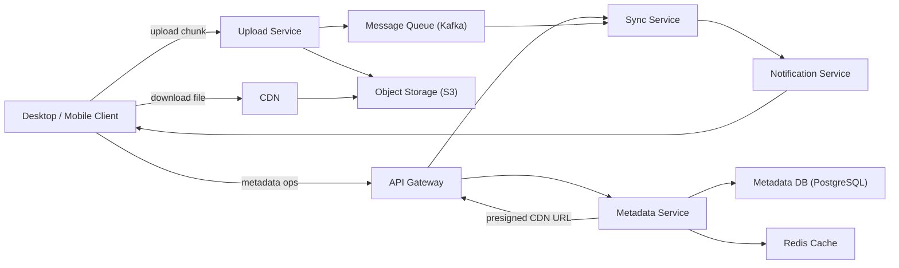
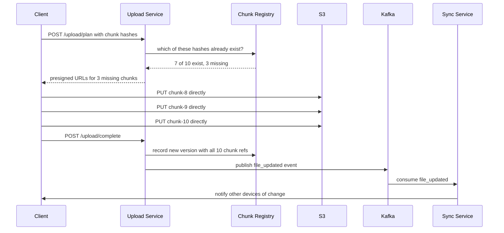
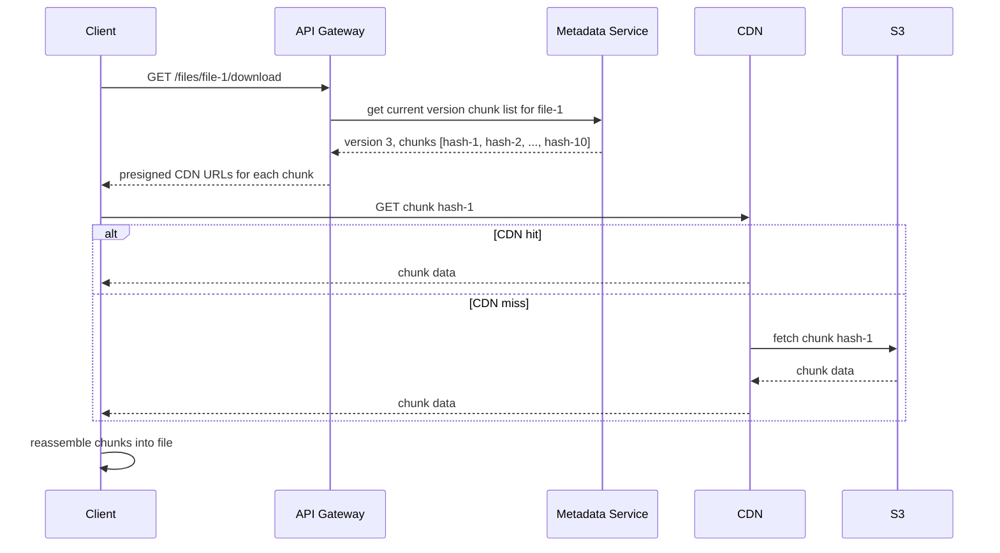

# 12. Design a File Storage System (Dropbox / Google Drive)

## Requirements

### Functional
- Users can upload, download, and delete files of any type
- Files are automatically synced across all of a user's devices
- Users can share files and folders with other users (view or edit permissions)
- Deleted files go to a trash and can be restored within 30 days
- Support file versioning — users can view and restore previous versions

### Non-Functional
- **Durability**: files must never be lost (99.999% durability)
- **Availability**: uploads and downloads must work even during partial outages
- **Consistency**: a file updated on one device must appear on all other devices within seconds
- **Bandwidth efficiency**: do not re-upload unchanged parts of a file (delta sync)
- Scale: 500 million users, 200 million daily active users, average 10 GB storage per user

---

## Scale Estimation

```
Total storage:
  500M users × 10 GB = 5 exabytes (5,000 petabytes)
  → Stored in S3 or equivalent object storage

Upload QPS:
  200M DAU, each uploads ~1 file/day on average
  → 200M / 86,400 = ~2,300 uploads/second

Download QPS:
  Users download more than they upload (sync on multiple devices)
  → ~10,000 downloads/second

Metadata reads:
  Every file list, sync check, share lookup hits metadata DB
  → ~50,000 reads/second
```

---

## High-Level Architecture



---

## Core Components

### 1. Chunking — The Foundation of Efficient Sync

Files are split into **fixed-size chunks** (typically 4 MB each) before upload. Each chunk is identified by its **content hash** (SHA-256 of the chunk data).

```
File: presentation.pptx (40 MB)
  Chunk 1: bytes 0–4MB      → SHA-256: a3f8...  (hash = content fingerprint)
  Chunk 2: bytes 4–8MB      → SHA-256: 9d21...
  Chunk 3: bytes 8–12MB     → SHA-256: c7b4...
  ...
  Chunk 10: bytes 36–40MB   → SHA-256: e19f...
```

**Why chunking matters**:
- If the user edits slide 3, only chunk 2 changes. The client uploads only that one 4 MB chunk instead of the full 40 MB file
- Two users who upload the same file share the same chunks in S3 — deduplication happens automatically
- A failed upload can resume from the last successfully uploaded chunk

```csharp
public static IEnumerable<FileChunk> SplitIntoChunks(Stream fileStream, int chunkSizeBytes = 4 * 1024 * 1024)
{
    var buffer = new byte[chunkSizeBytes];
    int chunkIndex = 0;
    int bytesRead;

    while ((bytesRead = fileStream.Read(buffer, 0, chunkSizeBytes)) > 0)
    {
        var chunkData = buffer[..bytesRead];
        var hash = Convert.ToHexString(SHA256.HashData(chunkData));
        yield return new FileChunk(Index: chunkIndex++, Hash: hash, Data: chunkData);
    }
}
```

---

### 2. Upload Flow — Client to S3

The client does not upload directly through the API server (that would bottleneck on server bandwidth). Instead it uses **pre-signed S3 URLs**:

```
Step 1: Client sends metadata to Upload Service:
        { filename, size, chunks: [{ index, hash }] }

Step 2: Upload Service checks which chunks already exist in S3
        (by looking up hashes in the chunk registry)
        → Returns only the missing chunk hashes

Step 3: Upload Service issues pre-signed S3 URLs only for missing chunks

Step 4: Client uploads missing chunks directly to S3 (bypasses app servers)

Step 5: Client notifies Upload Service: "upload complete"

Step 6: Upload Service creates a new file version record in Metadata DB
        and publishes a "file_updated" event to Kafka
```

This means if a 40 MB file has 10 chunks and 9 are already in S3 (same content as another file, or a previous version), the client uploads only 4 MB, not 40 MB.

```csharp
public async Task<UploadPlan> PlanUploadAsync(UploadRequest request)
{
    // Find which chunks are already stored
    var existingHashes = await _chunkRegistry.GetExistingAsync(
        request.Chunks.Select(c => c.Hash));

    var missingChunks = request.Chunks
        .Where(c => !existingHashes.Contains(c.Hash))
        .ToList();

    // Issue pre-signed URLs only for missing chunks
    var presignedUrls = await Task.WhenAll(
        missingChunks.Select(async chunk =>
        {
            var url = await _s3.GeneratePresignedUrlAsync(
                bucket: "chunks",
                key: chunk.Hash,         // keyed by content hash — deduplication built in
                expiry: TimeSpan.FromMinutes(15));
            return new ChunkUploadUrl(chunk.Index, chunk.Hash, url);
        }));

    return new UploadPlan(PresignedUrls: presignedUrls, AlreadyStoredCount: existingHashes.Count);
}
```

---

### 3. Sync Service — Propagating Changes to Other Devices

When user A updates a file on their laptop, user A's phone and tablet must see the change. The Sync Service handles this:

```
File updated on laptop
  → Upload Service publishes "file_updated" event to Kafka
  → Sync Service consumes the event
  → Sync Service looks up all devices registered to this user
  → Sync Service pushes a "file_changed" notification to each device
      via the Notification Service (long-polling or WebSocket)
  → Other devices receive the notification, request the updated metadata
  → Client downloads only the changed chunks
```

**Long-polling vs WebSocket for sync notifications**:
- Dropbox uses **long-polling** — the client sends an HTTP request that the server holds open until a change occurs (or 30-second timeout). Simple, works through corporate firewalls and proxies that block WebSocket upgrades.
- Google Drive uses a **push webhook** model for its API and WebSocket for the web client.

---

### 4. Metadata Service — Tracking Files, Versions, and Shares

The Metadata Service is the source of truth for everything except file bytes. It manages:
- File and folder hierarchy
- File versions (each upload creates a new version)
- Share permissions

It reads from a Redis cache for hot data (recently accessed file metadata) and falls back to PostgreSQL.

---

### 5. File Versioning

Every upload creates a new version — the previous version is not deleted:

```
File: report.docx
  Version 3 (current): chunk hashes [a3f8, 9d21, c7b4]  — uploaded today
  Version 2:           chunk hashes [a3f8, 7e12, c7b4]  — uploaded yesterday
  Version 1:           chunk hashes [f491, 7e12, c7b4]  — uploaded last week
```

Chunks are shared across versions. If version 1 and version 3 both contain chunk `c7b4`, S3 stores it only once. Restoring to version 2 means pointing the file back to version 2's chunk list — no data movement needed.

Versions older than 30 days (or beyond the version limit, e.g. 100 versions) are eligible for cleanup. The chunk is deleted from S3 only when no version of any file references it (reference counting).

---

## Data Model

### files (PostgreSQL)

```sql
CREATE TABLE files (
    file_id       UUID PRIMARY KEY DEFAULT gen_random_uuid(),
    owner_id      BIGINT NOT NULL,
    parent_folder UUID,                    -- null = root
    name          TEXT NOT NULL,
    is_deleted    BOOLEAN DEFAULT false,
    deleted_at    TIMESTAMPTZ,
    created_at    TIMESTAMPTZ NOT NULL DEFAULT now()
);
```

### file_versions

```sql
CREATE TABLE file_versions (
    version_id    UUID PRIMARY KEY DEFAULT gen_random_uuid(),
    file_id       UUID NOT NULL REFERENCES files(file_id),
    version_num   INT NOT NULL,
    size_bytes    BIGINT NOT NULL,
    created_at    TIMESTAMPTZ NOT NULL DEFAULT now(),
    UNIQUE (file_id, version_num)
);
```

### file_chunks (join table: version → chunks)

```sql
CREATE TABLE file_chunks (
    version_id    UUID NOT NULL REFERENCES file_versions(version_id),
    chunk_index   INT NOT NULL,
    chunk_hash    CHAR(64) NOT NULL,       -- SHA-256 hex, 64 chars
    PRIMARY KEY (version_id, chunk_index)
);
```

### chunks (the actual S3 object registry)

```sql
CREATE TABLE chunks (
    chunk_hash    CHAR(64) PRIMARY KEY,
    size_bytes    INT NOT NULL,
    s3_key        TEXT NOT NULL,           -- e.g. "chunks/a3f8..."
    ref_count     INT NOT NULL DEFAULT 0,  -- how many versions reference this chunk
    created_at    TIMESTAMPTZ NOT NULL DEFAULT now()
);
```

### shares

```sql
CREATE TABLE shares (
    share_id      UUID PRIMARY KEY DEFAULT gen_random_uuid(),
    file_id       UUID NOT NULL REFERENCES files(file_id),
    shared_with   BIGINT NOT NULL,         -- user_id
    permission    TEXT NOT NULL,           -- 'view' | 'edit'
    created_at    TIMESTAMPTZ NOT NULL DEFAULT now()
);
```

---

## API Design

### File operations

```
POST   /api/v1/upload/plan
       Body: { filename, size_bytes, chunks: [{ index, hash }] }
       Response: { upload_id, presigned_urls: [{ index, hash, url }] }

POST   /api/v1/upload/{upload_id}/complete
       Response: { file_id, version_id, version_num }

GET    /api/v1/files/{file_id}/download
       Response: redirect to CDN pre-signed URL

GET    /api/v1/files/{file_id}/versions
       Response: [{ version_num, size_bytes, created_at }]

POST   /api/v1/files/{file_id}/restore/{version_num}
       Response: { new_version_id }

DELETE /api/v1/files/{file_id}            → soft delete (moves to trash)
DELETE /api/v1/files/{file_id}/permanent  → hard delete
```

### Sync

```
GET    /api/v1/sync/changes?since={cursor}
       Response: { changes: [{ file_id, event, version_num }], next_cursor }
       (long-poll — server holds open up to 30s waiting for changes)
```

### Sharing

```
POST   /api/v1/files/{file_id}/share
       Body: { user_id, permission }

GET    /api/v1/files/{file_id}/shares
DELETE /api/v1/files/{file_id}/share/{share_id}
```

---

## Key Challenges & Solutions

### Challenge 1: Conflict resolution — two devices edit the same file simultaneously

User edits `notes.txt` on their laptop (offline) and also on their phone (online). Both produce a new version. When the laptop reconnects, there are two conflicting versions.

**Solution**: last-write-wins with a conflict copy:
- Compare timestamps: the version with the later `created_at` becomes the canonical version
- The older conflicting version is saved as `notes (conflicted copy 2026-07-04).txt`
- The user sees both files and can manually merge or discard the conflict copy
- No data is ever lost — both edits are preserved

Google Docs solves this differently with **operational transforms** (OT) — concurrent character-level edits are merged automatically. But that requires the document to be open online simultaneously, which is a different model from file sync.

### Challenge 2: Large file upload failures and resumable uploads

A user uploads a 5 GB video. Their connection drops at 80%. Restarting from scratch wastes 4 GB of already-uploaded data.

**Solution**: chunk-level resumability. The upload plan records which chunks were successfully stored in S3. On reconnect, the client calls `GET /api/v1/upload/{upload_id}/status` to get the list of already-uploaded chunks, then resumes from the first missing chunk. The pre-signed URLs are reissued for the remaining chunks.

### Challenge 3: Storage deduplication at scale

500M users × 10 GB = 5 exabytes. Without deduplication, storing a popular document that 1M users have uploaded would consume 1M × the file size.

**Solution**: content-addressed storage. S3 keys are the chunk hash (SHA-256). Two users uploading identical content produce the same hash — the second upload finds the chunk already exists (via the chunk registry), skips the upload entirely, and just creates a new `file_chunks` record pointing at the existing S3 object. At Dropbox's scale, deduplication reduces storage by 30–50%.

### Challenge 4: Metadata DB at scale — 50,000 reads/second

A single PostgreSQL instance cannot handle 50K reads/second for metadata queries.

**Solution**: Redis cache in front of PostgreSQL. Hot data (recently accessed file metadata, active share permissions) is cached in Redis with a short TTL (5 minutes). Only cache misses and writes go to PostgreSQL. With a 95% cache hit rate, PostgreSQL sees ~2,500 reads/second — well within its capacity.

For very large deployments, shard PostgreSQL by `owner_id` — all metadata for a user lives on one shard, so queries never need to join across shards.

### Challenge 5: Trash and hard deletion — cleaning up S3 objects

When a file is permanently deleted, the S3 chunks cannot be immediately deleted — other file versions (or other users' files, via deduplication) may still reference the same chunks.

**Solution**: reference counting on the `chunks` table. When a file version is deleted, decrement `ref_count` for each of its chunks. A background garbage collector runs periodically and deletes S3 objects where `ref_count = 0`. This runs async — no user request waits for S3 deletion.

---

## Trade-offs

| Decision | Choice | Why | Alternative |
|---|---|---|---|
| Chunk size | 4 MB | Balances upload granularity vs request overhead | Smaller (more requests) or larger (less efficient delta sync) |
| Chunk key | Content hash (SHA-256) | Enables deduplication automatically | Random UUID (no dedup, wastes storage) |
| File bytes storage | S3 | Cheap, durable, infinitely scalable | Self-hosted object store (more ops overhead) |
| Sync notification | Long-polling | Works through firewalls, simple to implement | WebSocket (lower latency but blocked by some proxies) |
| Conflict resolution | Last-write-wins + conflict copy | Simple, no data loss | OT/CRDT (complex, better for collaborative editors) |
| Metadata storage | PostgreSQL + Redis | Relational model fits file/folder hierarchy well | Cassandra (better write throughput but weaker consistency) |
| CAP position | **CP** | File integrity is critical — better to reject a write than corrupt data | AP (acceptable for social feeds, not for file storage) |

---

## Sequence Diagrams

**Upload a file (delta sync — only missing chunks uploaded)**



**Download a file via CDN**


