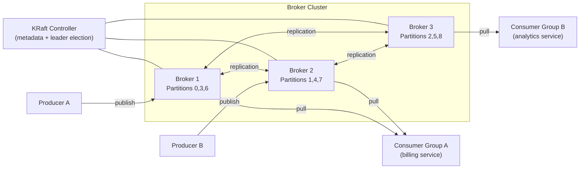
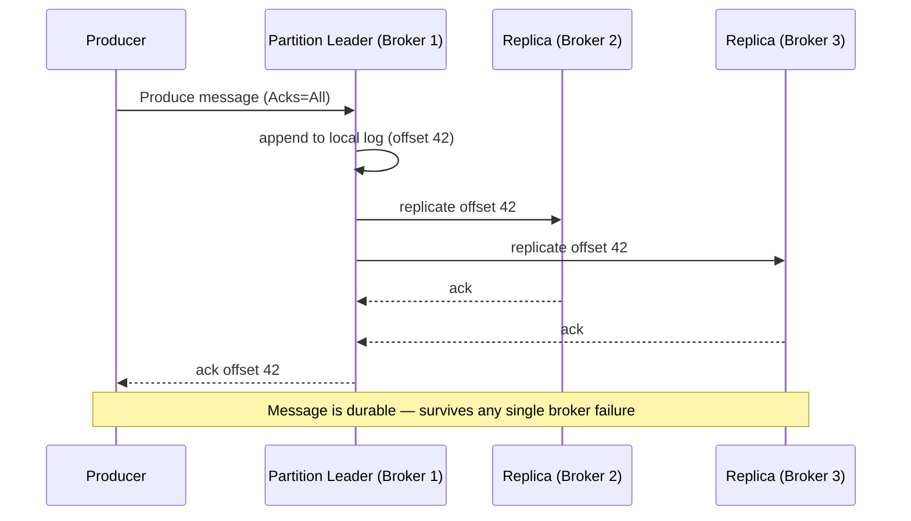
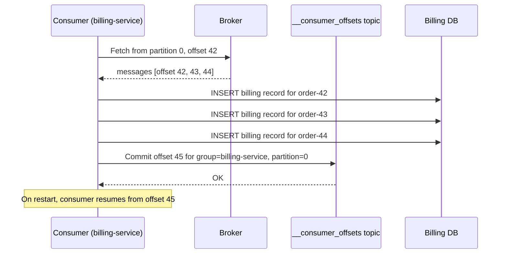

# 13. Design a Distributed Message Queue (Kafka / RabbitMQ)

## Requirements

### Functional
- Producers publish messages to named topics
- Consumers subscribe to topics and receive messages
- Messages are durably stored — not lost if a broker crashes
- Support multiple independent consumer groups reading the same topic
- Messages within a partition are delivered in order
- Support configurable message retention (e.g. 7 days)
- Consumers can replay messages from any point in history

### Non-Functional
- **Throughput**: handle millions of messages per second
- **Low latency**: end-to-end delivery under 10ms at p99
- **Durability**: no message loss on broker failure
- **Scalability**: add brokers and partitions without downtime
- **Fault tolerance**: survive broker failures transparently

---

## Scale Estimation

```
Target throughput: 1 million messages/second ingested
Message size: 1 KB average
Ingestion bandwidth: 1M × 1 KB = 1 GB/second

Retention: 7 days
Storage: 1 GB/s × 86,400s × 7 days = ~600 TB
→ Distribute across a broker cluster (each broker holds a subset of partitions)

Consumers: 100 consumer groups, each reading at full throughput
→ Partitions provide parallelism: 100 partitions → 100 consumers in a group work in parallel
```

---

## High-Level Architecture



---

## Core Concepts

### 1. Topics and Partitions

A **topic** is a named stream of messages (e.g. `order-events`, `payment-processed`). Topics are split into **partitions** — the unit of parallelism and ordering.

```
Topic: order-events  (6 partitions)

Partition 0:  [msg0] [msg1] [msg4] [msg7] ...
Partition 1:  [msg2] [msg5] [msg8] ...
Partition 2:  [msg3] [msg6] [msg9] ...
Partition 3:  ...
Partition 4:  ...
Partition 5:  ...
```

**Key properties**:
- Messages within one partition are **strictly ordered** by their offset
- Messages across partitions have no ordering guarantee
- Each partition is stored on one broker (leader) and replicated to others
- More partitions = more parallelism for both producers and consumers

**Routing messages to partitions**: the producer chooses the partition via a **partition key**:
```csharp
// Messages with the same key always go to the same partition
// → all events for order-42 are in order, in the same partition
var result = await _producer.ProduceAsync("order-events", new Message<string, string>
{
    Key = "order-42",         // hash(key) % num_partitions → partition index
    Value = JsonSerializer.Serialize(orderEvent)
});
```

If no key is specified, the producer round-robins across partitions — maximises throughput but loses per-key ordering.

---

### 2. The Commit Log — How Brokers Store Messages

Each partition is stored as an **append-only log on disk**. New messages are appended to the end; nothing is ever overwritten or deleted mid-retention.

```
Partition 0 on Broker 1:
  Offset 0:  { order_id: 42, status: "placed",    timestamp: 10:00:00 }
  Offset 1:  { order_id: 17, status: "placed",    timestamp: 10:00:01 }
  Offset 2:  { order_id: 42, status: "paid",      timestamp: 10:00:05 }
  Offset 3:  { order_id: 55, status: "placed",    timestamp: 10:00:07 }
  Offset 4:  { order_id: 17, status: "cancelled", timestamp: 10:00:09 }
  ...
```

**Why append-only**:
- Sequential disk writes are 100–1000× faster than random writes
- No locking needed — only one writer (the partition leader) ever appends
- The log is the message — retention, replay, and consumer offset tracking all fall out naturally

---

### 3. Replication — Surviving Broker Failures

Each partition has one **leader** and N **replicas** on different brokers (typically N=3, meaning 2 replicas + 1 leader).

**ISR (In-Sync Replicas)**: the set of replicas that are fully caught up to the leader. The producer can be configured to wait for ISR acknowledgement before considering a message durable:

```csharp
var config = new ProducerConfig
{
    BootstrapServers = "broker1:9092,broker2:9092,broker3:9092",
    Acks = Acks.All,             // wait for all ISR replicas to acknowledge
    EnableIdempotence = true,    // exactly-once at the producer level
    MessageTimeoutMs = 5000
};
```

`Acks.All` means: the message is not acknowledged to the producer until the leader AND all in-sync replicas have written it to their local log. A broker can crash after this point and the message is still not lost.

**On leader failure**:
1. KRaft controller detects the failure (heartbeat timeout)
2. Controller promotes the most up-to-date ISR replica to leader
3. Producers and consumers automatically reconnect to the new leader
4. Entire failover typically completes in < 30 seconds

---

### 4. Consumer Groups — Parallel Consumption

A **consumer group** is a set of consumers that collectively read a topic. Each partition is assigned to exactly one consumer in the group — no two consumers in the same group read the same partition simultaneously.

```
Topic: order-events (6 partitions)

Consumer Group A (billing service) — 3 consumers:
  Consumer A-1: reads partitions 0, 1
  Consumer A-2: reads partitions 2, 3
  Consumer A-3: reads partitions 4, 5

Consumer Group B (analytics service) — 6 consumers:
  Consumer B-1: reads partition 0
  Consumer B-2: reads partition 1
  ...
  Consumer B-6: reads partition 5
```

Both groups read the full topic independently. Adding more partitions allows adding more consumers to scale throughput linearly.

**Offset tracking**: each consumer group tracks its own position (offset) per partition in a special Kafka topic (`__consumer_offsets`). Consumers commit their offset after processing each batch — this is how Kafka knows where to resume after a consumer restart.

```csharp
using var consumer = new ConsumerBuilder<string, string>(new ConsumerConfig
{
    BootstrapServers = "broker1:9092",
    GroupId = "billing-service",
    AutoOffsetReset = AutoOffsetReset.Earliest,
    EnableAutoCommit = false     // manual commit for at-least-once guarantees
}).Build();

consumer.Subscribe("order-events");

while (true)
{
    var message = consumer.Consume();

    await ProcessOrderEventAsync(message.Value);   // process first

    consumer.Commit(message);                      // commit offset after success
    // If the process crashes before commit, the message is redelivered — at-least-once
}
```

---

### 5. Delivery Guarantees

| Guarantee | How | Trade-off |
|---|---|---|
| **At-most-once** | Commit offset before processing | Fast; messages can be lost if consumer crashes after commit but before processing |
| **At-least-once** | Commit offset after processing | Default; messages may be redelivered on crash — consumers must be idempotent |
| **Exactly-once** | Idempotent producer + transactional consumer | Slowest; requires transactional API; use only when duplicate processing is unacceptable |

At-least-once with idempotent consumers is the standard choice. Idempotency means processing the same message twice produces the same result as processing it once — achieved by checking a `message_id` or `event_id` in the DB before applying changes.

---

### 6. Pull vs Push

Kafka uses a **pull** model — consumers ask the broker for the next batch of messages. RabbitMQ uses a **push** model — the broker delivers messages to consumers as they arrive.

**Why pull is better for high-throughput systems**:
- Consumers control their own pace; a slow consumer cannot be overwhelmed
- Consumers can batch-fetch efficiently (fetch 1,000 messages in one request)
- No per-message delivery tracking needed on the broker side

**Why push is sometimes better**:
- Lower latency for single messages (no polling interval)
- Simpler for task queues where work must be distributed immediately
- RabbitMQ's push model with routing keys is better suited for complex message routing (e.g. fanout, topic exchange, direct exchange)

---

### 7. Dead Letter Queue (DLQ)

If a consumer repeatedly fails to process a message (e.g. throws an exception 5 times), the message should not block the entire partition. It is moved to a **Dead Letter Queue** — a separate topic for failed messages:

```
order-events          → normal processing
order-events.DLQ      → messages that failed after max retries
```

An ops team can inspect the DLQ, fix the root cause, and replay the messages from the DLQ back to the main topic. This prevents one bad message from halting all processing.

---

## Data Model

Kafka stores messages as raw bytes — no schema enforced at the broker level. Schema enforcement is handled by a **Schema Registry** (Confluent or AWS Glue):

```
Producer → serialize with Avro/Protobuf → embed schema_id in message header
Consumer → read schema_id from header → fetch schema from registry → deserialize
```

This ensures producers and consumers agree on the message format without coupling them directly.

**Internal Kafka topics** (managed automatically):

| Topic | Purpose |
|---|---|
| `__consumer_offsets` | Stores committed offsets per consumer group per partition |
| `__transaction_state` | Tracks in-progress exactly-once transactions |

---

## API Design

Kafka does not expose an HTTP API — clients use the native binary protocol over TCP. The C# client is `Confluent.Kafka`:

### Producer

```csharp
// Startup registration:
builder.Services.AddSingleton<IProducer<string, string>>(sp =>
    new ProducerBuilder<string, string>(new ProducerConfig
    {
        BootstrapServers = configuration["Kafka:Brokers"],
        Acks = Acks.All,
        EnableIdempotence = true
    }).Build());

// Usage:
public async Task PublishOrderEventAsync(OrderEvent evt)
{
    await _producer.ProduceAsync("order-events", new Message<string, string>
    {
        Key = evt.OrderId.ToString(),
        Value = JsonSerializer.Serialize(evt),
        Headers = new Headers { { "event-type", Encoding.UTF8.GetBytes(evt.GetType().Name) } }
    });
}
```

### Consumer

```csharp
// Background service consuming a topic:
public class OrderEventConsumer : BackgroundService
{
    protected override async Task ExecuteAsync(CancellationToken stoppingToken)
    {
        using var consumer = new ConsumerBuilder<string, string>(new ConsumerConfig
        {
            BootstrapServers = _config["Kafka:Brokers"],
            GroupId = "billing-service",
            EnableAutoCommit = false,
            AutoOffsetReset = AutoOffsetReset.Earliest
        }).Build();

        consumer.Subscribe("order-events");

        while (!stoppingToken.IsCancellationRequested)
        {
            var result = consumer.Consume(stoppingToken);
            try
            {
                await ProcessAsync(result.Message.Value);
                consumer.Commit(result);
            }
            catch (Exception ex)
            {
                _logger.LogError(ex, "Failed to process offset {Offset}", result.Offset);
                // retry logic / DLQ routing here
            }
        }
    }
}
```

---

## Key Challenges & Solutions

### Challenge 1: Consumer lag — consumers falling behind producers

Producers write faster than consumers can process. The lag (difference between latest offset and consumer's current offset) grows. If lag exceeds retention period, messages are deleted before being consumed.

**Solutions**:
- **Add more partitions + consumers**: if topic has 10 partitions, add up to 10 consumers in the group
- **Increase retention**: extend the retention period to give consumers more time to catch up
- **Alert on lag**: set up monitoring (Kafka consumer lag metric) and alert when lag exceeds a threshold
- **Scale the consumer service horizontally**: more instances = more consumers in the group

### Challenge 2: Rebalancing — partitions reassigned when consumers join or leave

When a consumer joins or leaves a group, Kafka triggers a **rebalance** — partitions are redistributed among the remaining consumers. During the rebalance, all consumers in the group stop processing (stop-the-world).

**Solutions**:
- **Cooperative rebalancing** (Kafka 2.4+): only the partitions being moved pause; others continue processing. Much less disruptive than the old eager rebalance.
- **Static group membership**: assign a stable `group.instance.id` to each consumer. Kafka waits for the consumer to reconnect (with a session timeout) before triggering a rebalance — avoids rebalances on short restarts.

### Challenge 3: Message ordering with multiple producers

Two producers write events for the same order. Producer A writes `order.placed` and producer B writes `order.paid`. If they go to different partitions, the consumer might process `order.paid` before `order.placed`.

**Solution**: use the order ID as the partition key. All events for the same order always land in the same partition, preserving their order. This is why partition keys matter for business logic correctness.

### Challenge 4: Hot partition — one key gets all the traffic

A viral seller on an e-commerce platform generates 90% of all orders. All their order events share the same seller key → same partition → one broker handles all the load while others are idle.

**Solutions**:
- Use a finer-grained key (`order_id` instead of `seller_id`) to distribute load
- Add a random suffix to the key for the hot entity: `seller-42-0`, `seller-42-1`, `seller-42-2` — routes to 3 partitions, consumer stitches results together
- Increase partition count so the hot key's partition has more disk/CPU headroom

---

## Kafka vs RabbitMQ

| | Kafka | RabbitMQ |
|---|---|---|
| Model | Distributed log (append-only, pull) | Traditional broker (push, queue) |
| Message retention | Configurable (days/weeks); messages persist after consumption | Deleted after successful consumption |
| Ordering | Per-partition ordering guaranteed | Per-queue ordering guaranteed |
| Throughput | Millions/second per broker | Hundreds of thousands/second |
| Replay | Yes — consumers can seek to any offset | No — consumed messages are gone |
| Routing | Topic + partition key | Exchanges (direct, fanout, topic, headers) |
| Best for | Event streaming, audit logs, high-throughput pipelines | Task queues, RPC, complex routing, low-latency delivery |
| Consumer model | Pull (consumer controls pace) | Push (broker controls pace) |

Choose Kafka when: you need replay, high throughput, event sourcing, or multiple independent consumers on the same stream.
Choose RabbitMQ when: you need complex routing logic, lower throughput, or classic work-queue semantics.

---

## Trade-offs

| Decision | Choice | Why | Alternative |
|---|---|---|---|
| Storage model | Append-only log | Sequential writes = maximum disk throughput | B-tree (random writes — much slower) |
| Consumer model | Pull | Consumer controls pace; efficient batching | Push (simpler but overwhelms slow consumers) |
| Delivery guarantee | At-least-once | Simpler; requires idempotent consumers | Exactly-once (high overhead; use only when necessary) |
| Partition count | Set at topic creation | More partitions = more parallelism | Too many partitions = more overhead on controller |
| Replication factor | 3 | Survives 2 simultaneous broker failures | 2 (cheaper but survives only 1 failure) |
| Schema enforcement | Schema Registry (Avro/Protobuf) | Prevents incompatible producer/consumer versions | No schema (fast but brittle — any format change breaks consumers) |
| CAP position | **AP** | Availability and partition tolerance; accepts brief inconsistency during leader election | CP (would require synchronous replication everywhere — kills throughput) |

---

## Sequence Diagrams

**Producer publishes a message — durable write with ISR acknowledgement**



**Consumer group reads and commits offset**


