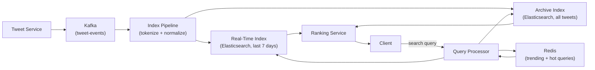
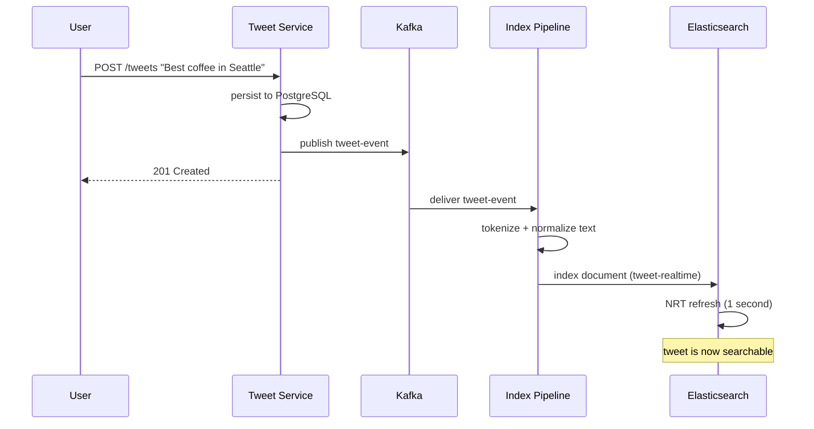
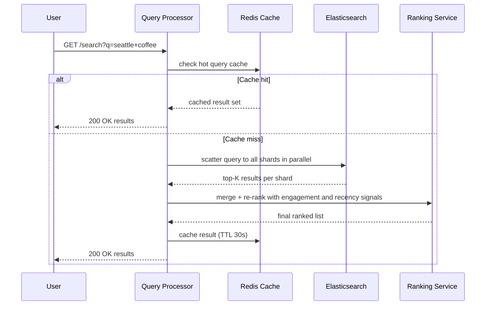

# 14. Design Twitter Search / Full-Text Search

## Requirements

### Functional
- Users can search tweets by keyword, hashtag, or @mention
- Results are ranked by relevance and recency
- New tweets appear in search results within seconds of being posted
- Support filtering by date range, language, and verified accounts
- Support autocomplete for search queries (covered separately in Q8)

### Non-Functional
- **Freshness**: a tweet posted 10 seconds ago must be searchable
- **Low latency**: search results returned in < 200ms at p99
- **High availability**: search must work during partial outages
- **Scale**: 500M tweets/day indexed, 1–2B search queries/day served

---

## Scale Estimation

```
Tweets indexed:
  500M tweets/day = ~6,000 tweets/second
  Average tweet: 200 bytes of text + 100 bytes metadata = 300 bytes
  Daily index additions: 500M × 300 bytes = 150 GB/day
  7-day real-time index: ~1 TB
  Full archive (10 years): ~500 TB

Search queries:
  1.5B queries/day = ~17,000 queries/second

Index size:
  Inverted index typically 3–5× the raw text size (term dictionary + posting lists)
  7-day index: ~3–5 TB across the cluster
```

---

## High-Level Architecture



---

## Core Components

### 1. Inverted Index — The Foundation of Full-Text Search

A traditional database scans rows to find matching text (slow). A full-text search engine pre-builds an **inverted index** — a dictionary that maps each word to the list of documents containing it:

```
Inverted index for tweets:

Term "coffee"  → [tweet:101 (pos:3, freq:1), tweet:205 (pos:1, freq:2), tweet:412 (pos:7, freq:1)]
Term "seattle" → [tweet:101 (pos:5, freq:1), tweet:318 (pos:2, freq:1), tweet:412 (pos:1, freq:1)]
Term "best"    → [tweet:101 (pos:1, freq:1), tweet:205 (pos:3, freq:1), tweet:519 (pos:4, freq:1)]
```

**Query "seattle coffee"**:
1. Look up posting list for "seattle": {101, 318, 412}
2. Look up posting list for "coffee": {101, 205, 412}
3. Intersect: {101, 412} — tweets containing both words
4. Score and rank by relevance

A posting list lookup is O(1) (hash map to find the term), and the intersection of two sorted lists is O(n). This is orders of magnitude faster than a full table scan.

---

### 2. Tokenization and Normalization — Building the Index

Before a tweet can be indexed, its text is processed into **terms** (tokens):

```
Raw tweet: "Best coffee in Seattle!! #coffee @seattlefoodie 🤩"

Step 1 — Tokenize: ["Best", "coffee", "in", "Seattle", "coffee", "seattlefoodie"]
Step 2 — Lowercase: ["best", "coffee", "in", "seattle", "coffee", "seattlefoodie"]
Step 3 — Remove stop words: ["best", "coffee", "seattle", "coffee", "seattlefoodie"]
Step 4 — Stem / lemmatize: ["best", "coffe", "seattl", "coffe", "seattlefood"]
           (optional — "running" → "run", "coffees" → "coffee")

Special tokens preserved as-is:
  Hashtags:  #coffee     → stored as exact term "hashtag:coffee"
  Mentions:  @seattlefoodie → stored as exact term "mention:seattlefoodie"
```

Normalisation ensures "Coffee", "coffee", and "COFFEE" all match the same posting list entry. Hashtags and mentions are indexed separately to allow exact lookup without relevance scoring.

---

### 3. Indexing Pipeline — Real-Time Tweet Ingestion

```
Tweet posted by user
  → Tweet Service persists to PostgreSQL
  → Publishes to Kafka topic "tweet-events"
  → Index Pipeline consumer:
      1. Fetch tweet text and metadata from Kafka
      2. Tokenize and normalize
      3. Write to Elasticsearch real-time index (< 1 second lag)
  → Tweet is searchable within ~2 seconds of posting
```

The pipeline writes to Elasticsearch using the bulk API for throughput. Elasticsearch's near-real-time architecture (NRT) makes new documents visible after a 1-second index refresh — the trade-off between write throughput and search freshness.

```csharp
public async Task IndexTweetAsync(Tweet tweet)
{
    var document = new TweetDocument
    {
        TweetId   = tweet.Id,
        AuthorId  = tweet.AuthorId,
        Text      = tweet.Text,
        Hashtags  = tweet.Hashtags,
        Mentions  = tweet.Mentions,
        Language  = tweet.Language,
        CreatedAt = tweet.CreatedAt,
        LikeCount = tweet.LikeCount,
        RetweetCount = tweet.RetweetCount
    };

    await _elasticClient.IndexAsync(document, i => i
        .Index("tweets-realtime")
        .Id(tweet.Id));
}
```

---

### 4. Query Processing — Translating a Search into Index Lookups

```csharp
public async Task<SearchResponse> SearchAsync(SearchRequest request)
{
    var response = await _elasticClient.SearchAsync<TweetDocument>(s => s
        .Index("tweets-realtime")
        .Query(q => q
            .Bool(b => b
                .Must(m => m
                    .MultiMatch(mm => mm
                        .Query(request.Query)
                        .Fields(f => f
                            .Field(d => d.Text, boost: 1.0)
                            .Field(d => d.Hashtags, boost: 2.0)  // hashtag matches score higher
                        )
                    )
                )
                .Filter(f => f
                    .Term(t => t.Language, request.Language)     // language filter
                    .DateRange(r => r
                        .Field(d => d.CreatedAt)
                        .GreaterThan(request.Since))             // date filter
                )
            )
        )
        .Sort(sort => sort
            .Descending(SortSpecialField.Score)                  // relevance first
            .Descending(d => d.CreatedAt)                        // then recency
        )
        .Size(20)
    );

    return MapToSearchResponse(response);
}
```

---

### 5. Relevance Scoring — What Makes a Tweet Rise to the Top

Elasticsearch uses **BM25** (Best Match 25) as its base relevance algorithm — an improvement over TF-IDF:

```
BM25 score for a term in a document:
  score = IDF × (TF × (k1 + 1)) / (TF + k1 × (1 - b + b × docLen/avgDocLen))

  IDF (Inverse Document Frequency): rare terms score higher
    "coffee" appears in 10M tweets → low IDF
    "covfefe" appears in 5 tweets → high IDF

  TF (Term Frequency): term appearing more in one tweet scores higher
    tweet mentioning "coffee" 3 times > tweet mentioning "coffee" once

  docLen normalisation: penalises very long documents padding the score
```

Twitter-specific **ranking signals** applied on top of BM25:

| Signal | Why |
|---|---|
| Recency | Tweets from the last hour score much higher — Twitter is about now |
| Engagement | Likes + retweets indicate quality content |
| Author authority | Verified accounts and accounts you follow score higher |
| Hashtag exact match | Query `#coffee` → hashtag match scores higher than body text match |
| Language match | Tweets in the user's language score higher |

---

### 6. Real-Time vs Archive Index

Twitter splits the search index into two tiers:

**Real-Time Index** (last 7 days):
- Optimised for write throughput — ingests 6,000 tweets/second
- Smaller size fits in RAM across the cluster → fast reads
- Index is rebuilt or refreshed frequently
- Serves the vast majority of search queries (users rarely search tweets older than a week)

**Archive Index** (all tweets since 2006):
- Optimised for read throughput and storage efficiency
- Much larger — requires extensive sharding and cold storage tiers
- Queried only for explicit historical searches ("find tweets from March 2020")
- Lower freshness requirement — batch updates acceptable

---

### 7. Trending Topics

Trending is a separate pipeline from search — it does not use the inverted index:

```
All incoming tweets → Kafka → Trend Aggregator
  → Count term frequency per H3 cell (geographic area) per 5-minute window
  → Compare to baseline (same time last week)
  → If spike ratio > 3×: mark as trending in this location
  → Store trending terms in Redis with TTL = 15 minutes
  → Trending endpoint reads from Redis (< 1ms response)
```

A term trending is not about absolute count but relative spike — "World Cup" trending when there is a match, even though "the" appears far more often.

---

## Data Model

### Tweet document in Elasticsearch

```json
{
  "tweet_id":      "1802345678901",
  "author_id":     "user-42",
  "text":          "Best coffee in Seattle!! #coffee @seattlefoodie",
  "hashtags":      ["coffee"],
  "mentions":      ["seattlefoodie"],
  "language":      "en",
  "created_at":    "2026-07-10T09:15:00Z",
  "like_count":    142,
  "retweet_count": 38,
  "is_verified_author": false
}
```

### Index mapping (Elasticsearch)

```json
{
  "mappings": {
    "properties": {
      "tweet_id":    { "type": "keyword" },
      "text":        { "type": "text", "analyzer": "english" },
      "hashtags":    { "type": "keyword" },
      "mentions":    { "type": "keyword" },
      "language":    { "type": "keyword" },
      "created_at":  { "type": "date" },
      "like_count":  { "type": "integer" },
      "retweet_count": { "type": "integer" }
    }
  }
}
```

`text` fields are analyzed (tokenized, normalized, stemmed). `keyword` fields are stored as-is for exact match filtering — hashtags and mentions are never tokenized further.

---

## API Design

```
GET /api/v1/search?q=seattle+coffee&lang=en&since=2026-07-01&limit=20

Response 200 OK:
{
  "query": "seattle coffee",
  "total_results": 48200,
  "results": [
    {
      "tweet_id": "1802345678901",
      "text": "Best coffee in Seattle!! #coffee @seattlefoodie",
      "author": { "id": "user-42", "handle": "foodie_jane" },
      "created_at": "2026-07-10T09:15:00Z",
      "like_count": 142,
      "score": 0.94
    },
    ...
  ],
  "next_cursor": "eyJvZmZzZXQiOjIwfQ=="
}

GET /api/v1/trending?location=seattle&limit=10
Response: { "trends": ["#WorldCup", "Seattle coffee", ...] }
```

---

## Key Challenges & Solutions

### Challenge 1: Index freshness — tweets must be searchable within seconds

The indexing pipeline must process 6,000 tweets/second with < 2-second end-to-end latency.

**Solution**:
- Kafka decouples Tweet Service from Index Pipeline — tweet is acknowledged immediately, indexing happens asynchronously
- Index Pipeline consumers run in parallel (one per Kafka partition)
- Elasticsearch NRT refresh interval set to 1 second (default) — trade-off: shorter = fresher but more I/O
- For breaking news, refresh can be forced immediately (`POST /tweets-realtime/_refresh`)

### Challenge 2: Index sharding — 3–5 TB does not fit on one node

**Solution**: Elasticsearch shards the index automatically. Each shard is a self-contained Lucene index:

```
tweets-realtime index: 20 primary shards × 2 replicas = 60 total shards

Shard 0:  tweets with IDs hashing to bucket 0  → Elasticsearch Node 1
Shard 1:  tweets with IDs hashing to bucket 1  → Elasticsearch Node 2
...
Shard 19: tweets with IDs hashing to bucket 19 → Elasticsearch Node 10
```

A search query is broadcast to all 20 primary shards in parallel (scatter-gather). Each shard returns its top-K results; the coordinator merges and re-ranks them globally.

### Challenge 3: Hotspot at #trending hashtag

A viral hashtag suddenly receives millions of tweets. All queries for that hashtag hit the same shards heavily.

**Solutions**:
- Cache top trending query results in Redis (TTL = 30 seconds) — identical queries served from cache
- Read replicas for hot shards absorb extra read traffic
- Separate index for trending topics with pre-computed result sets

### Challenge 4: Spam and low-quality content flooding results

Bots post thousands of identical or near-identical tweets to manipulate search results.

**Solutions**:
- Minimum engagement filter: tweets with 0 likes/retweets from accounts < 7 days old are deprioritised
- Near-duplicate detection: SimHash (same technique as web crawler Q7) — tweets with similarity > 0.9 to an already-indexed tweet are suppressed
- Rate limit indexing per account: > 100 tweets/hour from one account triggers review before indexing

---

## Trade-offs

| Decision | Choice | Why | Alternative |
|---|---|---|---|
| Index engine | Elasticsearch (Lucene) | Battle-tested, rich query DSL, handles sharding automatically | Custom Lucene (Twitter's Earlybird — more control, more complexity) |
| Index split | Real-time + archive | Optimise each tier for its access pattern | Single index (simpler but forces compromise on both write and read performance) |
| Relevance | BM25 + signals | Good baseline + Twitter-specific boosts | Pure ML ranking (more accurate but slower and harder to explain) |
| Freshness | 1-second NRT refresh | Standard Elasticsearch default; balances freshness vs I/O | 100ms refresh (fresher but 10× more I/O overhead) |
| Trending | Separate Redis pipeline | Decoupled from search; < 1ms response | Query search index for frequency (slow, competes with search traffic) |
| CAP position | **AP** | Returning slightly stale results is better than search being down | CP (unnecessary — missing a tweet for 2 seconds is acceptable) |

---

## Sequence Diagrams

**Tweet indexed into real-time search**



**User searches for "seattle coffee"**


