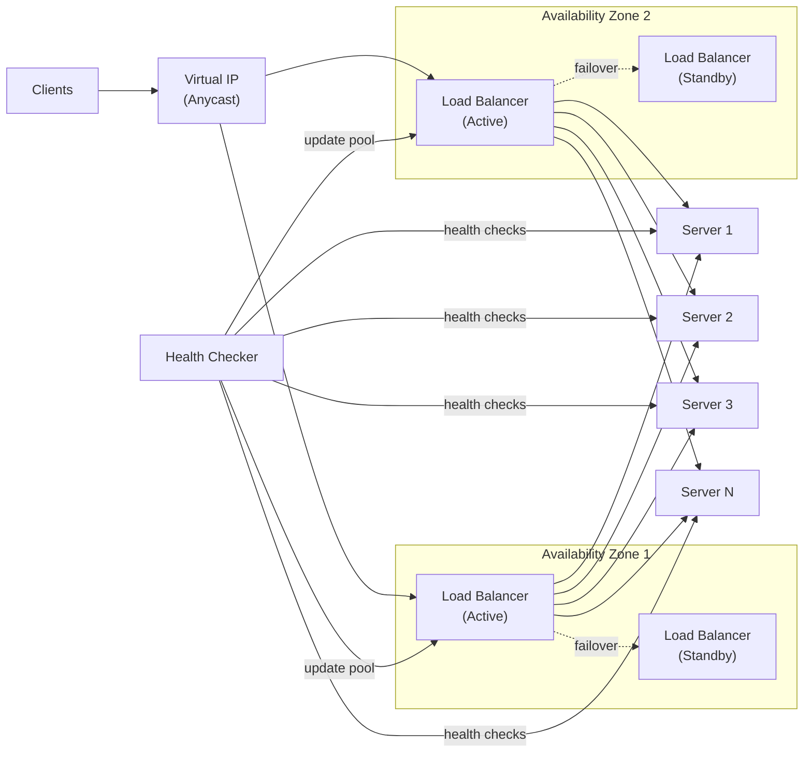
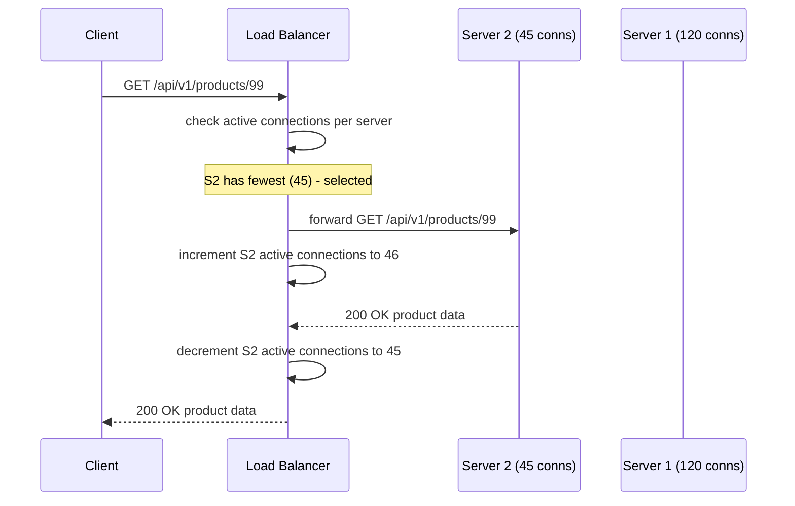
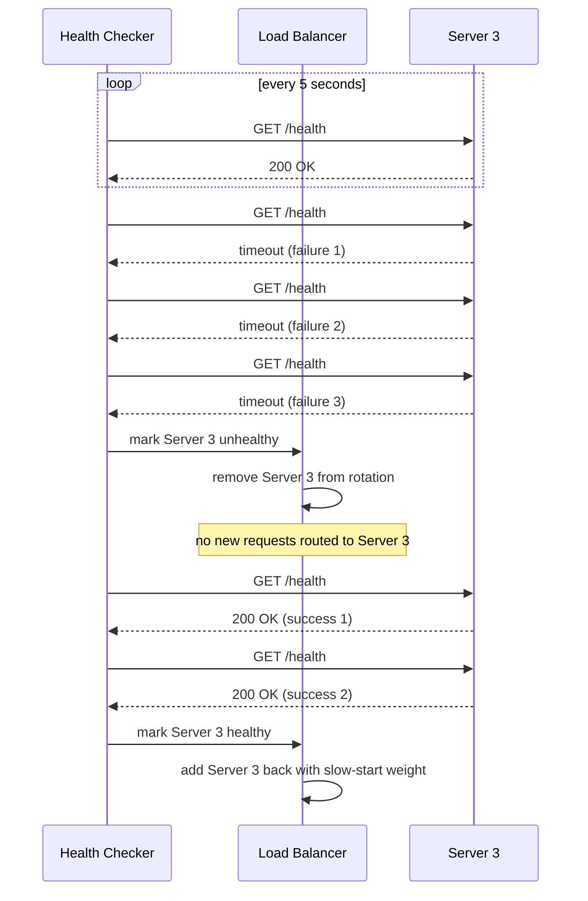

# 16. Design a Load Balancer

## Requirements

### Functional
- Distribute incoming requests across a pool of backend servers
- Detect unhealthy servers and stop routing to them automatically
- Support multiple load balancing algorithms (round robin, least connections, IP hash)
- Support sticky sessions — route the same client to the same server consistently
- Drain a server gracefully before taking it offline for maintenance
- Support both HTTP/HTTPS and TCP traffic

### Non-Functional
- **Throughput**: handle 1M+ requests/second
- **Latency**: add < 1ms overhead per request
- **High availability**: the load balancer itself must not be a single point of failure
- **Health checking**: detect a failed server within 10 seconds
- Scale: large platform with hundreds of backend servers across multiple availability zones

---

## Scale Estimation

```
Requests:           1,000,000 req/second
Avg request size:   2 KB
Throughput:         2 GB/second

Load balancer instances needed:
  Single LB instance (high-performance, kernel bypass): ~500K req/s
  → 2 active instances minimum for 1M req/s
  → Deploy 4 for redundancy (active-active pair per AZ)

Health check overhead:
  200 backend servers × 1 health check every 5s = 40 checks/second (trivial)
```

---

## High-Level Architecture



---

## Core Components

### 1. Load Balancing Algorithms

The algorithm determines which backend server receives each request. Different algorithms suit different workloads:

**Round Robin** — requests distributed sequentially across servers:
```
Request 1 → Server 1
Request 2 → Server 2
Request 3 → Server 3
Request 4 → Server 1 (wraps around)
```
Simple and fair. Assumes all servers have equal capacity and all requests have equal cost — often not true in practice.

**Weighted Round Robin** — servers with more capacity get more requests:
```
Server 1: weight=3 (8 CPU cores)
Server 2: weight=1 (2 CPU cores)

Request 1 → Server 1
Request 2 → Server 1
Request 3 → Server 1
Request 4 → Server 2
Request 5 → Server 1 (cycle repeats)
```

**Least Connections** — route to the server with the fewest active connections:
```
Server 1: 120 active connections
Server 2: 45 active connections  ← next request goes here
Server 3: 98 active connections
```
Better than round robin when requests have variable processing time — a slow server accumulates connections and naturally receives fewer new ones.

**IP Hash** — hash the client IP to pick a server (same IP always maps to same server):
```csharp
public int SelectServer(IPAddress clientIp, List<Server> servers)
{
    var hash = clientIp.GetHashCode();
    return Math.Abs(hash) % servers.Count;
}
```
Used for sticky sessions without cookies. Limitation: if a server goes down, all its clients reroute — losing session state.

**Least Response Time** — route to the server with the lowest average response time:
```
Server 1: avg 45ms response
Server 2: avg 12ms response  ← next request goes here
Server 3: avg 78ms response
```
Most accurate measure of server health and capacity but requires tracking response times per server.

---

### 2. Health Checking — Detecting Failed Servers

The health checker continuously probes backend servers and removes unhealthy ones from the rotation:

**Passive health check**: the load balancer monitors responses to real traffic. If a server returns 5xx errors or times out, it is marked unhealthy. No extra probes needed — uses production traffic as signal.

**Active health check**: the load balancer sends dedicated probe requests on a schedule, independent of real traffic:

```csharp
public class HealthChecker : BackgroundService
{
    protected override async Task ExecuteAsync(CancellationToken ct)
    {
        while (!ct.IsCancellationRequested)
        {
            foreach (var server in _serverPool.All())
            {
                var healthy = await ProbeAsync(server);

                if (!healthy)
                    server.ConsecutiveFailures++;
                else
                    server.ConsecutiveFailures = 0;

                // Mark unhealthy after 3 consecutive failures
                if (server.ConsecutiveFailures >= 3)
                    _serverPool.MarkUnhealthy(server);

                // Mark healthy again after 2 consecutive successes
                if (healthy && server.ConsecutiveSuccesses >= 2)
                    _serverPool.MarkHealthy(server);
            }
            await Task.Delay(TimeSpan.FromSeconds(5), ct);
        }
    }

    private async Task<bool> ProbeAsync(Server server)
    {
        try
        {
            var response = await _http.GetAsync($"http://{server.Host}:{server.Port}/health");
            return response.IsSuccessStatusCode;
        }
        catch
        {
            return false;
        }
    }
}
```

Three failure thresholds before marking unhealthy prevents transient blips from causing flapping. Two success thresholds before marking healthy prevents premature re-entry.

---

### 3. Layer 4 vs Layer 7 Load Balancing

Load balancers operate at different layers of the network stack, with different capabilities:

**Layer 4 (Transport Layer — TCP/UDP)**:
- Routes based on IP address and port only
- Does not inspect the request content — treats traffic as raw bytes
- Extremely fast — minimal processing per packet
- Cannot route based on URL path, HTTP headers, or cookies
- Used for: raw TCP traffic, UDP (DNS, gaming), very high throughput scenarios

```
Client → LB (sees: src=203.0.113.42:54321, dst=10.0.0.1:443)
LB → Server 2 (translates dst to server's IP — NAT)
Server 2 → Client (response goes directly back, or through LB depending on mode)
```

**Layer 7 (Application Layer — HTTP/HTTPS)**:
- Inspects the full HTTP request (URL, headers, body, cookies)
- Can route based on URL path, hostname, content type, user agent
- Can terminate TLS (decrypt HTTPS at the LB, forward plain HTTP to backends)
- Can modify requests and responses (add/remove headers, rewrite URLs)
- Slower than L4 due to full packet inspection — but still < 1ms added latency

```
Client → LB (sees full HTTP request: GET /api/v1/users/42, Host: api.example.com)
LB → User Service (routes based on URL prefix /api/v1/users)
LB → Order Service (routes /api/v1/orders to a different server pool)
```

Most large platforms use **L7 for application traffic** (rich routing capabilities) and **L4 as the outer tier** (absorbs raw TCP connections, forwards to L7 LBs):

```
Internet → L4 LB (routes TCP connections to L7 LBs)
         → L7 LB (inspects HTTP, routes to correct backend service)
         → Backend Servers
```

---

### 4. Sticky Sessions

Some applications store session state on the server (user shopping cart, game state). A subsequent request from the same user must reach the same server — this is a sticky session.

**Cookie-based stickiness** (L7 only):
```
First request from user:
  LB selects Server 2, sets cookie: Set-Cookie: LB_SERVER=srv2; HttpOnly

Subsequent requests:
  Client sends Cookie: LB_SERVER=srv2
  LB reads cookie → routes directly to Server 2
```

**IP-hash stickiness** (L4 or L7):
```
hash(client_IP) % num_servers → always same server
```

**Problem with sticky sessions**: if Server 2 crashes, all its sticky clients lose their session. The fix is to move session state out of server memory and into a shared store (Redis) — then any server can handle any request, and stickiness becomes unnecessary. This is the preferred architecture.

---

### 5. Graceful Drain

Before taking a server offline for maintenance (deployment, scaling down), connections must be drained gracefully:

```
Step 1: Mark server as "draining" — no new requests routed to it
Step 2: Wait for existing in-flight requests to complete (up to drain timeout: 30s)
Step 3: After timeout (or all requests done), close connections and deregister server
Step 4: Deploy new version / perform maintenance
Step 5: Register server back, health checks pass, re-enter rotation
```

Without draining: requests in-flight to the server at the moment of shutdown receive errors — visible to users as failed requests.

---

### 6. High Availability — Preventing the LB Itself from Being a Single Point of Failure

The load balancer sits in front of everything — if it fails, the entire platform is down.

**Active-Passive failover**:
- Two LB instances share a **Virtual IP (VIP)** — a floating IP address
- Active instance owns the VIP and handles all traffic
- Passive instance monitors the active via heartbeat
- On active failure: passive detects missed heartbeats (within 1–2 seconds), claims the VIP via **VRRP** (Virtual Router Redundancy Protocol), and begins handling traffic
- Failover is invisible to clients — the VIP address never changes

**Active-Active with Anycast**:
- Multiple LB instances all announce the same IP address via BGP (Anycast)
- The network routes each client to the nearest LB instance
- If one instance fails, BGP withdraws its route and clients are automatically directed to other instances
- No failover wait — the network re-routes in seconds

AWS ALB, GCP Load Balancer, and Cloudflare all use Anycast for their global load balancers.

---

## Data Model

The load balancer is stateless for request routing. It maintains in-memory state only:

```
Server pool:
  server_id   host           port  weight  status     active_connections  avg_response_ms
  srv-1       10.0.1.10      8080  3       healthy    142                 45
  srv-2       10.0.1.11      8080  1       healthy    38                  12
  srv-3       10.0.1.12      8080  2       unhealthy  0                   -
  srv-4       10.0.1.13      8080  2       draining   7                   61

Sticky session table (for cookie-based stickiness):
  session_id → server_id   (in-memory hash map, or Redis for multi-LB consistency)
```

---

## API Design

Load balancers are configured via a management API (not exposed to end users):

```
GET  /api/servers                     → list all servers and their status
POST /api/servers                     → add a server to the pool
DELETE /api/servers/{id}              → remove a server (triggers graceful drain)
PATCH /api/servers/{id}/weight        → update server weight
PATCH /api/servers/{id}/drain         → start graceful drain
GET  /api/stats                       → current connections, request rates, error rates
POST /api/algorithm                   → switch load balancing algorithm
```

---

## Key Challenges & Solutions

### Challenge 1: Thundering herd after a server comes back online

A server was unhealthy for 2 minutes. It passes health checks and re-enters the pool. Round robin immediately sends it its fair share of requests — but the server's caches are cold and it cannot handle full load yet. It fails again.

**Solution**: **slow start** (ramp-up). When a server re-enters the pool, start it with weight=1 (minimum traffic). Over 2–3 minutes, gradually increase the weight to normal. This gives the server time to warm up its caches before receiving full load.

### Challenge 2: Uneven load despite round robin

Round robin distributes requests evenly, but if some requests take 100ms and others take 2 seconds, some servers accumulate long-running requests while others are idle.

**Solution**: use **least connections** instead of round robin for workloads with variable request duration. A server processing a 2-second request will have more active connections and receive fewer new requests until it catches up.

### Challenge 3: SSL/TLS termination at scale

Terminating TLS (decrypting HTTPS) is CPU-intensive. At 1M req/s, a single LB doing TLS termination would need significant CPU capacity.

**Solution**: offload TLS termination to dedicated hardware (SSL accelerator cards) or use DPDK/kernel bypass networking that handles TLS in optimised user-space code. Cloud load balancers (AWS ALB) handle this transparently — TLS termination is distributed across their global infrastructure.

### Challenge 4: WebSocket and long-lived connections

WebSocket connections are persistent — a client holds a connection to one server for minutes or hours. Round robin is meaningless for WebSockets (each connection is assigned once). Least connections is better — it accounts for the ongoing connection load.

Additionally, WebSocket connections must not be broken during LB upgrades. **Solution**: rolling restarts — upgrade one LB instance at a time. Active WebSocket connections stay on the old instance until they close naturally; new connections go to the upgraded instance.

---

## Trade-offs

| Decision | Choice | Why | Alternative |
|---|---|---|---|
| Algorithm | Least connections | Handles variable request duration naturally | Round robin (simpler but ignores server load) |
| Layer | L7 for HTTP | Rich routing, TLS termination, header manipulation | L4 (faster but blind to application content) |
| HA model | Active-active Anycast | No failover delay; scales horizontally | Active-passive VRRP (simpler but ~1s failover gap) |
| Sticky sessions | Cookie-based | Survives server addition/removal better than IP hash | IP hash (simpler, no cookie overhead) |
| Session state | External Redis | Removes need for stickiness entirely; any server handles any request | Server-local (requires stickiness; fragile on server failure) |
| Health checks | Active + passive combined | Active catches failures before real traffic hits; passive catches subtle degradation | Active only (misses degraded-but-alive servers) |

---

## Sequence Diagrams

**Request routing — least connections**



**Health check and server removal**


