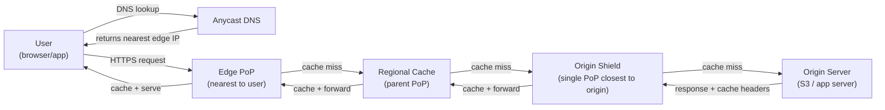
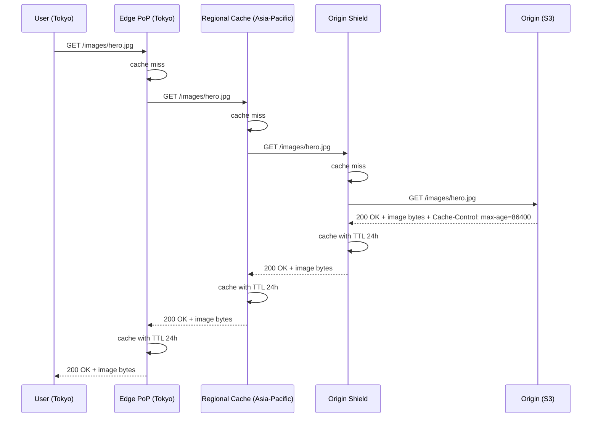
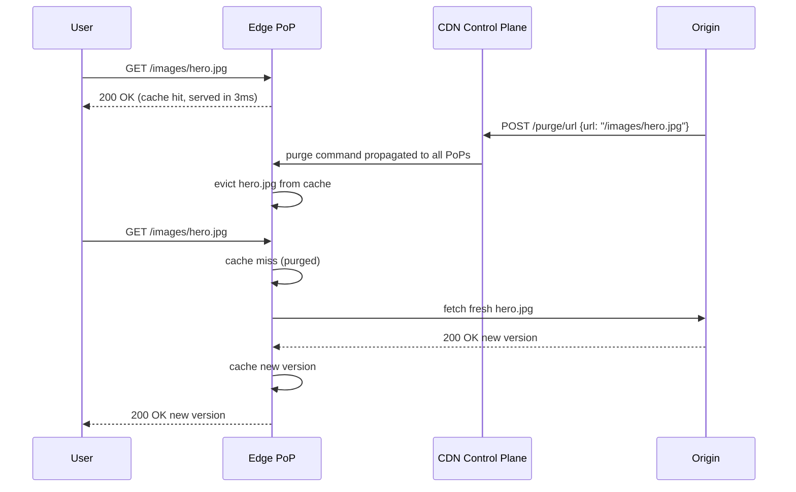

# 17. Design a CDN (Content Delivery Network)

## Requirements

### Functional
- Cache and serve static assets (images, videos, JS, CSS) from edge locations close to users
- Serve dynamic content with acceleration (connection reuse, route optimisation)
- Invalidate cached content when the origin updates it
- Support HTTPS with TLS termination at the edge
- Handle cache miss by fetching from origin and caching the response
- Support custom cache rules (TTL per content type, bypass for certain paths)

### Non-Functional
- **Low latency**: content served from < 50ms for 95% of users globally
- **High availability**: serve cached content even if the origin is down
- **Throughput**: handle petabytes of data transfer per day
- **Cache hit rate**: > 90% of requests served from cache (not hitting origin)
- Scale: global platform — users on every continent

---

## Scale Estimation

```
Daily traffic:       10 petabytes (PB) transferred per day
Requests:            1 billion requests/day = ~11,500 req/second globally
Avg object size:     1 MB (mix of images, videos, JS)

Origin offload (90% cache hit rate):
  Requests hitting origin: 11,500 × 10% = 1,150 req/second
  Data from origin:        10 PB × 10%  = 1 PB/day

Edge locations:
  200 PoPs (Points of Presence) globally
  Each PoP handles ~57 req/second on average (skewed toward dense regions)

Storage per PoP:
  Cached working set: ~10 TB per PoP (SSD for hot, HDD for warm)
```

---

## High-Level Architecture



---

## Core Components

### 1. DNS-Based Routing — Getting the User to the Nearest Edge

When a user's browser resolves `cdn.example.com`, the CDN's DNS service returns the IP address of the nearest edge PoP, not a single global IP:

```
User in Tokyo:
  DNS query: cdn.example.com
  CDN DNS: client is in AS7670 (NTT Japan) → return Tokyo PoP IP: 203.0.113.10

User in London:
  DNS query: cdn.example.com
  CDN DNS: client is in AS5089 (BT UK) → return London PoP IP: 198.51.100.20
```

The CDN DNS knows the user's approximate location from their **IP geolocation** and the **BGP Autonomous System** their request originates from. It returns the IP of the lowest-latency PoP for that user — typically determined by network distance (fewest BGP hops), not geographic distance.

**Anycast DNS**: the CDN's DNS resolvers themselves are Anycast — every DNS resolver in the CDN fleet announces the same IP via BGP, so the user's DNS query also goes to the nearest DNS resolver automatically.

---

### 2. Edge PoP — The Cache at the Network Edge

Each edge PoP is a cluster of servers in a data centre co-located with major internet exchange points (IXPs) — where ISPs connect to each other. This minimises the number of network hops between the user and the cache.

**Cache lookup at the edge:**

```
Request: GET https://cdn.example.com/images/hero.jpg

Cache key: "example.com/images/hero.jpg" (hostname + path + optional vary headers)

Cache hit:  serve from local SSD cache → response in < 5ms
Cache miss: forward to regional cache (parent PoP)
```

**Cache storage tiers at the edge:**
```
L1 (hot):  SSD, ~1 TB    — most frequently requested objects, sub-millisecond access
L2 (warm): HDD, ~10 TB   — less frequent objects, ~5ms access
L3 (miss): fetch from regional cache or origin
```

Objects are evicted using **LRU (Least Recently Used)** — when the cache is full, the object that has not been requested for the longest time is evicted first.

---

### 3. Tiered Caching — Regional Caches and Origin Shield

A naive CDN has each edge PoP fetch directly from the origin on a miss. With 200 PoPs, a cache miss at all of them simultaneously (e.g. after a cache invalidation) would send 200 simultaneous requests to the origin — the **thundering herd**.

**Solution**: tiered caching with an Origin Shield:

```
200 edge PoPs → ~20 regional caches → 1 Origin Shield → Origin

On a cache miss:
  Edge PoP (Tokyo) misses → asks Regional Cache (Asia-Pacific)
  Regional Cache (Asia-Pacific) hits → returns from cache  ← only 1 origin request saved

  Edge PoP (Tokyo) misses → asks Regional Cache (Asia-Pacific) misses → asks Origin Shield
  Origin Shield hits → returns from cache  ← still only 1 origin request

  All three miss → Origin Shield fetches from origin → caches at all three layers
```

**Origin Shield** is one specific PoP designated as the single point of contact with the origin. No matter how many edge PoPs miss simultaneously, at most one request reaches the origin (from the Shield). This collapses 200 simultaneous origin fetches into 1.

---

### 4. Cache Control — What Gets Cached and for How Long

The origin server controls caching behaviour via HTTP response headers:

```
Cache-Control: public, max-age=86400        → cache for 24 hours, shared caches allowed
Cache-Control: private, max-age=0           → do not cache (user-specific content)
Cache-Control: public, s-maxage=3600        → CDN caches for 1 hour (overrides max-age for shared caches)
Cache-Control: no-store                     → never cache, not even for a single request
Surrogate-Control: max-age=86400            → CDN-specific header (stripped before sending to browser)
ETag: "abc123"                              → content fingerprint for conditional requests
Last-Modified: Mon, 14 Jul 2026 08:00:00   → timestamp for conditional requests
```

**CDN-specific TTL rules** (configured in the CDN dashboard, override origin headers):

```
/images/**           → TTL: 30 days   (images rarely change; versioned filenames)
/videos/**           → TTL: 7 days
/assets/app.js       → TTL: 1 year    (hashed filename: app.a3f8b2.js — never changes)
/api/**              → TTL: 0         → bypass cache, always forward to origin
/user/profile/**     → TTL: 0         → bypass cache (user-specific content)
```

---

### 5. Cache Invalidation — Evicting Stale Content

When content changes at the origin, the cached copies at all edge PoPs must be invalidated. Three strategies:

**URL-based purge** — explicitly invalidate specific URLs:
```
POST /api/v1/purge
{ "urls": ["https://cdn.example.com/images/hero.jpg"] }

CDN propagates purge command to all edge PoPs within ~5 seconds
Next request for hero.jpg: cache miss → fetches fresh version from origin
```

**Tag-based purge** — group objects by tag and purge all with one call:
```
Origin tags response: Surrogate-Key: product-42 category-electronics

Later: POST /purge { "tag": "product-42" }
→ All objects tagged "product-42" across all PoPs are purged simultaneously
→ Useful when a product update invalidates multiple images, pages, and assets
```

**Versioned URLs** — the best strategy for static assets:
```
Bad:  /assets/app.js            → same URL, must invalidate on every deploy
Good: /assets/app.a3f8b2.js    → content hash in filename; new deploy = new URL
      /assets/app.c7d91f.js    → old URL still cached (and correct); new URL served fresh
```

With versioned URLs, old content never needs to be invalidated — it simply stops being requested. The cache naturally evicts it via LRU. This is the standard for JS, CSS, and images in modern frontend builds (webpack, Vite).

---

### 6. Dynamic Content Acceleration

Not all content can be cached. User-specific API responses, personalised pages, and checkout flows must hit the origin on every request. The CDN still adds value:

**TCP connection persistence**: the edge PoP maintains a persistent pool of connections to the origin. The user's request uses an existing warm TCP connection — no new TCP handshake needed (saves ~50ms).

**Protocol optimisation**: the edge PoP connects to the origin over HTTP/2 or HTTP/3 (QUIC), multiplexing many requests over one connection.

**Route optimisation**: the CDN's internal backbone (private fibre between PoPs) is faster and more reliable than the public internet. A request from Tokyo to an origin in New York travels over Cloudflare's or Akamai's private network — fewer hops, less congestion.

**TLS termination at the edge**: the user's TLS handshake terminates at the nearest edge PoP, not at the distant origin. This cuts the TLS handshake latency from ~200ms (round trip to origin) to ~10ms (round trip to local edge PoP).

---

### 7. Security at the Edge

The CDN sits between the internet and the origin — it can enforce security before requests reach the origin:

**DDoS mitigation**: absorbs volumetric attacks (millions of requests/second) at the edge. The origin never sees the flood — the CDN drops malicious traffic at its 200 PoPs simultaneously.

**WAF (Web Application Firewall)**: inspects HTTP requests for known attack patterns (SQL injection, XSS, path traversal). Blocks malicious requests at the edge before they reach the origin.

**Bot detection**: distinguishes human users from bots via browser fingerprinting, JavaScript challenges (similar to CAPTCHA), and request pattern analysis.

**TLS certificate management**: the CDN manages TLS certificates for customer domains (Let's Encrypt or dedicated certificates), handles renewal automatically.

---

## Data Model

CDN state is distributed — each PoP maintains its own cache independently:

```
Cache entry (per object, per PoP):
  cache_key:     "example.com/images/hero.jpg"
  content:       bytes (stored on SSD/HDD)
  etag:          "abc123"
  expires_at:    timestamp (now + TTL)
  last_accessed: timestamp (for LRU eviction)
  content_type:  "image/jpeg"
  size_bytes:    245760

Object metadata (shared across PoPs, stored in distributed KV):
  surrogate_keys: ["product-42", "category-electronics"]
  purge_version:  7   ← incremented on each purge; PoPs compare on cache hit
```

---

## API Design

### Content delivery (transparent — no explicit API call by user)

```
GET https://cdn.example.com/images/hero.jpg
→ Edge PoP serves from cache or fetches from origin
→ Returns: 200 OK + content + cache headers
→ Returns: 304 Not Modified (if client sent If-None-Match / If-Modified-Since and content unchanged)
```

### CDN management API (for content owners)

```
POST /api/v1/purge/url          → purge specific URLs
POST /api/v1/purge/tag          → purge all objects with a surrogate key
GET  /api/v1/analytics          → cache hit rate, bandwidth, request counts per PoP
POST /api/v1/rules              → update cache TTL rules per path pattern
GET  /api/v1/origin-shield      → configure which PoP acts as origin shield
```

---

## Key Challenges & Solutions

### Challenge 1: Cache stampede on popular content expiry

A viral image's TTL expires simultaneously across 200 edge PoPs. All 200 send a fetch to the origin at the same moment. The origin is overwhelmed.

**Solutions**:
- **Origin Shield**: collapses 200 simultaneous fetches to 1 (the shield fetches once, all edge PoPs wait for it)
- **Stale-while-revalidate**: serve the stale cached object immediately while fetching a fresh version in the background. Users see no delay; origin is not hit by 200 simultaneous urgent requests
  ```
  Cache-Control: max-age=3600, stale-while-revalidate=86400
  → Serve cached version for up to 24 hours after expiry while refreshing in background
  ```

### Challenge 2: Cache poisoning — attacker injects malicious content into cache

An attacker crafts a request that tricks the CDN into caching a malicious response (e.g. a 404 page that contains XSS, or a response for URL `/admin` cached for all users).

**Solutions**:
- Only cache responses with explicit `Cache-Control: public` headers
- Never cache responses to requests with `Authorization` or `Cookie` headers (unless Vary is correctly set)
- Validate cache keys include all relevant request variations (host, path, query string)
- Never cache 4xx/5xx responses (or cache them for only a very short TTL)

### Challenge 3: Geo-restricted content — different content for different regions

A video licensed only for the US must not be served in Europe.

**Solution**: the edge PoP checks the user's geolocation (from IP) against the content's access rules before serving. If the user is in a restricted region, the PoP returns 403 or redirects to a "not available in your region" page — without ever fetching from the origin.

### Challenge 4: Long-tail content — objects requested only once

80% of objects are requested only once or twice. Caching them wastes SSD space and evicts hot objects. They never achieve a cache hit.

**Solution**: do not cache long-tail content at edge PoPs. Route it directly to a regional cache or origin shield. Only cache objects that are requested more than N times in a time window (request coalescing threshold). Some CDNs use ML models to predict which objects are worth caching based on content type, URL pattern, and historical access frequency.

---

## Trade-offs

| Decision | Choice | Why | Alternative |
|---|---|---|---|
| Routing | DNS-based geolocation | Simple, works with any client, sub-100ms | Anycast IP (faster but complex BGP management) |
| Cache hierarchy | Three-tier (edge → regional → shield) | Collapses origin requests; each tier has more storage | Two-tier (edge → origin; simpler but more origin load) |
| Invalidation | Versioned URLs for static assets | No invalidation needed; old and new coexist | Time-based TTL (simpler but stale window before expiry) |
| Eviction | LRU | Simple, effective for temporal locality | LFU (frequency-based; better for viral content spikes) |
| Dynamic content | Accelerate via edge TCP pools | Reduces latency without caching | Full caching with short TTL (risky for personalised content) |
| Security | WAF + DDoS at edge | Protects origin; absorbs attacks at the distributed edge | Origin-side WAF (origin still receives attack traffic) |
| CAP position | **AP** | Serving slightly stale content is better than being unavailable | CP (unnecessary for a cache — brief staleness is acceptable) |

---

## Sequence Diagrams

**Cache miss — tiered fetch from origin**



**Cache hit and purge flow**


