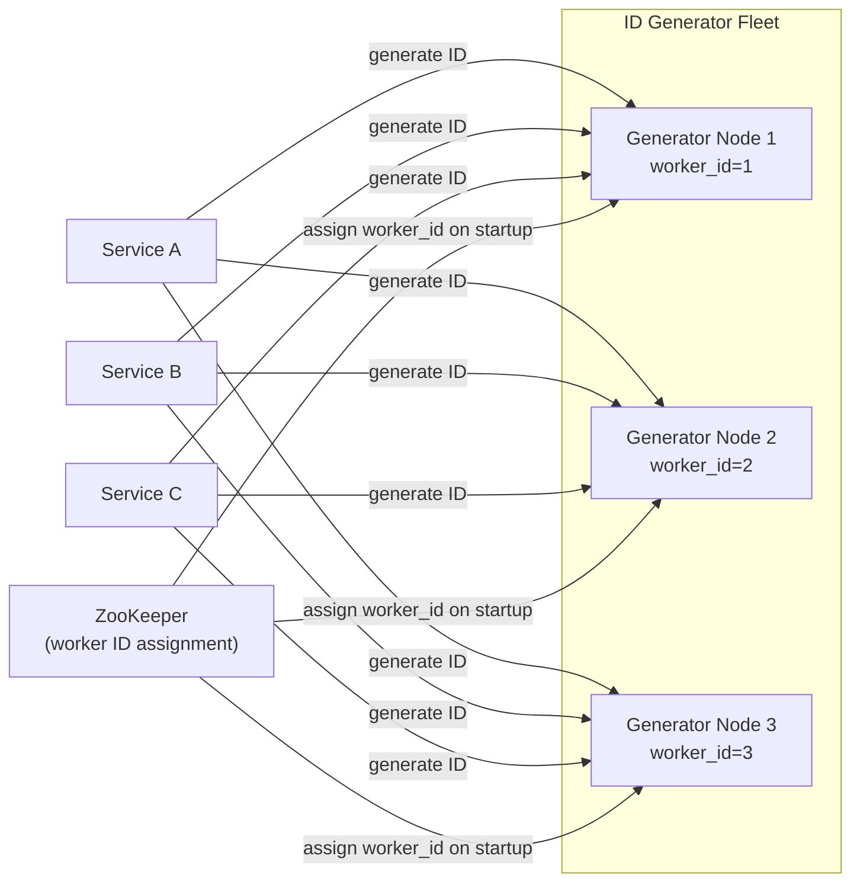
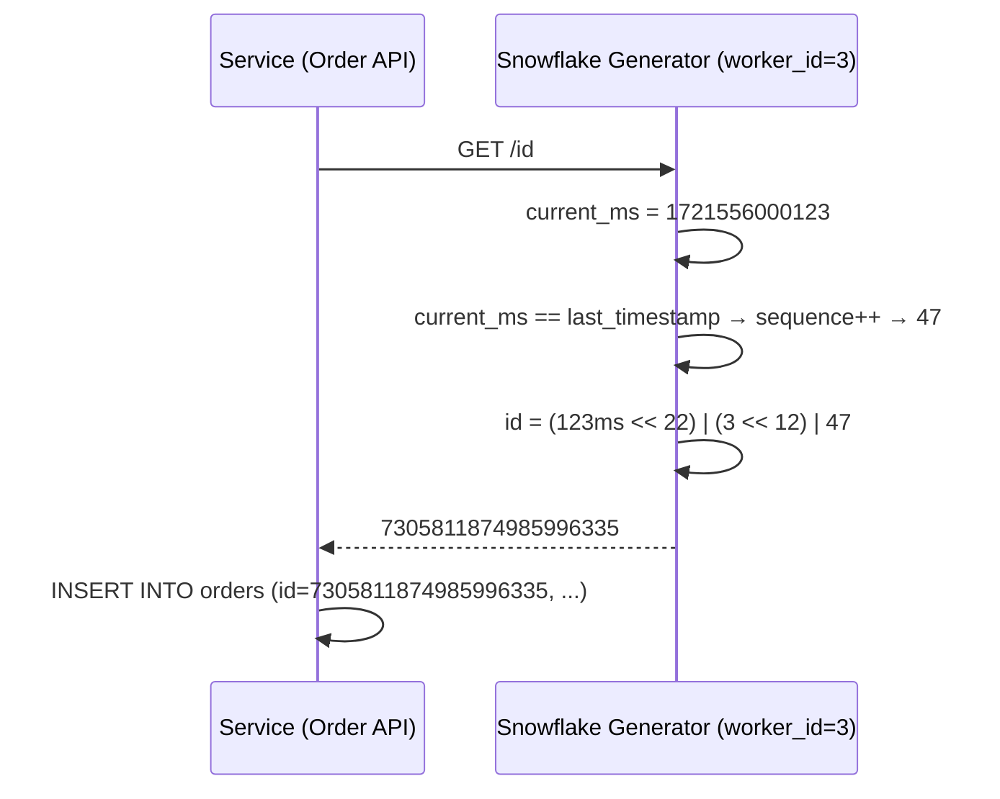
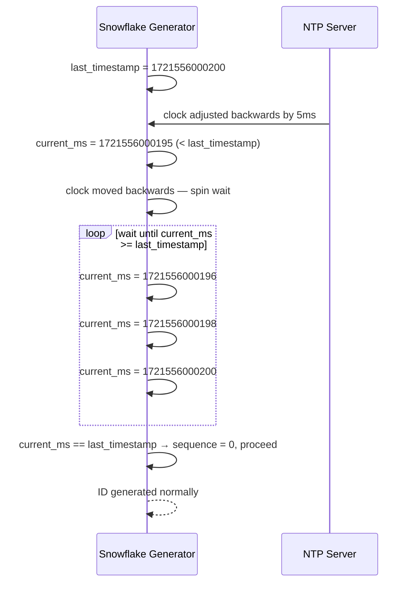

# 18. Design a Distributed ID Generator

## Requirements

### Functional
- Generate unique IDs across a distributed system with multiple generator instances
- IDs must be globally unique — no two IDs are ever the same, even across nodes
- IDs should be roughly time-ordered (newer records have larger IDs)
- Generate IDs without coordination between nodes (no central lock or consensus)

### Non-Functional
- **Throughput**: 100,000+ IDs/second across the system
- **Latency**: ID generation must be near-instant (< 1ms) — it is in the critical path of every write
- **High availability**: no single point of failure — if one generator node goes down, others keep generating
- **Monotonicity**: IDs generated on the same node should increase over time (supports range scans in databases)
- Scale: global system, multiple datacentres, hundreds of services calling the generator

---

## Scale Estimation

```
Writes per second:     100,000 globally
Generator nodes:       10 (10,000 IDs/node/second)
ID bit width:          64 bits (fits in a long/int64 — compatible with most databases)

Lifespan with 41-bit timestamp (milliseconds since epoch):
  2^41 = 2,199,023,255,552 ms ≈ 69 years
  Starting from 2024-01-01: safe until ~2093

IDs per millisecond per node:
  2^12 = 4,096 IDs/ms/node
  10 nodes × 4,096 = 40,960 IDs/ms = 40M IDs/second — far exceeds the 100K requirement
```

---

## High-Level Architecture



---

## Core Design — Snowflake ID

Twitter open-sourced **Snowflake** in 2010: a 64-bit integer composed of three fields that together guarantee uniqueness without coordination.

### Bit layout

```
 63        22 21      12 11       0
 ┌──────────┬──────────┬──────────┐
 │timestamp │ worker   │ sequence │
 │ 41 bits  │ 10 bits  │ 12 bits  │
 └──────────┴──────────┴──────────┘

Total: 1 sign bit (always 0) + 41 + 10 + 12 = 64 bits
```

- **41 bits — timestamp**: milliseconds since a custom epoch (e.g. 2024-01-01). Gives 69 years of range.
- **10 bits — worker ID**: identifies the generator node. Supports up to 1,024 unique nodes.
- **12 bits — sequence**: counter reset each millisecond. Supports 4,096 IDs per millisecond per node.

### How uniqueness is guaranteed

Two IDs can only collide if they share the same timestamp millisecond AND the same worker ID AND the same sequence number. The worker ID is unique per node (assigned at startup). The sequence resets to 0 each millisecond and increments atomically within a node. So within one millisecond:
- Node 1 generates IDs with sequence 0, 1, 2, ..., 4095
- Node 2 generates IDs with sequence 0, 1, 2, ..., 4095
- No collision — different worker IDs

Across milliseconds, the timestamp field increments — all IDs from millisecond N+1 are larger than all IDs from millisecond N.

### C# implementation

```csharp
public sealed class SnowflakeGenerator
{
    private const long Epoch = 1704067200000L; // 2024-01-01 UTC in ms
    private const int WorkerIdBits = 10;
    private const int SequenceBits = 12;
    private const long MaxWorkerId = (1L << WorkerIdBits) - 1;    // 1023
    private const long MaxSequence = (1L << SequenceBits) - 1;    // 4095
    private const int WorkerIdShift = SequenceBits;                // 12
    private const int TimestampShift = SequenceBits + WorkerIdBits; // 22

    private readonly long _workerId;
    private long _lastTimestamp = -1L;
    private long _sequence = 0L;
    private readonly object _lock = new();

    public SnowflakeGenerator(long workerId)
    {
        if (workerId < 0 || workerId > MaxWorkerId)
            throw new ArgumentOutOfRangeException(nameof(workerId));
        _workerId = workerId;
    }

    public long NextId()
    {
        lock (_lock)
        {
            var timestamp = CurrentMs();

            if (timestamp < _lastTimestamp)
                throw new InvalidOperationException(
                    $"Clock moved backwards by {_lastTimestamp - timestamp}ms");

            if (timestamp == _lastTimestamp)
            {
                _sequence = (_sequence + 1) & MaxSequence;
                if (_sequence == 0)
                    timestamp = WaitNextMs(_lastTimestamp); // sequence exhausted — wait for next ms
            }
            else
            {
                _sequence = 0; // new millisecond — reset sequence
            }

            _lastTimestamp = timestamp;

            return ((timestamp - Epoch) << TimestampShift)
                 | (_workerId << WorkerIdShift)
                 | _sequence;
        }
    }

    private static long CurrentMs() =>
        DateTimeOffset.UtcNow.ToUnixTimeMilliseconds();

    private static long WaitNextMs(long lastMs)
    {
        var ms = CurrentMs();
        while (ms <= lastMs) ms = CurrentMs();
        return ms;
    }
}
```

### Parsing an ID back to its components

```csharp
public static (DateTimeOffset timestamp, long workerId, long sequence) Parse(long id)
{
    var timestamp = (id >> TimestampShift) + Epoch;
    var workerId  = (id >> WorkerIdShift) & MaxWorkerId;
    var sequence  = id & MaxSequence;

    return (DateTimeOffset.FromUnixTimeMilliseconds(timestamp), workerId, sequence);
}
```

This is useful for debugging — given any Snowflake ID you can instantly tell when it was created and which node created it.

---

## Worker ID Assignment — ZooKeeper

Each generator node needs a unique worker ID (0–1023). Without coordination, two nodes might claim the same ID → collisions.

**ZooKeeper ephemeral sequential nodes**:

```
On generator startup:
  1. Connect to ZooKeeper
  2. Create ephemeral sequential node: /workers/node-
     ZooKeeper auto-assigns the next sequence number: /workers/node-0003
  3. Extract number (3) → use as worker_id

On generator shutdown or crash:
  ZooKeeper deletes the ephemeral node automatically (ephemeral = dies with the session)
  The worker ID 3 becomes available for the next node that starts
```

ZooKeeper guarantees sequential node creation is atomic — no two nodes get the same sequence number. This is the only coordination in the system, and it happens once at startup, not on every ID generation.

Alternative: assign worker IDs statically via environment variables or configuration management (simpler but requires manual coordination when scaling).

---

## Data Model

No persistent storage — the generator is pure in-memory state:

```
Per generator node (in-memory):
  worker_id:       long     — assigned at startup, fixed for node lifetime
  last_timestamp:  long     — last millisecond an ID was generated (clock drift guard)
  sequence:        long     — current sequence counter within the current millisecond
```

The ZooKeeper worker ID registry:
```
/workers/
  node-0001  → { ip: "10.0.1.10", port: 8080, started_at: "2026-07-21T10:00:00Z" }
  node-0002  → { ip: "10.0.1.11", port: 8080, started_at: "2026-07-21T10:00:01Z" }
  node-0003  → { ip: "10.0.1.12", port: 8080, started_at: "2026-07-21T10:00:02Z" }
```

---

## API Design

Generator nodes expose a simple HTTP endpoint (or gRPC — lower overhead for high-throughput callers):

```
GET /id
→ 200 OK  { "id": 7305811874985984003 }

GET /ids?count=100
→ 200 OK  { "ids": [7305811874985984003, 7305811874985984004, ...] }

GET /parse?id=7305811874985984003
→ 200 OK  { "timestamp": "2026-07-21T10:00:00.123Z", "worker_id": 3, "sequence": 0 }
```

Alternatively, embed the Snowflake generator as a library directly in each service — no network call at all. The service generates its own IDs locally, with its worker ID assigned at deployment time. This is the approach used by most high-throughput systems.

---

## Key Challenges & Solutions

### Challenge 1: Clock drift and NTP adjustments

System clocks drift and NTP (Network Time Protocol) periodically corrects them — sometimes stepping the clock *backwards*. If the clock moves back 5ms, the generator might produce IDs with a smaller timestamp than the previous ID — breaking time-ordering and risking collision.

**Detection**: the generator tracks `last_timestamp`. If `current_time < last_timestamp`, the clock went backwards.

**Solutions**:
- **Refuse to generate until the clock catches up**: wait in a spin loop until `current_time >= last_timestamp`. Safe but adds latency if drift is large.
- **Throw an exception**: fail fast and let the caller retry. Appropriate if drift is rare and brief.
- **Use a logical clock extension**: instead of using the wall clock, maintain a strictly increasing counter. Sacrifice timestamp accuracy for guaranteed monotonicity.

In practice, NTP adjustments are usually < 1ms and happen rarely. The spin-wait approach handles this transparently.

### Challenge 2: Sequence exhaustion within one millisecond

A single node generating 4,096 IDs within one millisecond exhausts the sequence counter. The 4,097th request in that millisecond must wait.

**Solution**: `WaitNextMs()` — spin until the clock advances to the next millisecond, then reset the sequence to 0. The wait is at most 1ms. In practice, 4,096 IDs/ms per node (4M IDs/second per node) far exceeds realistic workloads.

If this limit is genuinely hit: split the worker ID bits differently — e.g. 8-bit worker ID (256 nodes) + 14-bit sequence (16,384 IDs/ms/node).

### Challenge 3: Worker ID reuse after crash

A generator node crashes before ZooKeeper detects the session timeout (default ~15 seconds). A new node starts and gets a new worker ID. During the 15-second window, if the crashed node's session is still alive in ZooKeeper, the new node avoids the crashed node's worker ID — no collision. After the session times out, ZooKeeper deletes the ephemeral node and the worker ID becomes available for reassignment.

Edge case: a zombie process (paused by GC or scheduling delay) resumes after its ZooKeeper session expired and its worker ID was reassigned. It might generate IDs with the same worker ID as an active node.

**Mitigation**: fence on ZooKeeper session validity before generating IDs. If the session has expired, refuse to generate until a new session is established and a new worker ID is assigned.

### Challenge 4: Multi-datacentre deployment

In a multi-datacentre setup, you might want IDs to encode which datacentre they came from. Split the worker ID bits:

```
10-bit worker ID → 5-bit datacenter ID + 5-bit node ID within the datacenter
  32 datacenters × 32 nodes each = 1,024 total nodes (same capacity)
```

This lets you instantly determine not just which node but which datacentre generated an ID — useful for routing and debugging.

---

## Alternatives

### UUID v4 (random)
```
550e8400-e29b-41d4-a716-446655440000
```
- **Pro**: zero coordination — generate anywhere with no worker ID assignment
- **Con**: 128 bits (double the storage), not sortable (random order), poor database index locality (random inserts cause B-tree page splits → slow writes)
- Use when: you cannot run a Snowflake service, IDs cross system boundaries (external APIs), or uniqueness matters more than ordering

### UUID v7 (time-ordered)
```
018e5b59-1234-7xxx-yxxx-xxxxxxxxxxxx
  ↑ first 48 bits are Unix timestamp in ms — roughly sortable
```
- **Pro**: sortable like Snowflake, no coordination needed, 128-bit unique without worker ID
- **Con**: still 128 bits; slightly less compact than Snowflake; sequence ordering within one millisecond is random not monotonic
- Use when: you want time-ordered IDs without running a dedicated generator service

### Database auto-increment
```sql
INSERT INTO orders (...) VALUES (...);
-- RETURNING id → 100042
```
- **Pro**: simple, built into every relational database
- **Con**: single point of failure (one DB generates all IDs), does not scale across shards (two shards each generate ID 100042), insert bottleneck at high throughput
- Use when: single-database systems, low-throughput write paths

### Segment's KSUID
64-bit timestamp (seconds, not ms) + 128 random bits = 160 bits total. Globally unique, sortable to the second. Larger than Snowflake but no coordination required.

---

## Trade-offs

| Decision | Choice | Why | Alternative |
|---|---|---|---|
| ID width | 64 bits | Fits in `long`/`int64` — compatible with all databases and languages | 128 bits (UUID — no coordination needed but worse index performance) |
| Time resolution | Milliseconds | 4,096 IDs/ms/node is sufficient; sub-ms resolution wastes bits | Seconds (fewer IDs/unit but longer lifespan) |
| Worker ID assignment | ZooKeeper ephemeral nodes | Automatic, crash-safe, no manual config | Static env vars (simpler but requires manual management at scale) |
| Deployment | Library embedded in each service | Zero network hop for ID generation | Dedicated service (centralised management but adds network latency) |
| Clock drift handling | Wait for clock to catch up | Simple; drift is rare and brief in practice | Logical clock (no wall-clock dependency but loses true timestamp semantics) |

---

## Sequence Diagrams

**ID generation — normal case**



**Clock rollback handling**


