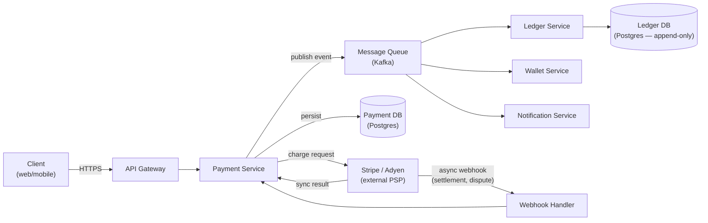
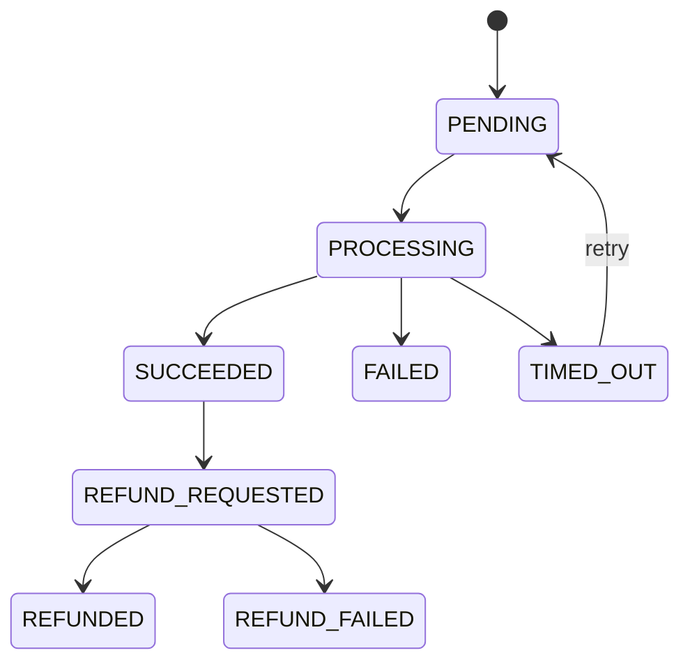
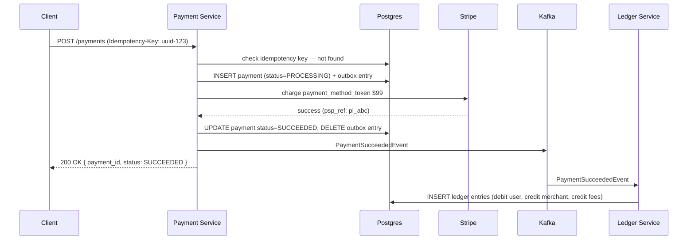
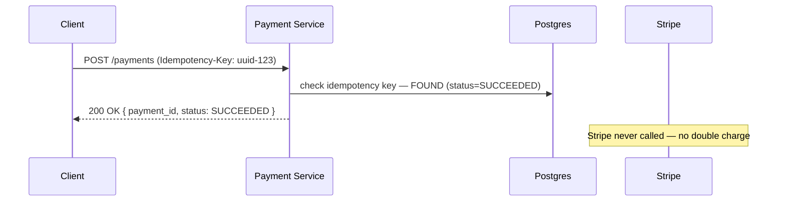

# 19. Design a Payment System (Stripe/PayPal)

## Requirements

### Functional
- Accept payments from users via credit/debit card, bank transfer, or digital wallet
- Support payouts to merchants or sellers
- Handle refunds (full and partial)
- Maintain a transaction ledger — every money movement is recorded
- Integrate with external payment providers (card networks, banks)
- Prevent double charges — a retry must never charge the user twice

### Non-Functional
- **Exactly-once processing**: a payment must complete exactly once — never zero times (lost payment) or twice (double charge)
- **Strong consistency**: money balances must always be accurate — no eventual consistency for financial data
- **Durability**: a confirmed payment must never be lost, even if the system crashes immediately after
- **Auditability**: every state change is permanently recorded with a timestamp
- **Availability**: 99.99% uptime — payment downtime directly means lost revenue
- Scale: 1,000 transactions/second peak; global user base

---

## Scale Estimation

```
Peak transactions:       1,000/second
Avg transaction size:    $85
Daily volume:            1,000 × 86,400 = 86.4M transactions/day
Daily dollar volume:     86.4M × $85 ≈ $7.3 billion/day

Storage per transaction: ~2 KB (metadata, status, audit trail)
Daily storage:           86.4M × 2 KB ≈ 173 GB/day
Annual storage:          ~63 TB (before compression)

Ledger entries:          2–4 per transaction (debit + credit ± fee entries)
```

---

## High-Level Architecture



---

## Core Components

### 1. Exactly-Once Payment Processing — The Idempotency Key

The most critical requirement: a user tapping "Pay" twice, or a network retry after a timeout, must never result in two charges.

**Solution**: every payment request carries a client-generated **idempotency key** — a UUID the client creates before the first attempt and reuses on every retry:

```
POST /v1/payments
Idempotency-Key: 550e8400-e29b-41d4-a716-446655440000
{
  "amount": 9900,
  "currency": "USD",
  "payment_method": "pm_card_visa_1234",
  "merchant_id": "merch_abc"
}
```

The Payment Service stores the key and result together in Postgres before returning:

```csharp
public async Task<PaymentResult> CreatePaymentAsync(CreatePaymentRequest req)
{
    // Check if this idempotency key was already processed
    var existing = await _db.Payments
        .FirstOrDefaultAsync(p => p.IdempotencyKey == req.IdempotencyKey);

    if (existing != null)
        return existing.ToResult(); // return cached result — no second charge

    // Not seen before — process the payment
    var pspResult = await _psp.ChargeAsync(req);

    var payment = new Payment
    {
        Id            = Guid.NewGuid(),
        IdempotencyKey = req.IdempotencyKey,
        Amount        = req.Amount,
        Currency      = req.Currency,
        Status        = pspResult.Success ? PaymentStatus.Succeeded : PaymentStatus.Failed,
        PspReference  = pspResult.Reference,
        CreatedAt     = DateTimeOffset.UtcNow
    };

    await _db.Payments.AddAsync(payment);
    await _db.SaveChangesAsync(); // persist before returning

    return payment.ToResult();
}
```

If the client retries with the same idempotency key, the service returns the original result without calling the payment provider again.

---

### 2. Payment State Machine

A payment is not a single operation — it moves through states:



Each state transition is a database write. The payment record is never overwritten in place without tracking the previous state — every transition is also written to the audit log.

---

### 3. Ledger — Double-Entry Bookkeeping

Every money movement is recorded as a pair of ledger entries: one debit and one credit. The sum of all ledger entries always equals zero — this is the invariant that makes reconciliation possible.

```
User pays merchant $99:

  Entry 1: DEBIT  user_wallet    $99.00   (user's balance decreases)
  Entry 2: CREDIT merchant_wallet $96.03  (merchant receives net amount)
  Entry 3: CREDIT platform_fees    $2.97  (platform takes fee)

  Sum: -$99.00 + $96.03 + $2.97 = $0.00 ✓
```

The ledger table is **append-only** — no updates, no deletes. Current balance is computed by summing all entries:

```sql
CREATE TABLE ledger_entries (
    id             BIGSERIAL PRIMARY KEY,
    payment_id     UUID NOT NULL,
    account_id     UUID NOT NULL,         -- user, merchant, or platform account
    entry_type     TEXT NOT NULL,         -- 'DEBIT' or 'CREDIT'
    amount         NUMERIC(19,4) NOT NULL, -- always positive
    currency       CHAR(3) NOT NULL,
    description    TEXT,
    created_at     TIMESTAMPTZ NOT NULL DEFAULT now()
    -- NO update_at — this table never changes after insert
);

-- Current balance for an account:
SELECT
    SUM(CASE WHEN entry_type = 'CREDIT' THEN amount ELSE -amount END)
FROM ledger_entries
WHERE account_id = 'acct-abc-123' AND currency = 'USD';
```

For performance, balances are cached in a `wallet_balances` table that is updated transactionally with each ledger insert.

---

### 4. External Payment Provider Integration

The system does not process card numbers directly — that would require PCI-DSS Level 1 compliance (extremely burdensome). Instead, the client tokenises the card with the provider's SDK, and the Payment Service sends only the token:

```
Client flow:
  1. Client loads Stripe.js on the frontend
  2. User enters card number → Stripe.js sends it directly to Stripe servers
  3. Stripe returns a payment method token: "pm_card_visa_1234"
  4. Client sends token to our Payment Service (card number never touches our servers)

Payment Service flow:
  1. Receive token + amount
  2. Call Stripe API: POST /v1/payment_intents { amount, currency, payment_method }
  3. Stripe charges the card, returns success/failure
  4. Persist result + publish event
```

**Handling PSP timeouts**: if the Stripe API call times out, we do not know if the charge succeeded or not. The payment enters `TIMED_OUT` state. A background reconciliation job queries Stripe's API for the payment intent status and updates the record accordingly.

---

### 5. Reconciliation

The system independently verifies that its records match the payment provider's records. This catches silent failures — cases where Stripe charged the user but our system crashed before recording it, or vice versa.

```csharp
public class ReconciliationJob : BackgroundService
{
    protected override async Task ExecuteAsync(CancellationToken ct)
    {
        while (!ct.IsCancellationRequested)
        {
            // Fetch all payments from Stripe for the last 24 hours
            var pspPayments = await _psp.ListPaymentsAsync(since: DateTime.UtcNow.AddDays(-1));

            foreach (var pspPayment in pspPayments)
            {
                var local = await _db.Payments
                    .FirstOrDefaultAsync(p => p.PspReference == pspPayment.Id);

                if (local == null)
                {
                    // Stripe has a payment we don't — ghost charge
                    await _alerting.RaiseMissingPaymentAlertAsync(pspPayment);
                }
                else if (local.Status != pspPayment.Status.ToLocalStatus())
                {
                    // Status mismatch — update local record
                    local.Status = pspPayment.Status.ToLocalStatus();
                    await _db.SaveChangesAsync();
                }
            }

            await Task.Delay(TimeSpan.FromHours(1), ct);
        }
    }
}
```

---

### 6. Refunds

A refund is a new payment in the reverse direction — it does not modify the original payment record:

```csharp
public async Task<RefundResult> CreateRefundAsync(CreateRefundRequest req)
{
    var original = await _db.Payments.FindAsync(req.PaymentId);

    if (original.Status != PaymentStatus.Succeeded)
        throw new InvalidOperationException("Cannot refund a non-succeeded payment");

    if (req.Amount > original.Amount - original.TotalRefunded)
        throw new InvalidOperationException("Refund amount exceeds remaining refundable amount");

    // Call PSP to reverse the charge
    var pspResult = await _psp.RefundAsync(original.PspReference, req.Amount);

    // Record refund as a new ledger entry (reverse direction)
    await _ledger.RecordAsync(new LedgerEntry[]
    {
        new(original.MerchantAccountId, EntryType.Debit,  req.Amount), // merchant balance decreases
        new(original.UserAccountId,     EntryType.Credit, req.Amount)  // user gets money back
    });

    original.TotalRefunded += req.Amount;
    await _db.SaveChangesAsync();

    return new RefundResult(pspResult.RefundId, req.Amount);
}
```

---

## Data Model

```sql
CREATE TABLE payments (
    id               UUID PRIMARY KEY DEFAULT gen_random_uuid(),
    idempotency_key  UUID NOT NULL UNIQUE,     -- client-generated, enforces exactly-once
    user_id          UUID NOT NULL,
    merchant_id      UUID NOT NULL,
    amount           NUMERIC(19,4) NOT NULL,
    currency         CHAR(3) NOT NULL,
    status           TEXT NOT NULL,             -- PENDING, PROCESSING, SUCCEEDED, FAILED, TIMED_OUT
    psp_reference    TEXT,                      -- Stripe/Adyen payment intent ID
    psp_provider     TEXT NOT NULL,             -- 'stripe', 'adyen'
    total_refunded   NUMERIC(19,4) NOT NULL DEFAULT 0,
    failure_reason   TEXT,
    created_at       TIMESTAMPTZ NOT NULL DEFAULT now(),
    updated_at       TIMESTAMPTZ NOT NULL DEFAULT now()
);

CREATE TABLE payment_events (
    id           BIGSERIAL PRIMARY KEY,
    payment_id   UUID NOT NULL REFERENCES payments(id),
    event_type   TEXT NOT NULL,                -- 'status_changed', 'refund_initiated', etc.
    from_status  TEXT,
    to_status    TEXT,
    metadata     JSONB,
    occurred_at  TIMESTAMPTZ NOT NULL DEFAULT now()
);

CREATE TABLE ledger_entries (
    id           BIGSERIAL PRIMARY KEY,
    payment_id   UUID NOT NULL,
    account_id   UUID NOT NULL,
    entry_type   TEXT NOT NULL,               -- 'DEBIT' or 'CREDIT'
    amount       NUMERIC(19,4) NOT NULL,
    currency     CHAR(3) NOT NULL,
    created_at   TIMESTAMPTZ NOT NULL DEFAULT now()
);

CREATE TABLE wallet_balances (
    account_id   UUID PRIMARY KEY,
    currency     CHAR(3) NOT NULL,
    balance      NUMERIC(19,4) NOT NULL DEFAULT 0,
    version      INT NOT NULL DEFAULT 0        -- optimistic locking
);
```

---

## API Design

```
POST /v1/payments
  Headers: Idempotency-Key: <uuid>
  Body:    { amount, currency, payment_method_token, merchant_id }
  Returns: { payment_id, status, created_at }

GET  /v1/payments/{payment_id}
  Returns: { payment_id, status, amount, currency, psp_reference, created_at }

POST /v1/payments/{payment_id}/refunds
  Body:    { amount }                        -- omit for full refund
  Returns: { refund_id, amount, status }

GET  /v1/payments/{payment_id}/refunds
  Returns: [ { refund_id, amount, status, created_at } ]

GET  /v1/accounts/{account_id}/balance
  Returns: { account_id, currency, balance }

GET  /v1/accounts/{account_id}/ledger?from=&to=&cursor=
  Returns: paginated ledger entries
```

---

## Key Challenges & Solutions

### Challenge 1: The PSP call and database write must be atomic

If the PSP charges the user but our service crashes before writing to the database, we have charged money with no record. If we write to the database but the PSP call fails silently, we have a record of a payment that never happened.

**Solution**: the **outbox pattern**:

```
In a single database transaction:
  1. INSERT payment (status=PROCESSING)
  2. INSERT outbox_message { type: 'charge_request', payload: {...} }
  3. COMMIT

Background worker:
  4. Reads outbox_message
  5. Calls PSP API
  6. On success: UPDATE payment (status=SUCCEEDED), DELETE outbox_message
  7. On failure: UPDATE payment (status=FAILED), DELETE outbox_message
```

The payment record and the intent to call the PSP are written atomically. The actual PSP call happens asynchronously. If the worker crashes mid-PSP-call, it retries — idempotency on the PSP side (Stripe supports idempotency keys on their API too) prevents double charges.

### Challenge 2: Currency precision — floating point errors

```csharp
// Wrong — floating point cannot represent 0.1 + 0.2 exactly:
double amount = 0.1 + 0.2; // 0.30000000000000004

// Correct — use decimal for financial arithmetic:
decimal amount = 0.1m + 0.2m; // 0.3
```

All monetary amounts are stored as `NUMERIC(19,4)` in Postgres (not FLOAT or DOUBLE). In C#, always use `decimal`, never `double` or `float` for money. Amounts are stored in the smallest currency unit where possible (cents for USD: $9.99 → 999).

### Challenge 3: Payout timing and settlement

When a user pays a merchant, the money does not instantly leave the user's bank. Card payments take 1–3 business days to settle (T+1 or T+2). The platform must manage this float:

```
Day 0: User's card charged $99 → funds held by Stripe
Day 1: Stripe confirms settlement → platform receives $99 from card network
Day 2: Platform pays out $96.03 to merchant's bank account
```

The ledger tracks the state of each balance:
- **Available balance**: settled funds, ready to pay out
- **Pending balance**: charged but not yet settled
- **Reserved balance**: held for disputes or refund risk

---

## Trade-offs

| Decision | Choice | Why | Alternative |
|---|---|---|---|
| Idempotency | Client-generated UUID key | Client controls retries safely; server is stateless for new keys | Server-generated (server must handle de-duplication differently) |
| Ledger model | Append-only double-entry | Immutable audit trail; reconciliation by summing entries | Mutable balance table (simpler but no audit trail; hard to reconcile) |
| Card processing | PSP tokenisation (Stripe) | No PCI-DSS scope for card data on our servers | Direct card processing (full PCI compliance required — years of work) |
| PSP integration | Outbox pattern for atomicity | Crash-safe; PSP call and DB write never desync | Synchronous PSP call + DB write (risks lost payment on crash) |
| Consistency | Strong (Postgres ACID) | Money balances must be exact; no eventual consistency acceptable | Eventual consistency (inappropriate for financial data) |
| Currency storage | NUMERIC(19,4) / decimal | Exact representation; no floating-point rounding errors | FLOAT (fast but introduces cent-level errors at scale) |

---

## Sequence Diagrams

**Successful payment flow**



**Retry with same idempotency key**


