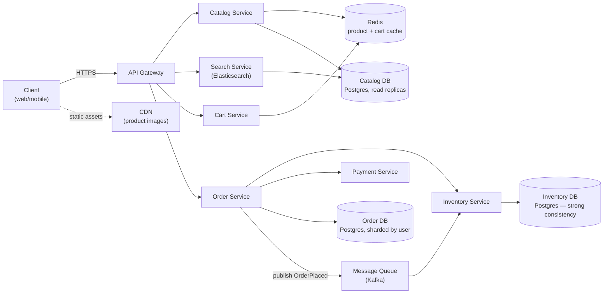
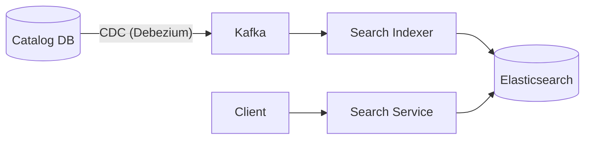
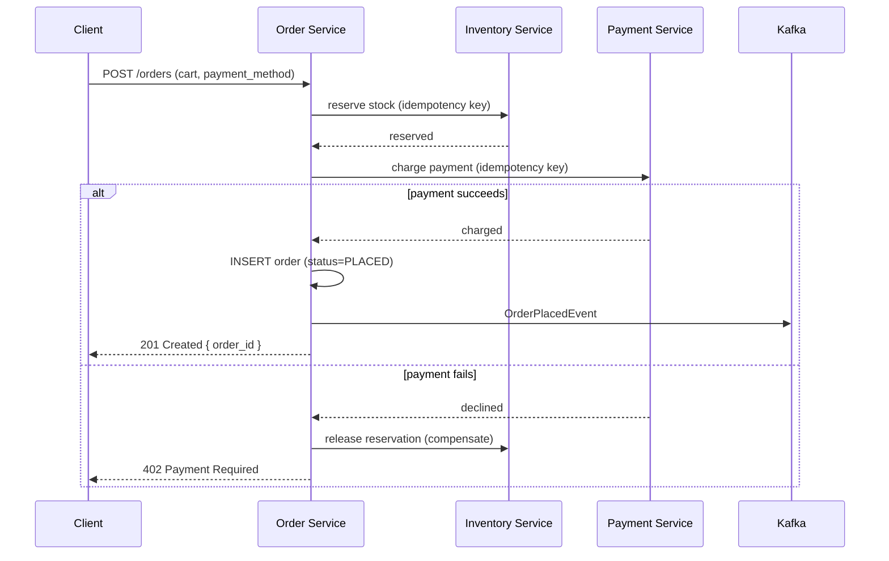
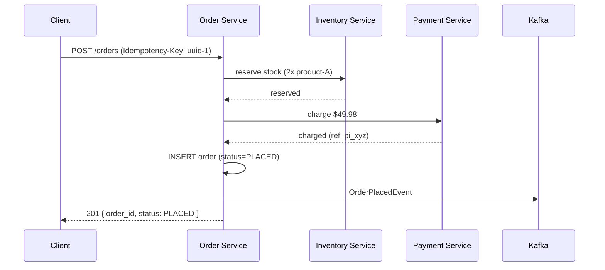
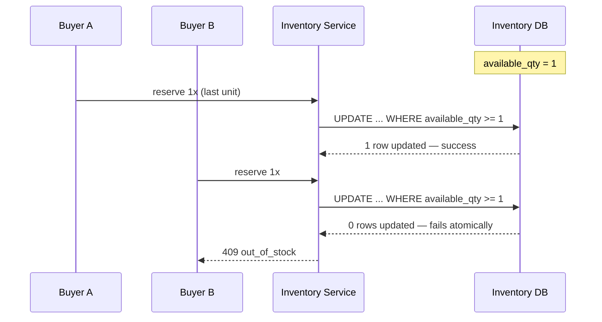

# 20. Design an E-Commerce Platform (Amazon)

## Requirements

### Functional
- Browse and search product catalog with categories, filters, and search
- View product detail pages with pricing, images, reviews, and stock status
- Add items to a shopping cart, persist across sessions and devices
- Checkout: place an order, apply payment, reserve inventory
- Track order status (placed → paid → shipped → delivered)
- Sellers can list, update, and manage inventory for products
- Handle flash sales / high-demand items without overselling

### Non-Functional
- **High read throughput**: catalog browsing is read-heavy — millions of product views per minute
- **Strong consistency for inventory and checkout**: never oversell an item; never double-charge
- **Eventual consistency acceptable for catalog data**: product descriptions, reviews, ratings can lag slightly
- **Availability**: 99.99% for browsing; checkout must degrade gracefully rather than go fully down
- **Low latency**: product page loads < 200ms p99
- Scale: 500M products, 100M daily active users, 50K orders/second at peak (e.g. Black Friday)

---

## Scale Estimation

```
Catalog:
  Products:              500M
  Product metadata:      ~5 KB each → 2.5 TB
  Product images:        ~5 per product × 200 KB → 500 TB (object storage)

Traffic:
  Product page views:    2B/day → ~23,000 QPS avg, ~150,000 QPS peak (browsing)
  Search queries:        500M/day → ~5,800 QPS avg
  Orders:                10M/day avg, 50,000/sec peak (flash sale)

Cart:
  Active carts:          50M concurrent → ~5 items each × 200 bytes ≈ 50 GB (cache-friendly)

Order storage:
  Orders/year:           3.65B
  Storage/order:         ~3 KB (order + line items + shipping)
  Annual storage:        ~11 TB
```

---

## High-Level Architecture



---

## Core Components

### 1. Catalog Service — Read-Optimized

Product data is read orders of magnitude more than it's written. The catalog is denormalized and cached aggressively.

```csharp
public async Task<ProductView> GetProductAsync(string productId)
{
    var cached = await _cache.GetAsync<ProductView>($"product:{productId}");
    if (cached != null)
        return cached;

    var product = await _db.Products
        .Include(p => p.Images)
        .Include(p => p.Price)
        .AsNoTracking()
        .FirstOrDefaultAsync(p => p.Id == productId);

    var view = product.ToView();

    // Cache with short TTL — price/stock badge can lag slightly
    await _cache.SetAsync($"product:{productId}", view, TimeSpan.FromMinutes(5));
    return view;
}
```

Reads go through Redis first, then Postgres **read replicas** (never the primary). Writes (new listings, price updates) go to the primary and invalidate the cache key.

---

### 2. Search Service

Product search is powered by Elasticsearch, kept in sync with the catalog via change-data-capture (CDC) from Postgres through Kafka — not synchronous dual-writes.



This decouples search indexing from the write path — a slow reindex never blocks a product update, and search can be temporarily stale without affecting checkout correctness.

---

### 3. Shopping Cart

Carts must persist across sessions and devices but don't need strong consistency — a cart is a working draft, not a financial record.

```csharp
public async Task AddToCartAsync(string userId, string productId, int quantity)
{
    var cartKey = $"cart:{userId}";
    var cart = await _cache.GetAsync<Cart>(cartKey) ?? new Cart(userId);

    cart.AddOrUpdateItem(productId, quantity);

    // Redis is primary store for active carts — fast, TTL-based
    await _cache.SetAsync(cartKey, cart, TimeSpan.FromDays(30));

    // Async write-behind to Postgres for durability beyond Redis TTL
    await _outbox.EnqueueAsync(new PersistCartCommand(cart));
}
```

Cart reads/writes hit Redis directly — no database round trip on the common path. A background job periodically flushes carts to Postgres so a Redis eviction doesn't lose long-abandoned carts.

---

### 4. Inventory — Prevent Overselling

This is the one place in the catalog path that must be **strongly consistent**. A flash sale on a limited-stock item is the classic failure case: 10,000 requests race for 100 units.

**Solution**: atomic conditional decrement at the database level, not read-then-write in application code.

```csharp
public async Task<bool> TryReserveStockAsync(string productId, int quantity)
{
    // Single atomic UPDATE — the WHERE clause enforces the invariant
    var rows = await _db.Database.ExecuteSqlRawAsync(
        @"UPDATE inventory
          SET available_qty = available_qty - {0}
          WHERE product_id = {1} AND available_qty >= {0}",
        quantity, productId);

    return rows > 0; // 0 rows updated means insufficient stock — reservation failed
}
```

```sql
CREATE TABLE inventory (
    product_id      UUID PRIMARY KEY,
    available_qty   INT NOT NULL CHECK (available_qty >= 0),
    reserved_qty    INT NOT NULL DEFAULT 0,
    version         INT NOT NULL DEFAULT 0
);
```

For extreme hotspot items (a single row taking 50K writes/sec), the row is sharded into N sub-counters (`product_id_shard_0..9`) and reservation picks a random shard, reducing lock contention on a single row. Total availability is the sum across shards.

---

### 5. Order Placement — Saga Across Services

Placing an order touches inventory, payment, and order records — three different services/databases. A distributed transaction (2PC) would be too slow and fragile at this scale, so checkout is modeled as a **saga** with compensating actions.



```csharp
public async Task<OrderResult> PlaceOrderAsync(PlaceOrderRequest req)
{
    var reserved = await _inventory.TryReserveStockAsync(req.Items, req.IdempotencyKey);
    if (!reserved)
        return OrderResult.Failed("out_of_stock");

    var payment = await _payments.ChargeAsync(req.PaymentMethod, req.Total, req.IdempotencyKey);
    if (!payment.Success)
    {
        // Compensating action — release what we reserved
        await _inventory.ReleaseReservationAsync(req.Items, req.IdempotencyKey);
        return OrderResult.Failed("payment_declined");
    }

    var order = await _orders.CreateAsync(req, payment.Reference);
    await _events.PublishAsync(new OrderPlacedEvent(order.Id));

    return OrderResult.Success(order.Id);
}
```

Reservations that are never confirmed (client abandons after reserving) expire via a TTL and a background sweep releases the stock back.

---

## Data Model

```sql
CREATE TABLE products (
    id             UUID PRIMARY KEY DEFAULT gen_random_uuid(),
    seller_id      UUID NOT NULL,
    title          TEXT NOT NULL,
    description    TEXT,
    category_id    UUID NOT NULL,
    price_cents    BIGINT NOT NULL,
    currency       CHAR(3) NOT NULL,
    status         TEXT NOT NULL,          -- ACTIVE, DELISTED
    created_at     TIMESTAMPTZ NOT NULL DEFAULT now(),
    updated_at     TIMESTAMPTZ NOT NULL DEFAULT now()
);

CREATE TABLE inventory (
    product_id      UUID PRIMARY KEY REFERENCES products(id),
    available_qty   INT NOT NULL CHECK (available_qty >= 0),
    reserved_qty    INT NOT NULL DEFAULT 0
);

CREATE TABLE orders (
    id             UUID PRIMARY KEY DEFAULT gen_random_uuid(),
    user_id        UUID NOT NULL,
    status         TEXT NOT NULL,          -- PLACED, PAID, SHIPPED, DELIVERED, CANCELLED
    total_cents    BIGINT NOT NULL,
    currency       CHAR(3) NOT NULL,
    payment_ref    TEXT,
    idempotency_key UUID NOT NULL UNIQUE,
    created_at     TIMESTAMPTZ NOT NULL DEFAULT now()
) PARTITION BY HASH (user_id);            -- sharded by user for scale

CREATE TABLE order_items (
    id             BIGSERIAL PRIMARY KEY,
    order_id       UUID NOT NULL REFERENCES orders(id),
    product_id     UUID NOT NULL,
    quantity       INT NOT NULL,
    unit_price_cents BIGINT NOT NULL
);
```

---

## API Design

```
GET  /v1/products/{product_id}
  Returns: { id, title, price, images, stock_status, seller_id }

GET  /v1/search?q=&category=&filters=&cursor=
  Returns: paginated product results

POST /v1/cart/items
  Body:    { product_id, quantity }
  Returns: { cart_id, items, subtotal }

GET  /v1/cart
  Returns: { items, subtotal }

POST /v1/orders
  Headers: Idempotency-Key: <uuid>
  Body:    { cart_id, payment_method_token, shipping_address }
  Returns: { order_id, status, total }

GET  /v1/orders/{order_id}
  Returns: { order_id, status, items, total, tracking }
```

---

## Key Challenges & Solutions

### Challenge 1: Flash sale traffic spikes (Black Friday, limited drops)

A single popular item can receive 100x normal request volume in seconds, overwhelming the inventory row and the checkout path.

**Solution**: a lightweight **queueing gate** in front of checkout for known hot items — rather than letting all requests hit the database, users are placed in a virtual queue and admitted at a controlled rate. Combined with sharded inventory counters (see Core Components §4), this keeps write contention bounded regardless of incoming request volume.

### Challenge 2: Catalog reads must scale independently of order writes

Browsing traffic (read-heavy, cacheable, tolerant of staleness) and checkout traffic (write-heavy, strongly consistent) have opposite scaling profiles. Coupling them to the same database means a traffic spike in one degrades the other.

**Solution**: separate read and write paths entirely — catalog reads go through Redis + read replicas, inventory/order writes go to a dedicated, smaller, strongly-consistent cluster. Search never touches the transactional database directly (see Core Components §2).

### Challenge 3: Cart-to-order price consistency

Prices can change between when an item is added to a cart and when checkout happens. Charging a stale price is either a loss (undercharge) or a bad customer experience (overcharge).

**Solution**: at checkout time, prices are re-fetched from the catalog (not read from the cached cart) and the order confirms the current price to the user before charging. If the price changed materially, the client is shown a re-confirmation step rather than silently charging a different amount.

---

## Trade-offs

| Decision | Choice | Why | Alternative |
|---|---|---|---|
| Catalog consistency | Eventual (cache + replicas) | Read-heavy workload tolerates staleness; huge latency win | Strong consistency (would bottleneck on primary DB) |
| Inventory consistency | Strong (conditional atomic update) | Overselling is a hard failure — refunds and reputational damage | Eventual consistency (risks overselling under load) |
| Search indexing | Async via CDC/Kafka | Decouples indexing from writes; search staleness is acceptable | Synchronous dual-write (couples catalog writes to ES latency/failures) |
| Cart storage | Redis primary, Postgres backup | Cart is a draft, not a financial record — speed matters more than durability | Postgres primary (durable but slower for the common add-to-cart path) |
| Checkout transaction | Saga with compensation | Avoids distributed 2PC across inventory/payment/order services | Two-phase commit (poor availability, doesn't scale across services) |
| Hot-item inventory | Sharded counters | Spreads write contention across N rows instead of one hot row | Single row (guaranteed contention bottleneck under flash-sale load) |

---

## Sequence Diagrams

**Successful checkout**



**Out-of-stock race — one of two concurrent buyers loses**


