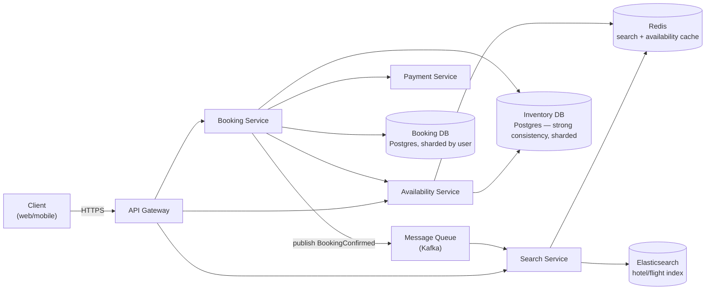
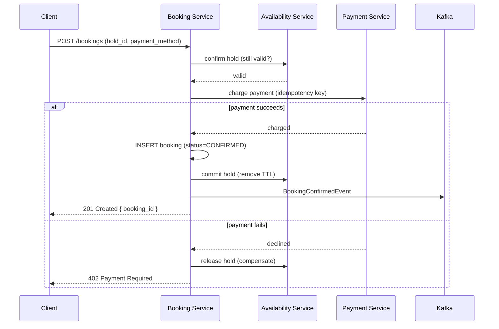
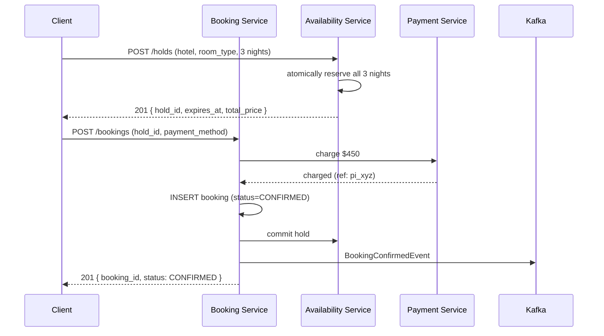
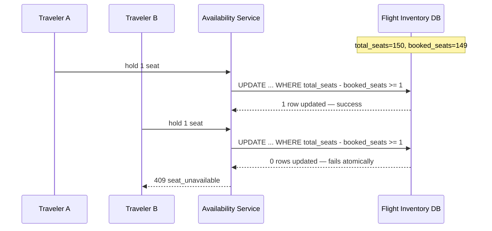

# 21. Design a Hotel/Flight Booking System

## Requirements

### Functional
- Search availability across hotels/flights by location/route, dates, and guest/passenger count
- Show real-time price and inventory (rooms left, seats left)
- Reserve and hold inventory during checkout (a few minutes) before payment completes
- Book a room/seat: charge payment, confirm inventory, issue a confirmation
- Cancel/modify a booking, with inventory released back to the pool
- Support overbooking policies for flights (airlines intentionally oversell) but never for hotels beyond configured limits
- Handle multi-night hotel stays / multi-leg flights as a single atomic booking

### Non-Functional
- **No double-booking**: the same room-night or seat must never be sold to two customers
- **High read throughput**: search is read-heavy, orders of magnitude more than bookings
- **Low search latency**: < 300ms p99 across possibly hundreds of hotels/flights
- **Strong consistency on the booking path**: inventory decrement must be atomic and durable
- **Availability**: search should stay up even if the booking path is degraded
- Scale: 500K hotels / 5K airline routes, 50M searches/day, 500K bookings/day, peak 5,000 bookings/sec (holiday sale)

---

## Scale Estimation

```
Search:
  Searches/day:        50M → ~580 QPS avg, ~5,000 QPS peak
  Result set:           50-500 hotels/flights per search, cached aggressively

Inventory:
  Hotels:                500K, ~100 rooms each → 50M room records
  Room-nights (1yr):     50M rooms × 365 ≈ 18B rows (if modeled per-night)
  Flights:                5K routes × 10 flights/day × 365 ≈ 18M flight instances/yr
  Seats per flight:       ~150-300

Bookings:
  Bookings/day:           500K avg → ~6 bookings/sec avg, 5,000/sec peak (flash sale, holiday)
  Storage/booking:        ~2 KB (booking + guest/passenger info + payment ref)
  Annual booking storage: ~500K × 365 × 2 KB ≈ 365 GB
```

---

## High-Level Architecture



---

## Core Components

### 1. Search Service — Read-Optimized, Cache-Friendly

Search queries (location + dates + guests) are read millions of times more than bookings occur. Results are cached by query shape and refreshed on a short TTL — exact availability is re-verified at reservation time, not trusted from search.

```csharp
public async Task<SearchResult> SearchHotelsAsync(SearchRequest req)
{
    var cacheKey = $"search:{req.City}:{req.CheckIn:yyyyMMdd}:{req.CheckOut:yyyyMMdd}:{req.Guests}";
    var cached = await _cache.GetAsync<SearchResult>(cacheKey);
    if (cached != null)
        return cached;

    var hits = await _searchIndex.QueryAsync(req.City, req.CheckIn, req.CheckOut, req.Guests);

    // Approximate price/availability badge — re-verified before checkout
    var result = new SearchResult(hits);
    await _cache.SetAsync(cacheKey, result, TimeSpan.FromSeconds(30));
    return result;
}
```

Search is powered by Elasticsearch, kept in sync via CDC from the inventory database — never queried synchronously against the transactional store.

---

### 2. Availability & Inventory — Prevent Double-Booking

This is the strongly consistent core. A hotel room-night or flight seat must decrement atomically, with the same "conditional UPDATE" pattern used for e-commerce inventory, but modeled per date-range for hotels.

**Hotel inventory** — modeled per room-type per night, not per physical room, to avoid needing to assign a specific room at booking time:

```sql
CREATE TABLE room_inventory (
    hotel_id        UUID NOT NULL,
    room_type_id    UUID NOT NULL,
    stay_date       DATE NOT NULL,
    total_rooms     INT NOT NULL,
    booked_rooms    INT NOT NULL DEFAULT 0 CHECK (booked_rooms <= total_rooms),
    PRIMARY KEY (hotel_id, room_type_id, stay_date)
);
```

```csharp
public async Task<bool> TryReserveRoomsAsync(
    Guid hotelId, Guid roomTypeId, DateOnly checkIn, DateOnly checkOut, int roomCount)
{
    // Atomically increment booked_rooms for every night in the stay,
    // in one transaction, only if every night has capacity
    using var txn = await _db.Database.BeginTransactionAsync();

    var nights = DateRange(checkIn, checkOut);
    var rows = await _db.Database.ExecuteSqlRawAsync(
        @"UPDATE room_inventory
          SET booked_rooms = booked_rooms + {0}
          WHERE hotel_id = {1} AND room_type_id = {2}
            AND stay_date = ANY({3})
            AND total_rooms - booked_rooms >= {0}",
        roomCount, hotelId, roomTypeId, nights);

    if (rows != nights.Length)
    {
        await txn.RollbackAsync();
        return false; // at least one night was insufficient — fail the whole stay atomically
    }

    await txn.CommitAsync();
    return true;
}
```

**Flight inventory** — one row per flight instance per fare class, decremented the same way:

```sql
CREATE TABLE flight_inventory (
    flight_id       UUID NOT NULL,
    fare_class      TEXT NOT NULL,       -- ECONOMY, BUSINESS
    total_seats     INT NOT NULL,
    booked_seats    INT NOT NULL DEFAULT 0,
    overbook_limit  INT NOT NULL DEFAULT 0,  -- airlines allow intentional oversell
    PRIMARY KEY (flight_id, fare_class)
);
```

Airlines deliberately allow `booked_seats` to exceed `total_seats` up to `overbook_limit`, based on historical no-show rates — this is a business decision, not a bug, and is the key difference from hotel inventory which never oversells.

---

### 3. Hold / Reservation Window

Between "user picks a room/seat" and "payment completes," inventory must be **held**, not fully committed, so it isn't sold to someone else mid-checkout — but also isn't lost forever if the user abandons.

```csharp
public async Task<HoldResult> CreateHoldAsync(BookingRequest req)
{
    var reserved = await _availability.TryReserveAsync(req); // decrements booked_* as above
    if (!reserved)
        return HoldResult.Failed("unavailable");

    var hold = new BookingHold(req.IdempotencyKey, req, expiresAt: DateTime.UtcNow.AddMinutes(10));
    await _holds.SaveAsync(hold);

    // Background sweep releases inventory for holds that expire unconfirmed
    await _scheduler.ScheduleAsync(new ExpireHoldCommand(hold.Id), hold.ExpiresAt);

    return HoldResult.Success(hold.Id);
}
```

A hold is a soft reservation with a TTL: inventory is decremented immediately (so it can't be double-sold) but reverted automatically if payment doesn't complete within the hold window.

---

### 4. Booking — Saga Across Availability, Payment, and Confirmation



```csharp
public async Task<BookingResult> ConfirmBookingAsync(ConfirmBookingRequest req)
{
    var hold = await _holds.GetAsync(req.HoldId);
    if (hold == null || hold.IsExpired)
        return BookingResult.Failed("hold_expired");

    var payment = await _payments.ChargeAsync(req.PaymentMethod, hold.TotalPrice, req.IdempotencyKey);
    if (!payment.Success)
    {
        await _availability.ReleaseHoldAsync(hold.Id); // compensating action
        return BookingResult.Failed("payment_declined");
    }

    var booking = await _bookings.CreateAsync(hold, payment.Reference);
    await _holds.CommitAsync(hold.Id); // hold becomes permanent, TTL sweep no longer applies
    await _events.PublishAsync(new BookingConfirmedEvent(booking.Id));

    return BookingResult.Success(booking.Id);
}
```

---

## Data Model

```sql
CREATE TABLE hotels (
    id             UUID PRIMARY KEY DEFAULT gen_random_uuid(),
    name           TEXT NOT NULL,
    city           TEXT NOT NULL,
    lat            DOUBLE PRECISION,
    lng            DOUBLE PRECISION
);

CREATE TABLE room_types (
    id             UUID PRIMARY KEY DEFAULT gen_random_uuid(),
    hotel_id       UUID NOT NULL REFERENCES hotels(id),
    name           TEXT NOT NULL,          -- e.g. "Deluxe King"
    base_price_cents BIGINT NOT NULL
);

CREATE TABLE room_inventory (
    hotel_id        UUID NOT NULL,
    room_type_id    UUID NOT NULL,
    stay_date       DATE NOT NULL,
    total_rooms     INT NOT NULL,
    booked_rooms    INT NOT NULL DEFAULT 0,
    PRIMARY KEY (hotel_id, room_type_id, stay_date)
);

CREATE TABLE flights (
    id              UUID PRIMARY KEY DEFAULT gen_random_uuid(),
    flight_number   TEXT NOT NULL,
    origin          TEXT NOT NULL,
    destination     TEXT NOT NULL,
    departure_time  TIMESTAMPTZ NOT NULL,
    arrival_time    TIMESTAMPTZ NOT NULL
);

CREATE TABLE flight_inventory (
    flight_id       UUID NOT NULL REFERENCES flights(id),
    fare_class      TEXT NOT NULL,
    total_seats     INT NOT NULL,
    booked_seats    INT NOT NULL DEFAULT 0,
    overbook_limit  INT NOT NULL DEFAULT 0,
    PRIMARY KEY (flight_id, fare_class)
);

CREATE TABLE bookings (
    id              UUID PRIMARY KEY DEFAULT gen_random_uuid(),
    user_id         UUID NOT NULL,
    booking_type    TEXT NOT NULL,         -- HOTEL, FLIGHT
    status          TEXT NOT NULL,         -- HELD, CONFIRMED, CANCELLED
    total_cents     BIGINT NOT NULL,
    currency        CHAR(3) NOT NULL,
    payment_ref     TEXT,
    idempotency_key UUID NOT NULL UNIQUE,
    created_at      TIMESTAMPTZ NOT NULL DEFAULT now()
) PARTITION BY HASH (user_id);

CREATE TABLE booking_holds (
    id              UUID PRIMARY KEY DEFAULT gen_random_uuid(),
    booking_ref     JSONB NOT NULL,        -- room/flight + dates + counts
    expires_at      TIMESTAMPTZ NOT NULL,
    status          TEXT NOT NULL          -- HELD, COMMITTED, EXPIRED
);
```

---

## API Design

```
GET  /v1/hotels/search?city=&check_in=&check_out=&guests=
  Returns: paginated list of { hotel_id, name, price_from, availability_badge }

GET  /v1/flights/search?origin=&destination=&date=
  Returns: paginated list of { flight_id, times, price, seats_left }

POST /v1/holds
  Body:    { type: HOTEL|FLIGHT, hotel_id/flight_id, dates/fare_class, count }
  Returns: { hold_id, expires_at, total_price }

POST /v1/bookings
  Headers: Idempotency-Key: <uuid>
  Body:    { hold_id, payment_method_token, guest_details }
  Returns: { booking_id, status, confirmation_number }

DELETE /v1/bookings/{booking_id}
  Returns: { booking_id, status: CANCELLED, refund_amount }
```

---

## Key Challenges & Solutions

### Challenge 1: Preventing double-booking under concurrent demand

Two users searching the same last room or seat at the same instant must not both succeed — this is the central correctness requirement of the whole system.

**Solution**: the atomic conditional-UPDATE pattern (see Core Components §2) ensures only one of two racing requests can decrement inventory below zero — the loser's `UPDATE` affects 0 rows and fails cleanly. For hotels, the update spans every night of the stay in a single transaction so a stay is never partially booked.

### Challenge 2: Abandoned checkouts locking up inventory

If inventory were decremented only on final payment, two users could both pass availability checks and one would fail at payment — a bad experience. If decremented on hold and never released, an abandoned checkout would permanently lock a room/seat no one actually bought.

**Solution**: the **hold with TTL** pattern (see Core Components §3) — inventory is reserved immediately on hold creation, given a short expiry (e.g. 10 minutes), and a background sweep releases it back automatically if the booking never confirms. This trades a small window of "phantom unavailability" for correctness.

### Challenge 3: Search must stay fast and available even when booking is under load

A flash sale or peak booking window (e.g. holiday flight sales) can saturate the inventory database with writes. If search shared that database, browsing would degrade along with checkout.

**Solution**: search never touches the transactional inventory DB directly — it reads from a cached, eventually-consistent Elasticsearch index (see Core Components §1), updated asynchronously via CDC. Exact availability is only verified at hold-creation time against the strongly consistent store, so search stays fast and available independent of booking write load.

---

## Trade-offs

| Decision | Choice | Why | Alternative |
|---|---|---|---|
| Search consistency | Eventual (cached index) | Read-heavy, staleness-tolerant; keeps search fast under booking load | Query inventory DB directly (couples search latency to write contention) |
| Inventory consistency | Strong (conditional atomic update) | Double-booking is a hard failure — refunds, reputational damage, legal exposure for hotels | Eventual consistency (risks selling the same room/seat twice) |
| Checkout inventory | Hold with TTL, decremented on hold | Prevents two users from both passing availability then racing at payment | Decrement only on payment success (creates a race window between hold and charge) |
| Flight overbooking | Explicit overbook_limit, allowed | Matches real airline policy — no-show rates make some oversell economically optimal | Never oversell (matches hotel policy, but doesn't reflect the flight business model) |
| Hotel stay booking | Multi-night atomic transaction | A partially-booked stay (3 of 5 nights) is worse than a clean failure | Per-night independent booking (simpler, but risks inconsistent partial stays) |
| Booking transaction | Saga with compensation | Avoids distributed 2PC across availability/payment/booking services | Two-phase commit (poor availability, doesn't scale across services) |

---

## Sequence Diagrams

**Successful hotel booking**



**Last-seat race — one of two concurrent travelers loses**


