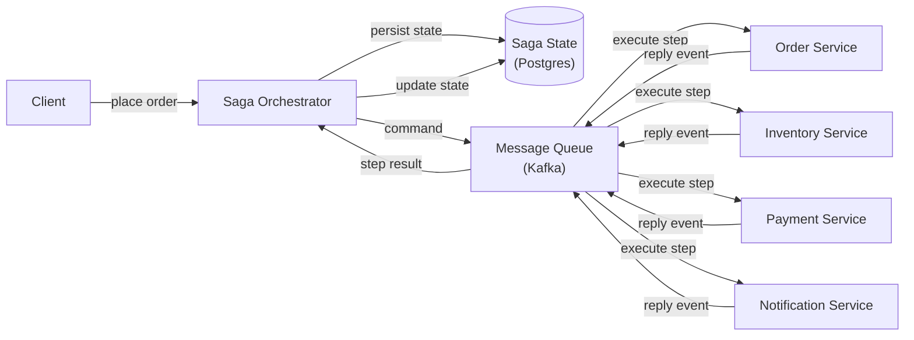
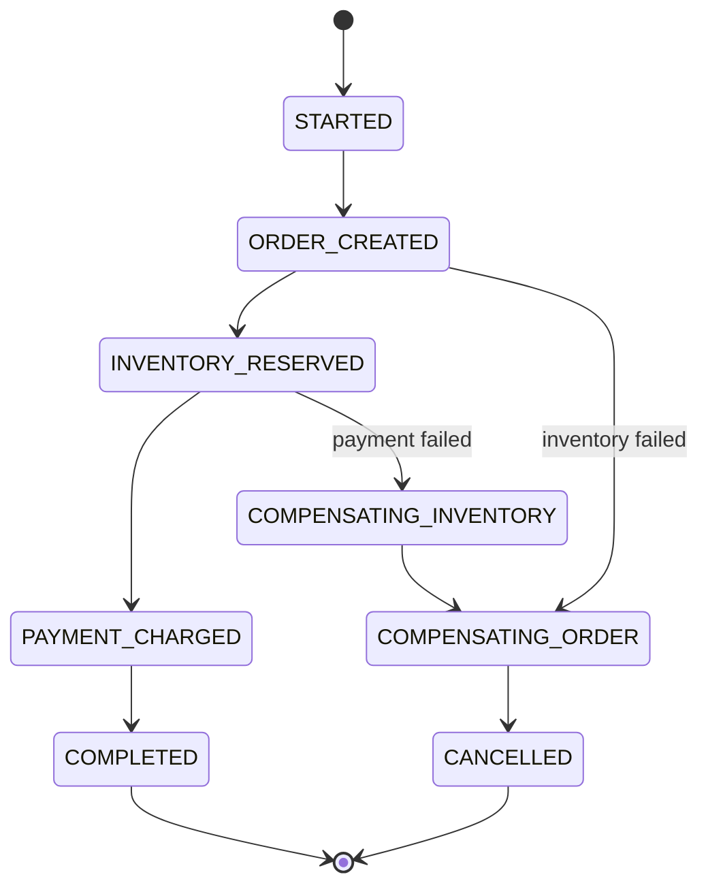
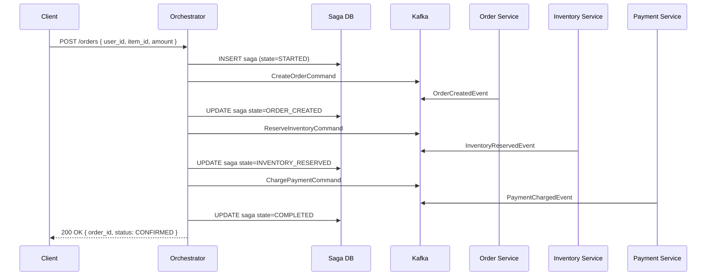
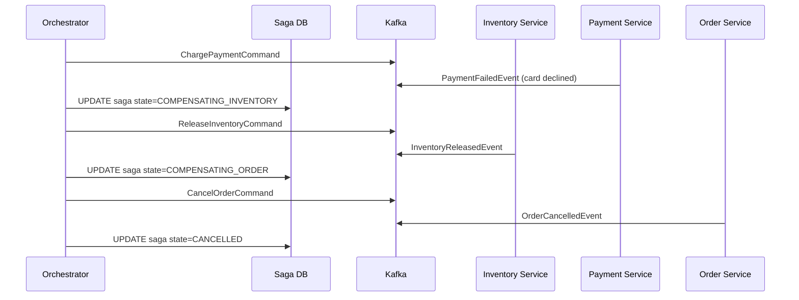

# 48. Design a Distributed Transaction System

## Requirements

### Functional
- Coordinate a transaction that spans multiple services (e.g. place order → reserve inventory → charge payment → send confirmation)
- Guarantee atomicity: either all steps succeed or the system rolls back to a consistent state
- Handle partial failures: if step 3 fails, undo steps 1 and 2
- Support both synchronous coordination (2PC) and asynchronous choreography (Saga)

### Non-Functional
- **Consistency**: no permanent partial state — a half-completed order must not survive a failure
- **Availability**: the system should continue processing other transactions even when one is stuck
- **Durability**: transaction state must survive crashes — a restarted coordinator must be able to resume or roll back
- Scale: hundreds of services, thousands of concurrent distributed transactions

---

## The Core Problem

In a single database, a transaction is simple:

```sql
BEGIN;
  UPDATE inventory SET stock = stock - 1 WHERE product_id = 42;
  INSERT INTO orders (user_id, product_id) VALUES (1, 42);
  UPDATE payments SET balance = balance - 99 WHERE user_id = 1;
COMMIT; -- or ROLLBACK if anything fails
```

The database guarantees atomicity — either all three happen or none do.

In a microservices architecture, each service owns its own database. There is no shared transaction context across services:

```
Order Service    → writes to orders_db
Inventory Service → writes to inventory_db
Payment Service  → writes to payments_db
```

If Payment Service fails after Inventory Service has already decremented stock, the databases are in an inconsistent state. No single `ROLLBACK` can fix all three simultaneously.

---

## Scale Estimation

```
Concurrent distributed transactions:   10,000
Steps per transaction:                 3–5 services
Transaction duration:                  100ms – 30s (payment can be slow)
Coordinator state per transaction:     ~1 KB
Total coordinator state:               10,000 × 1 KB = 10 MB (fits in memory + persisted to DB)
```

---

## Two Approaches

### Approach 1: Two-Phase Commit (2PC)

2PC uses a **coordinator** that drives all participants through two phases synchronously.

**Phase 1 — Prepare (voting)**:
```
Coordinator → Order Service:     "Can you reserve order #99? Vote yes/no"
Coordinator → Inventory Service: "Can you reserve item #42? Vote yes/no"
Coordinator → Payment Service:   "Can you reserve $99 from user #1? Vote yes/no"

Each service:
  - Acquires locks on the relevant rows
  - Writes a prepare record to its local WAL (write-ahead log)
  - Responds: VOTE_YES or VOTE_NO
```

**Phase 2 — Commit or Abort**:
```
If ALL voted YES:
  Coordinator → all: COMMIT
  Each service: makes the change permanent, releases locks

If ANY voted NO (or timed out):
  Coordinator → all: ABORT
  Each service: releases locks, discards the prepare record
```

**The problem with 2PC** — the blocking coordinator:

```
Phase 1 complete — all voted YES
Coordinator sends COMMIT to Order Service ✓
Coordinator crashes before sending COMMIT to Inventory and Payment

Now:
  Order Service: committed (permanent change)
  Inventory Service: locked, waiting for coordinator decision
  Payment Service: locked, waiting for coordinator decision

Inventory and Payment are stuck — they cannot commit or abort without the coordinator.
Locks are held indefinitely → other transactions that need the same rows are blocked.
```

2PC is **blocking** — a coordinator crash leaves participants in a locked limbo. This is why 2PC is rarely used in internet-scale microservice architectures where availability is critical.

**When 2PC is appropriate**: tightly controlled environments — same datacenter, few participants, where holding locks briefly is acceptable (database clusters, internal financial systems).

---

### Approach 2: Saga Pattern

A Saga breaks the distributed transaction into a sequence of **local transactions**, each with a corresponding **compensating transaction** (undo operation) if something goes wrong.

```
Step 1: Order Service     → create order (status: PENDING)
Step 2: Inventory Service → reserve item
Step 3: Payment Service   → charge card
Step 4: Order Service     → mark order CONFIRMED

If Step 3 fails:
  Compensate Step 2: Inventory Service → release item reservation
  Compensate Step 1: Order Service     → cancel order (status: CANCELLED)
```

No locks are held across services. Each step commits locally and immediately. On failure, the system runs compensating transactions to undo what was already done.

**Compensating transactions are not rollbacks** — they are new forward-moving operations that undo the effect:

```
Forward:     INSERT INTO reservations (item_id=42, user_id=1, status=RESERVED)
Compensating: UPDATE reservations SET status=CANCELLED WHERE item_id=42 AND user_id=1
```

The compensating transaction is itself a durable, committed database change.

---

## High-Level Architecture — Saga Orchestration



---

## Core Components

### 1. Saga Orchestrator

The orchestrator is the central brain — it knows the full sequence of steps and drives execution. It is stateful: it persists the current state of each saga to a database so it can resume after a crash.

```csharp
public class PlaceOrderSaga
{
    private readonly ISagaRepository _repo;
    private readonly IMessageBus _bus;

    public async Task HandleAsync(SagaEvent evt)
    {
        var saga = await _repo.LoadAsync(evt.SagaId);

        saga.State = (saga.State, evt.Type) switch
        {
            (SagaState.Started,            EventType.OrderCreated)      => SagaState.OrderCreated,
            (SagaState.OrderCreated,       EventType.InventoryReserved) => SagaState.InventoryReserved,
            (SagaState.InventoryReserved,  EventType.PaymentCharged)    => SagaState.PaymentCharged,
            (SagaState.PaymentCharged,     EventType.EmailSent)         => SagaState.Completed,

            // Failure paths → trigger compensation
            (SagaState.InventoryReserved,  EventType.PaymentFailed)     => SagaState.CompensatingInventory,
            (SagaState.OrderCreated,       EventType.InventoryFailed)   => SagaState.CompensatingOrder,
            _ => throw new InvalidOperationException($"Unexpected event {evt.Type} in state {saga.State}")
        };

        await _repo.SaveAsync(saga); // persist state BEFORE sending next command

        var nextCommand = saga.State switch
        {
            SagaState.OrderCreated           => new ReserveInventoryCommand(saga),
            SagaState.InventoryReserved      => new ChargePaymentCommand(saga),
            SagaState.PaymentCharged         => new SendConfirmationCommand(saga),
            SagaState.CompensatingInventory  => new ReleaseInventoryCommand(saga),
            SagaState.CompensatingOrder      => new CancelOrderCommand(saga),
            SagaState.Completed              => null,
            _ => null
        };

        if (nextCommand != null)
            await _bus.PublishAsync(nextCommand);
    }
}
```

**Critical ordering**: persist state to the database *before* sending the next command. If the orchestrator crashes after persisting but before publishing, it will republish on recovery (the participant must be idempotent). If it published first and then crashed before persisting, the step runs but the orchestrator thinks it never happened — duplicate execution with no record.

---

### 2. Saga State Machine

Each saga instance is a state machine. Every transition is recorded:



Saga state persisted in Postgres:

```sql
CREATE TABLE sagas (
    saga_id       UUID PRIMARY KEY,
    saga_type     TEXT NOT NULL,              -- 'place_order'
    state         TEXT NOT NULL,              -- current state enum value
    payload       JSONB NOT NULL,             -- order_id, user_id, item_id, amount, etc.
    created_at    TIMESTAMPTZ NOT NULL DEFAULT now(),
    updated_at    TIMESTAMPTZ NOT NULL DEFAULT now(),
    version       INT NOT NULL DEFAULT 0      -- optimistic locking
);

CREATE TABLE saga_events (
    id            BIGSERIAL PRIMARY KEY,
    saga_id       UUID NOT NULL REFERENCES sagas(saga_id),
    event_type    TEXT NOT NULL,
    event_payload JSONB NOT NULL,
    occurred_at   TIMESTAMPTZ NOT NULL DEFAULT now()
);
```

The `saga_events` table is an append-only audit log — every step and every failure is recorded. This is invaluable for debugging why a saga ended in CANCELLED.

---

### 3. Idempotent Participants

Because the orchestrator may replay commands (after a crash and recovery), each participant must handle duplicate commands safely:

```csharp
public class InventoryService
{
    public async Task HandleReserveInventoryAsync(ReserveInventoryCommand cmd)
    {
        // Idempotency check: if this saga already reserved inventory, return success
        var existing = await _db.Reservations
            .FirstOrDefaultAsync(r => r.SagaId == cmd.SagaId);

        if (existing != null)
        {
            // Already processed — republish the success event and return
            await _bus.PublishAsync(new InventoryReservedEvent(cmd.SagaId));
            return;
        }

        var item = await _db.Items.FindAsync(cmd.ItemId);
        if (item.Stock < cmd.Quantity)
        {
            await _bus.PublishAsync(new InventoryFailedEvent(cmd.SagaId, "Insufficient stock"));
            return;
        }

        item.Stock -= cmd.Quantity;
        _db.Reservations.Add(new Reservation { SagaId = cmd.SagaId, ItemId = cmd.ItemId });
        await _db.SaveChangesAsync();

        await _bus.PublishAsync(new InventoryReservedEvent(cmd.SagaId));
    }
}
```

The `SagaId` is the idempotency key — the same command with the same `SagaId` always produces the same result.

---

### 4. Choreography vs Orchestration

There are two ways to implement a Saga:

**Orchestration** (what we have above):
- A central orchestrator issues commands and listens for replies
- The orchestrator knows the full workflow
- Easy to visualise, debug, and monitor — one place to look at saga state
- The orchestrator is a single logical process (though it can be scaled horizontally)

**Choreography**:
- No central coordinator
- Each service listens for events and reacts by publishing the next event
- Order Service publishes `OrderCreated` → Inventory Service listens, reserves stock, publishes `InventoryReserved` → Payment Service listens, charges card, publishes `PaymentCharged` → ...
- More decoupled — services do not know about each other, only about events
- Harder to understand the full flow — the workflow is implicit across N services
- Harder to monitor — "where is this saga right now?" requires correlating events across all services

For complex workflows (more than 3 steps, multiple failure paths), **orchestration is almost always preferred** — the workflow is explicit, testable, and observable in one place.

---

## Data Flow — Happy Path



## Data Flow — Compensation Path



---

## Key Challenges & Solutions

### Challenge 1: Orchestrator crash mid-saga

The orchestrator persists saga state to Postgres before sending each command. On restart, it queries for all sagas not in a terminal state (COMPLETED or CANCELLED) and replays from the last persisted state:

```csharp
// On startup:
var inProgressSagas = await _repo.LoadAllInProgressAsync();
foreach (var saga in inProgressSagas)
    await ResumeAsync(saga); // re-send the next command based on current state
```

Because participants are idempotent (SagaId as idempotency key), replaying a command that was already executed produces the same result without side effects.

### Challenge 2: Compensation failure — what if the compensating transaction fails?

```
PaymentFailed → try to release inventory → InventoryService is down → compensation fails
```

**Solution**: retry with exponential backoff. Compensation is not optional — the system must eventually reach a consistent terminal state. The saga stays in `COMPENSATING_INVENTORY` state and keeps retrying the `ReleaseInventoryCommand` until it succeeds.

If compensation fails after exhausting retries (extremely rare), the saga is moved to a `COMPENSATION_FAILED` state and a human operator is alerted. This is the "dead letter" equivalent for sagas — manual intervention is required.

### Challenge 3: Lack of isolation — dirty reads between saga steps

Between steps, intermediate state is visible. Between Step 1 (order created) and Step 3 (payment charged), another process could read the order and see `status=PENDING` — a half-committed state.

**Solution**: semantic locking. Use status fields that communicate "this record is in flight":

```
Order status: PENDING → CONFIRMED or CANCELLED
              ↑ visible to readers, but signals "in progress — do not rely on this"
```

Services that read orders filter out `PENDING` orders from user-facing queries, or explicitly handle the in-progress state. This is a deliberate trade-off: Saga gives up isolation for availability.

### Challenge 4: Out-of-order events

A delayed `InventoryReservedEvent` arrives after the saga has already moved to `COMPENSATING` due to a timeout. The orchestrator must not process stale events.

**Solution**: include a `version` or `expectedState` field in every event. The orchestrator rejects events that do not match the current expected state:

```csharp
if (saga.State != evt.ExpectedState)
{
    _logger.LogWarning("Stale event {Event} ignored for saga {SagaId}", evt.Type, saga.SagaId);
    return; // discard
}
```

---

## Trade-offs

| Decision | Choice | Why | Alternative |
|---|---|---|---|
| Coordination style | Saga (async) | No distributed locks; services remain available; tolerates partial failures | 2PC (sync) — simpler but blocking; coordinator crash leaves participants locked |
| Saga style | Orchestration | Explicit workflow; easy to monitor and debug | Choreography — more decoupled but harder to reason about complex flows |
| State persistence | Postgres before command publish | Survive orchestrator crashes; replay on restart | In-memory only — lost on crash |
| Idempotency | SagaId as idempotency key | Safe replay on crash recovery without duplicate side effects | No idempotency — risk of double-charging, double-reserving |
| Isolation | Semantic locking (status fields) | Practical trade-off for distributed systems | Full isolation impossible without 2PC-style locks |
| Compensation failure | Retry + manual alert | Compensation must eventually succeed; human fallback for extreme failures | Accept inconsistency — wrong for financial systems |
